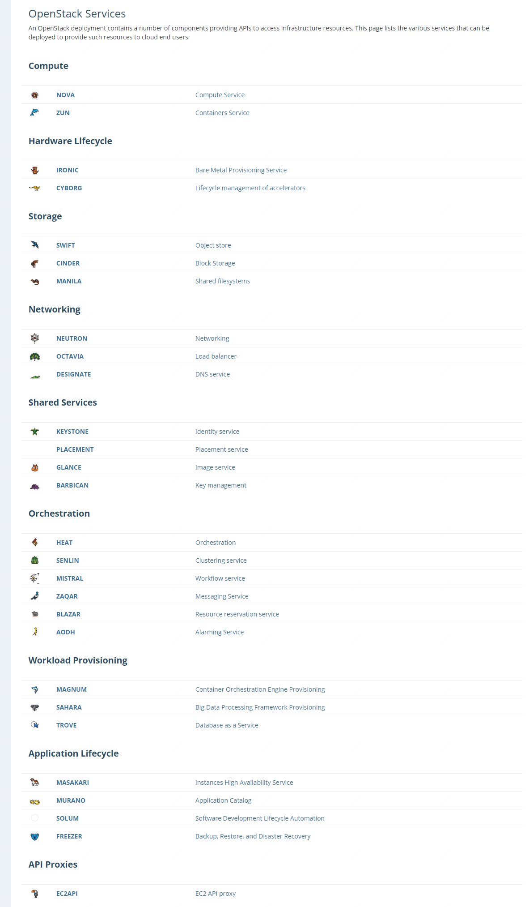

# 前言

云到底是什么？世界知名的云厂商aws这样[定义](https://aws.amazon.com/cn/what-is-cloud-computing/):

```text
云计算通过互联网按需提供 IT 资源，并且采用按使用量付费的定价方式。
您可以根据需要从诸如 Amazon Web Services (AWS) 之类的云提供商那里获得技术服务，
例如计算能力、存储和数据库，而无需购买、拥有和维护物理数据中心及服务器。
```

带入我个人的理解，云是将传统的硬件，包含计算服务器，存储磁盘以及交换机，路由器，
按照使用者希望的网络拓扑和需要使用的资源量，通过虚拟化和远程控制等方法，自动化的创建出来。
并按照使用者的实际使用量和时间收取费用。
它节省了应用开发人员的大量时间在

* 寻找机房
* 规划网络
* 购买硬件设备、等待接线和部署

等这些繁琐的过程。使得所需的IT设施在界面上点点鼠标就可以使用

# 与云相关的常见术语

## IaaS

IaaS叫做基础设施即服务，通常指的是计算、存储和网络。

计算常规上来说是包含cpu、gpu等任何具有计算能力的芯片统称，而不只是cpu。在表现形式是通常是1台x核心的云主机。

存储常规上来说包含内存、块存储硬盘以及具备远程访问能力的对象存储与文件存储的统称。

网络的范围则较为广泛，包含了二层广播域(VPC)，子网与路由交换设备，还有可以随时申请和摘除的互联网ip以及云主机上挂载的网卡(
包含私有ip)。
以及与之配套的规则配置能力，如nat规则、acl访问规则、路由规则等。

## PaaS

PaaS叫做平台即服务，通常指的是如数据库、缓存、消息队列、分布式索引等常见的、且又通用的平台组件。
更高级的还有诸如大数据平台、容器云平台、实时数据分析平台等，用于加速软件开发的组件。

所谓PaaS的意思是，它不是直接的成本品业务系统，辅助业务系统快速开发的的组件。

## SaaS

SaaS叫做软件即服务，通常指的是直接可用的软件产品，比如office 365。
使用者在线直接完成自己所需的，以前需要在传统的、需要安装的软件上才能完成的东西。
比如你突然需要用一个ps，按照传统的做法，需要下载安装ps。
如果ps SaaS化，则是直接注册一个账号，按月付费然后在线操作。

# SDC、SDN、SDS

SDX = **S**oftware **D**efined X，代表由软件的逻辑来定义的X，X通常指一个传统的硬件或设施。

SDC = 软件定义计算、SDN = 软件定义网络和SDS = 软件定义存储。
也就是通过虚拟化的方式和对外提供接口，让使用者或者开发人员能够基于这些开放接口的参数和定义操作物理服务器、交换机、磁盘阵列等传统硬件设备。
按照调用方的意图和软件编码，自动化地完成操作。云内的计算、存储和网络基本一定是软件定义的，而只有其中的一项无法成为云。

# 云的主要组件划分

```plantuml
@startuml
!include  https://plantuml.s3.cn-north-1.jdcloud-oss.com/C4_Container.puml

Person(租户, 租户) #orange
Person(运维, 运维)
Boundary(管理平面, 云管理平台, Management Plane) {
    System(租户控制台, 租户控制台) #orange
    System(运维营控制台, 运维(运营)控制台)
}
System(控制平面, 控制系统, Control Plane) #red
System(硬件设施, 硬件设施, Data Plane) #red

租户 -d-> 租户控制台
运维 -d-> 运维营控制台

租户控制台 -d-> 控制平面
运维营控制台 -d-> 控制平面

控制平面 -r-> 硬件设施
@enduml
```

从用户侧出发，租户需要访问他自己的租户控制台，云的运维则也需要自己的运维控制台。
租户在租户控制台上完成自己的云资源管理操作，运维在运维控制台上完成整个云设施的运维操作以及协助租户处理一些疑难杂症和主机迁移等操作。
这些界面操作或者提供的客户端都叫做管理平面(Management Plane)工具。
其建设的优先级是运维使用的最低，租户的较高。

无论是哪个控制台，都依仗着云的控制系统对外提供的接口和功能进行调用才能实现。云的控制系统也被称为云底座，通常是诸如openstack、k8s、openshift等对计算、存储、网络等软件定义的设施进行管理和调度的系统。
这些系统是云能工作的核心控制器，也被称为控制平面(Control Plane)。
它很重要，是云对外提供软件定义能力的基础，是云研发团队应当重点投入的组件。

控制系统创建出来的工作负载最终是跑在硬件设施上的，没有这些硬件设施的支撑，无论什么控制指令也没有意义。
这些承载着租户侧工作负载的硬件设施被称为数据平台(Data Plane)，意味着用户的虚拟机、存储的数据以及网络的东西和南北向通信都工作在这个平面上。
它是非常重要的，也是整个云研发团队应当投入的核心。

从重要性上看，数据面故障将影响租户的使用，属于较为严重的事故。控制面故障将导致新的工作负载无法产生，故障的工作负载无法重新调度。但是已经在工作的工作负载通常不会受到影响。
管理面的故障通常是控制台打不开，工具调用api报错等，属于影响租户使用但不影响租户业务的故障。

也由此，云的研发团队的核心应该还是更多地放到数据面和控制面板的内容上，直到云底层的稳定性、性能、安全性、扩展性等已经基本满足可用之后才是控制台的功能定义等工作。

# 云的可集成性

打开任何一个公有云的服务目录都能找到大量的可用服务。这些服务在云的内部也不是一个团队就能开发完的。而是数个团队协同工作才能完成开发和上线。因此一朵云必须具备可集成性，包含以下几个内容

## 云控制系统的可集成性

openstack，k8s等云控制系统都有一个特点，就是允许使用不同厂家的不同驱动或插件来完成最终的计算负载、网络控制规则和数据持久化等资源的生命周期管理和调度。
以k8s为例

* k8s提供cri插件来和容器运行时进行交互，要求容器运行时按照它的标准来启动容器并执行指令
* 在网络上，它提供cni插件，使得类似flannel、calico等开源网络sdn厂商能够按照它的要求为应用负载配置正确的ip以及网络访问规则。
* 在存储上，它提供csi插件，使得应用负载能够使用块存储、对象存储、文件存储等多种类型，不同协议的存储系统

因此，一个云控制系统应当能够支持多种多样的底层设施，且这些硬件设施的厂商通常都会支持主流的开源云控制系统和一些厂商自研且在市场上有一定地位的系统。
对于完全从0打造的云控制系统，除非有非常大的商业利益进行驱动，否则很难有厂商进行定制化支持。
失去了厂商和开源社区的支持，这样的云难以构建自己的生态，从而在商业竞争中只能被淘汰。
由此，**绝对**应当避免云控制系统的从0打造，而是选择一个可靠的、有市场占有率的开源系统、或者和成熟的，已经有一定市场占有率的公司购买源代码进行学习、修改以及调优。

## 云资源的可集成性

云在IaaS层提供了可靠的底层资源，这些资源在云的PaaS研发和SaaS研发时都应当能够助力这些团队的开发，而不是让这些团队也需要为了自己的资源如何调度，如何保证可用等再重新开发相应的代码。
因此，云的控制系统应当为这些开发团队提供内部的接口，这些接口使得开发团队能够在不占用租户的配额的前提下生成所需云资源，并完成这些云资源与租户网络的打通，使得租户能够直接使用PaaS能力。

## 控制台的可集成性

任何公有云厂商的云控制台的体验都是基本一致的，不会在点击云资源时出现不同风格的界面。这是由云控制台的可集成性保证的。
云控制台通过提供前端开发框架和组件，让其它云服务的开发团队能够将自己的前端ui按照给定的风格进行开发并有效地融入到云控制台框架中。

## 开放接口的可集成性

无论是云内的各个团队提供的接口，还是云对租户开放的接口，其调用风格都是基本统一。这需要云具有统一对外的api网关，且该网关具有能够兼容不同风格接口，对外统一开放的功能。

## 步骤

这些集成能力中，显然云控制系统的可集成性应当处于最高优先级，云产研团队应当尽早熟悉云控制系统都能对接哪些硬件设施，这些硬件设施的驱动是否可商用等；
在这基础上，是云控制台的可集成性，因为各个云开发团队都会在云控制台上开放自己的能力，需要有统一的登录，权限控制以及风格；
随着云的发展，只提供IaaS将失去竞争力，因此需要开放接口的可集成性以及云资源的可集成性。
这些可集成性标准对云平台来说是至关重要的，没有这些标准，整个云平台就是一盘散沙。

# 从简入繁

到此，应当认识到了云的开发是一项对知识、人员、组织和成本都爆炸性的工作，但同时也是一项非常具有意义的工作，知名的互联网公司和世界名企基本都是建设了自己的云平台。
因此，一个企业需要自己的云平台来支撑自己的业务。这一点上，任何公有云厂商都很难为单独一个企业去定制。
那么，一个企业内部要开发研发云平台，也需要依照自己团队具备云相关知识的人员数量、预计投入的研发成本以及希望的效果等多方面进行实质的考虑。
在此，推荐的路径是

* 掌握以k8s为主的容器云，这是因为
    * 首先它能够支撑企业的绝大部分以进程运行的应用且天生具备微服务所需的服务注册、配置管理等功能，目前开源社区也已经相对成熟，生态也很多，能够成为一个稳定可用的云底座支撑企业业务；
    * 其次，它的设计较为简单，但却包含了云的所有核心概念(包含计算资源调度和管理、网络管理、存储管理等)，是一个能较快理解云设计思路的开源系统；
    * 第三，在容器云运行的过程中，随着规模的扩大，机房数量的增多，云研发团队对真实生产过程中可能发生的问题的知识和运维能力的积累也是逐渐增加，为未来真实提供对外服务打下基础。
* 第二步推荐掌握以openstack为主的或其它主流厂商提供的云控制系统，这些系统能够提供包含虚拟机、容器、裸金属等多种计算资源，且能够提供隔离的二层网络，属于本质就是要面向多租户使用的云底座；
  当然，学习和掌握这些知识的成本需要提前考虑。如果大部分人员对于云的知识，特别是网络的知识相对匮乏的时候，对于这套多租户的云学习起来就较为吃力，这也是为什么不建议上来就挑战openstack的原因。



上图是一张openstack的所有项目清单，可见项目非常多，每一个如果都花精力去调研可用性、可靠性并进行实验的话，时间成本和人力成本都相对不低。
因此应当是在团队已经具有一定的知识基础的背景下再考虑进入openstack技术栈。

最后，具体的路径应当紧密结合企业的内部需要以及对于学习以及开发周期的容忍。
但不管怎么样，我本人都优先推荐先能从k8s入手掌握一些云的基本知识再去挑战更高难度，否则可能面临自己都不知道自己在做什么的情况。

# 下一步阅读

在进入云的世界前，推荐先阅读
[计算](%E8%AE%A1%E7%AE%97)、
[存储](%E5%AD%98%E5%82%A8)、
[网络](%E7%BD%91%E7%BB%9C)章节的基本知识，有些概念后再开始实践。
特别是网络，那部分搞明白了其它的不是太难。