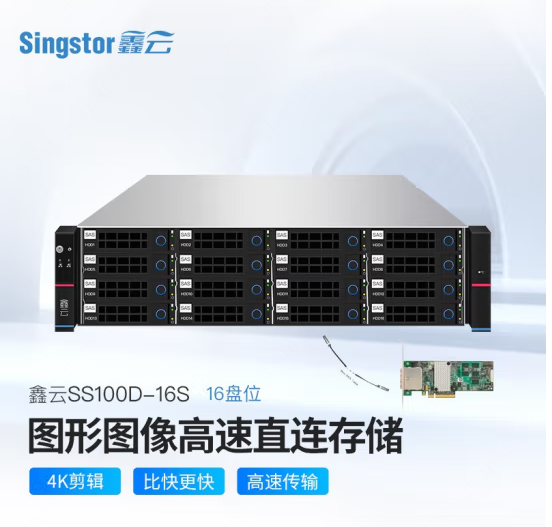
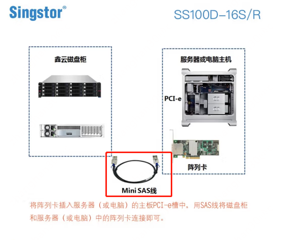
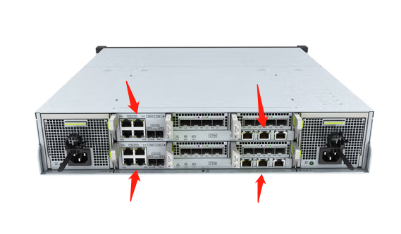
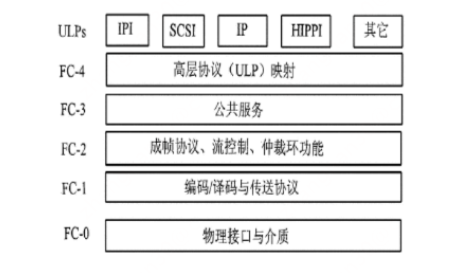

# 远程存储

磁盘在最一开始都是插在服务器本地的，这种能使得操作系统获得最快的访问速度，不过也有很多问题，比如

* 磁盘利用率不怎么高，很多服务器买了2T的硬盘可能实际写入不到一半(比如业务没有想象的那样发展)，剩余的部分也不能给别人用
* 磁盘跪了之后数据全丢，没有办法恢复，操作系统也启动不了，服务被迫中断
* 数据写在本地，不利于应用的多副本部署，因为在另外一台服务器上没有数据，不得不采用各种手段进行数据同步

于是就开始希望有一个远程的存储，能够把所有硬盘都管理起来，需要时取用，不需要时放回磁盘池给别人用

# 存储类型

基于不同的远程存储类型，分为块存储、文件存储和对象存储

## 块存储

块是操作系统和磁盘打交道的最基本单元，于是不难理解块存储主要对外提供的是1个远程磁盘，操作系统连接远程块存储获得1个磁盘。

```plantuml
@startuml
!include  https://plantuml.s3.cn-north-1.jdcloud-oss.com/C4_Container.puml

System(主机1, 主机)
System(主机2, 主机)
System(主机3, 主机)
Boundary(块存储服务器, 块存储服务器) {
    Container(hdd1, 磁盘1, hdd)
    Container(ssd1, 磁盘2, ssd)
    Container(ssd3, 磁盘3, ssd)
}

hdd1 --> 主机1
ssd1 --> 主机2
ssd3 --> 主机3

@enduml
```

## 文件存储

块是没有办法直接读写文件的，需要格式化成文件系统后才行。操作系统从块存领了一个磁盘后还是要格式化然后把文件存在块存储上，
当别人想要用这个块存储上的文件时就不得不再用其它的手段进行文件共享才行。文件存储就解决了这个问题，它提供的是一个远程的共享文件，
文件系统已经格式化好了，操作系统在这领的是一个文件夹，直接把文件写进去就行了。别人需要共享使用这个文件的时候那就向文件存储发起申请，领用这个文件夹就可以

```plantuml
@startuml
!include  https://plantuml.s3.cn-north-1.jdcloud-oss.com/C4_Container.puml

System(主机1, 主机)
System(主机2, 主机)
System(主机3, 主机)
Boundary(文件存储服务器, 文件存储服务器) {
    Container(foldder1, /xiaoming, folder)
    Container(foldder2, /liangliang, folder)
}

foldder1 --> 主机1
foldder1 --> 主机2
foldder2 --> 主机3

@enduml
```

## 对象存储

文件系统存储的文件是通过操作系统调用进行数据读写，比如java的"FileInputStream"，
在现今常用的http服务面前有一定的缺陷: 文件读取出来还要被接口把所有内容当做http响应返回，这样浏览器才能用url打开文件
(比如加载图片)。 为了解决这种问题，通常需要额外部署http文件服务器并将文件服务器和负责文件上传的服务器通过文件存储进行共享挂载

```plantuml
@startuml
!include  https://plantuml.s3.cn-north-1.jdcloud-oss.com/C4_Container.puml

System(主机1, http文件服务器)
System(主机2, 上传接口)
Boundary(文件存储服务器, 文件存储服务器) {
    Container(foldder1, /共享文档, folder)
    
}

foldder1 --> 主机1
主机2 -u-> foldder1

@enduml
```

这种在小数据量面前可以，但是一旦用户规模扩大后单个文件存储(包含文件存储柜)都可能无法支撑那么多文件
(存储大小 + 管理这么多文件的元数据造成的overhead)，需要采用一种海量数据规模的解决方案。
当提及海量数据时，可能会首先想到hdfs，然而不幸的是，hdfs说自己的一个最小文件是64M(如果我没记错的话)
，显然用户很少上传一个这么大的文件，大部分文件或者是自己的头像，或者是发票，编写的word，pdf文档什么的。
于是面对这种小的、零碎的、又海量的文件存储需求，对象存储就诞生了。

对象存储采用的基于http的s3协议，它通过http接口存储、修改、读取和删除一个对象(通常就是文件)，并一般支持海量的对象。

```plantuml
@startuml
!include  https://plantuml.s3.cn-north-1.jdcloud-oss.com/C4_Container.puml
Person(用户, 用户)
System(主机2, 上传接口)
Boundary(oss, 对象存储服务器) {
    Container(foldder1, 头像, bucket)
}

用户 -r-> foldder1: 直接从http url读取头像
主机2 -u-> foldder1

@enduml
```

通常对象存储能够提供对象的，直接被外部访问的url，这个url可以配置为cdn的回源，也可以直接发给app，让app直接请求对象存储获取数据而不需要额外的http服务器

# 远程(独立)存储硬件类型

远程数据存储能力需要具体的硬件来承载，那么能不能用一般的服务器来实现这个能力呢，答案是“能，但不划算“。
通常来说一般的服务器具有较高性能的cpu和内存，它除了做数据存储外，还要运行应用程序。如果这个服务器只做存储服务，那么高性能的cpu和以及内存以及可能服务器主板上的其它插槽就都浪费了。
因此会有专门的硬件来做远程存储服务器

## DAS

DAS(Direct-Attached Storage)叫做直连存储，谁白了就是把插在主板上的硬盘都插在一个独立的设备上，
再把这个设备通过专用的线缆(通常不是网线)和主机相连。





DAS主要提供块存储能力

## SAN

das主要给1台主机远程磁盘防止和扩展能力，但是如果我一个机房的所有服务器都想用一个磁盘柜怎么弄？
DAS显然不能支持。这时候需要SAN存储的支持

```plantuml
@startuml
!include  https://plantuml.s3.cn-north-1.jdcloud-oss.com/C4_Container.puml

System(主机1, 主机) #orange
System(主机2, 主机) #orange
System(主机3, 主机) #orange

System(交换机, 交换机, 网络交换) 

System(SAN, SAN) #red

主机1 <--> 交换机
主机2 <--> 交换机
主机3 <--> 交换机

交换机 <--> SAN

@enduml
```

上图是SAN存储的一个示意图，各个主机通过网络以及交换机和SAN存储连在一起，存储数据通过网络和SAN存储系统进行交换。
通常来说SAN的存储柜子会有一个独立于主机和主机之间网络流量的专用网络，因此SAN的名称叫做存储区域网络(Storage Area Network)。
意味着只有存储流量会走这个网络，主机和主机之间互相ping或者接口调用走别的网络。
当然如果非要较真说我主机只有一个网卡，还不能用SAN了？
答案当然是可以，只是流量高峰来的时候，主机和其它主机之间进行接口调用以及主机读写数据的网络都从这个网卡出去，不要到时候嫌网络卡的不行就可以。



从这张图上能看出来，san存储服务器背后有网口，而且通常以太网口和光线通道口都有。SAN一般主要提供块存储能力，部分厂家和型号能支持文件存储和对象存储。

## NAS

NAS(Network Attached Storage，网络附属存储)主要是提供远程的文件存储服，不怎么能提供块存储的能力。

## 分布式存储

DAS、SAN、NAS是目前运行多年的企业级存储方案，但是都有一个问题，那就是一个服务器的所有盘位插满了怎么扩展呢？
答案往往是再买1个新的存储服务器
(当然也有一些厂商本身就有集群化的解决方案，但是问题就是你只能继续买那家的设备，也就是被**厂家绑定**)
，然后将需要新存储空间的主机连到这个新的存储服务器上。
但是，之前已经连上去的主机怎么弄？之前买的那个随着年龄的增加如果坏了，老的数据怎么往新的上面导？
面对这样的问题，以ceph为代表的分布式存储提供了解决办法。它以多台服务器(可以是一般的服务器)
组成集群，对外提供一个数据多副本，节点可扩展的存储集群。

ceph将集群内的节点的所有磁盘统一管理，并在存储数据的时候会在多个服务器上存多份(有点raid-1的意思)。
当数据的副本不够时，它会在集群中再找节点进行数据的复制，确保数据总是保持给定的副本数并分散在集群内。

这样当单个节点坏了的时候，其它节点依然有数据的副本可用，并且可以直接通过横向扩展节点的方式来扩大集群的存储规模。

ceph集群也是提供的网络服务，因此也可以理解它是一个利用普通服务器就可完成的，不限厂家的SAN。缺点是开源软件坑多，全靠自己踩以及有能力修复。
然后，有人会觉得刚才不还讲不要拿普通服务器做存储服务器用吗，这个分布式存储又是什么鬼？

我的答案是：你可以观测一下分布式存储服务器的资源利用率，给它找点事干，就像你领导看你闲着给你找点事干一样~~~
毕竟作为一个企业，自己的it设施不能被另一个企业绑架不是么。而且分布式存储坑很多，要不要进圈自行琢磨。

# 远程存储协议

远程存储集群和主机之间主要依靠网络传输完成数据操作，因此必然需要涉及网络传输的协议

## 块存储: SCSI

之前介绍过SCSI口的硬盘，其实SCSI一种将设备连接到计算机上的协议，并不只是硬盘专用的，但可以成为硬盘和主机之间交换数据的信号协议，下图是scsi的接线电缆。


这个线缆看起来好像哪一个都插不到交换机上。为了能够让SCSI信号沿网络传输，业界引入了iSCSI(SCSI over IP)。
，就是通过tcp/ip协议承载SCSI协议，使得主机以为在用SCSI和自己的一个本地硬件打交道。


```plantuml
@startuml
!include  https://plantuml.s3.cn-north-1.jdcloud-oss.com/C4_Container.puml

Boundary(主机, 主机) {
    Container(iSCSI_init, iSCSI Initiator)
}

System(磁盘存储, 磁盘存储, iSCSI Target) 

iSCSI_init <-r-> 磁盘存储: 网络传输

@enduml
```

主机上需要装一个客户端叫iSCSI Initiator，iSCSI Initiator连接远程的iSCSI Target。通常为了获得一个大的传输带宽，连接iSCSI
target的网络需要10gbps，否则你硬盘柜子上的ssd在落泪

## FC(光纤通道)

既然为了传输效率需要大的带宽，那在千兆网还是神话的上古时期怎么实现呢？这时候就需要"光"。
FC通道是当时使用光纤完成二层网络封装的通信协议，它能提供8gbps或更高的传输速度。
这个速度在当时就算是"光速"了(现在其实也是，毕竟万兆还没进入平常百姓家)。



图中可见fc通道也是分层协议，主要包含了物理层和数据链路层，从FC-4开始可以封装一些上层协议，包含SCSI和IP协议。

之前讲解过硬盘接口有FC接口，**可能**本质上是光纤通道+SCSI(内部通信)

同时，因为FC通道能支持IP协议，因此iSCSI也可以使用FC交换机作为二层设备来支撑上面的ip包。

**警告**: FC交换机是指使用光纤通道协议作为网络协议的交换机，常见的万兆以太网交换机也有光口，但是这里的光纤是指传输介质是光纤，即物理层是光纤，但是二层协议依然是以太网协议。
也由此可见，万兆以太网交换机可以用来给iSCSI做网络支撑，而且还能作为以太网络交换机用。

## 块存储: ceph

ceph作为分布式块存储首先也有基于iSCSI的网关，从而能对外提供iSCSI target的能力。此外ceph也有自己的客户端，能够连接ceph服务器完成磁盘的挂载等基本操作。
ceph客户端和服务器之间利用tcp/ip作为协议栈承载。

## 文件存储协议: NFS & CIFS

* CIFS: SMB(Server Message Block)的统称，SMB（Server Message Block，
  又称Common Internet File System（CIFS））是由微软开发的一种软件程序级的网络传输协议，
  主要用来使得一个网络上的机器共享计算机文件、打印机、串行端口和通讯等资源
* NFS: 是网络文件系统, 平时更常用一些。但是有了对象存储后，更多的从用户侧上传的文件选择了对象存储

这两种协议都是直接mount目录到主机，然后由主机通过操作系统的文件访问函数来进行操作

## 对象存储协议: S3

当提及S3时，主要指的是Amazon Simple Storage Service (S3) ，它通过一组http接口api来操作bucket(桶)和object(对象)，
桶和对象的概念在其它对象存储实现中较为通用，不过具体的接口和功能每个对象存储厂商都有些许不同。
大多数对象存储厂商都能兼容aws s3协议。也有大量的、各种编程语言可用的现成的开源客户端和组件来操作桶和对象。
总的来说，对象存储能直接获取对象的http连接，并由对象存储服务器/cdn来承载文件流量，有助于http服务器的分流。

# 总结

存储有很多种，块存储是裸存储，相当于分配了一个磁盘；文件存储用于存储文件，相当于分配了一个文件夹；文件多了之后文件存储扛不住了，需要海量小文件的存储支持，于是需要对象存储；
远程存储也有很多种，直接连到服务器上的叫DAS、通过交换机，让多个主机和多个存储相连的是SAN，通过网络连上只支持文件存储的是NAS，还有一种叫做分布式存储，但是开源坑多，要不要入自行考虑；
存储远程后，存储信号通信也需要网络协议的支持，iSCSI利用tcp/ip来实现块存SCSI协议；存储要求大带宽，以往以太网网速不够时使用光纤通道来支持千兆/万兆交换，光纤通道是协议，iSCSI和SCSI都能跑在光纤通道协议栈上，光纤通道需要专用的交换机，带光口的万兆以太网交换机不行；
文件存储、对象存储和分布式存储也有自己的通信协议，基本都是或者利用tcp/ip或者利用http。
