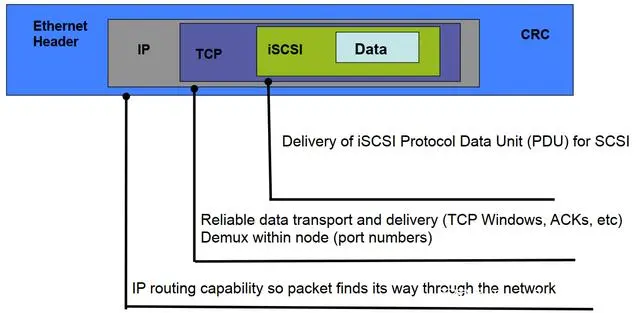

# 远程存储

磁盘在最一开始都是插在服务器本地的，这种能使得操作系统获得最快的访问速度，不过也有很多问题，比如

* 磁盘利用率不怎么高，很多服务器买了2T的硬盘可能实际写入不到一半(比如业务没有想象的那样发展)，剩余的部分也不能给别人用
* 磁盘跪了之后数据全丢，没有办法恢复，操作系统也启动不了，服务被迫中断
* 数据写在本地，不利于应用的多副本部署，因为在另外一台服务器上没有数据，不得不采用各种手段进行数据同步

于是就开始希望有一个远程的存储，能够把所有硬盘都管理起来，需要时取用，不需要时放回磁盘池给别人用

# 存储类型

基于不同的远程存储类型，分为块存储、文件存储和对象存储

## 块存储

块是操作系统和磁盘打交道的最基本单元，于是不难理解块存储主要对外提供的是1个远程磁盘，操作系统连接远程块存储获得1个磁盘。

```plantuml
@startuml
!include  https://plantuml.s3.cn-north-1.jdcloud-oss.com/C4_Container.puml

System(主机1, 主机)
System(主机2, 主机)
System(主机3, 主机)
Boundary(块存储服务器, 块存储服务器) {
    Container(hdd1, 磁盘1, hdd)
    Container(ssd1, 磁盘2, ssd)
    Container(ssd3, 磁盘3, ssd)
}

hdd1 --> 主机1
ssd1 --> 主机2
ssd3 --> 主机3

@enduml
```

## 文件存储

块是没有办法直接读写文件的，需要格式化成文件系统后才行。操作系统从块存领了一个磁盘后还是要格式化然后把文件存在块存储上，
当别人想要用这个块存储上的文件时就不得不再用其它的手段进行文件共享才行。文件存储就解决了这个问题，它提供的是一个远程的共享文件，
文件系统已经格式化好了，操作系统在这领的是一个文件夹，直接把文件写进去就行了。别人需要共享使用这个文件的时候那就向文件存储发起申请，领用这个文件夹就可以

```plantuml
@startuml
!include  https://plantuml.s3.cn-north-1.jdcloud-oss.com/C4_Container.puml

System(主机1, 主机)
System(主机2, 主机)
System(主机3, 主机)
Boundary(文件存储服务器, 文件存储服务器) {
    Container(foldder1, /xiaoming, folder)
    Container(foldder2, /liangliang, folder)
}

foldder1 --> 主机1
foldder1 --> 主机2
foldder2 --> 主机3

@enduml
```

## 对象存储

文件系统存储的文件是通过操作系统调用进行数据读写，比如java的"FileInputStream"，
在现今常用的http服务面前有一定的缺陷: 文件读取出来还要被接口把所有内容当做http响应返回，这样浏览器才能用url打开文件
(比如加载图片)。 为了解决这种问题，通常需要额外部署http文件服务器并将文件服务器和负责文件上传的服务器通过文件存储进行共享挂载

```plantuml
@startuml
!include  https://plantuml.s3.cn-north-1.jdcloud-oss.com/C4_Container.puml

System(主机1, http文件服务器)
System(主机2, 上传接口)
Boundary(文件存储服务器, 文件存储服务器) {
    Container(foldder1, /共享文档, folder)
    
}

foldder1 --> 主机1
主机2 -u-> foldder1

@enduml
```

这种在小数据量面前可以，但是一旦用户规模扩大后单个文件存储(包含文件存储柜)都可能无法支撑那么多文件
(存储大小 + 管理这么多文件的元数据造成的overhead)，需要采用一种海量数据规模的解决方案。
当提及海量数据时，可能会首先想到hdfs，然而不幸的是，hdfs说自己的一个最小文件是64M(如果我没记错的话)
，显然用户很少上传一个这么大的文件，大部分文件或者是自己的头像，或者是发票，编写的word，pdf文档什么的。
于是面对这种小的、零碎的、又海量的文件存储需求，对象存储就诞生了。

对象存储采用的基于http的s3协议，它通过http接口存储、修改、读取和删除一个对象(通常就是文件)，并一般支持海量的对象。

```plantuml
@startuml
!include  https://plantuml.s3.cn-north-1.jdcloud-oss.com/C4_Container.puml

System(主机1, http文件服务器)
System(主机2, 上传接口)
Boundary(oss, 对象存储服务器) {
    Container(foldder1, 头像, bucket)
    
}

foldder1 --> 主机1
主机2 -u-> foldder1

@enduml
```

# 远程存储协议

## 块存储协议

### SCSI & iSCSI

之前介绍过SCSI口的硬盘，其实SCSI一种将设备连接到计算机上的协议，并不只是硬盘专用的，这个东西已经很老了，下图是scsi的接线电缆，从而可见这东西和网络传输好像没什么关系。


和网络传输有关的是iSCSI(SCSI over IP)，就是通过tcp/ip协议承载SCSI协议，使得主机以为在用SCSI和自己的一个本地硬件打交道。



```plantuml
@startuml
!include  https://plantuml.s3.cn-north-1.jdcloud-oss.com/C4_Container.puml

Boundary(主机, 主机) {
    Container(iSCSI_init, iSCSI Initiator)
}

System(磁盘存储, 磁盘存储, iSCSI Target) 

iSCSI_init <-r-> 磁盘存储: 网络传输

@enduml
```

通常为了获得一个大的传输带宽，连接iSCSI target的网络需要10gbps，否则你硬盘柜子上的ssd在落泪

### FC通道