# 常见的磁盘类型

磁盘是存储数据的介质，常见的磁盘有

## 机械硬盘(HDD)

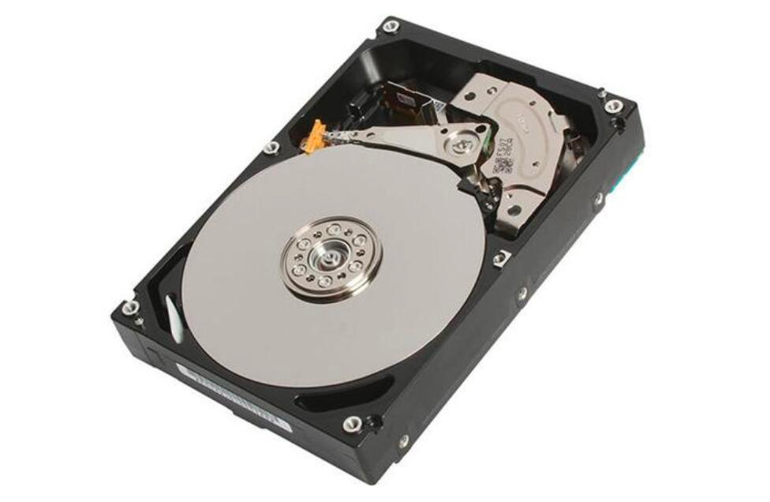

机械硬盘拆开了之后长这样，它由很多盘片构成

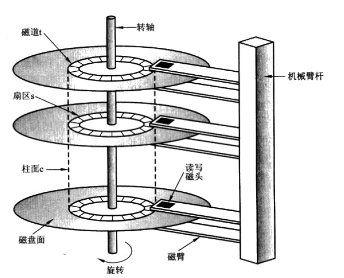

这些盘沿着直径被切成若干个扇区(就像你分蛋糕一样)。沿着半径又有很多同心圆，被称为磁道

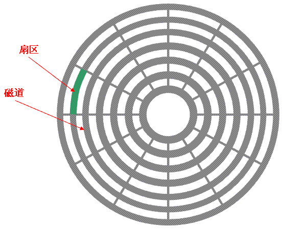

磁道在一个盘上是个圆，从上往下展开看多个盘就形成了一个圆柱体，叫柱面

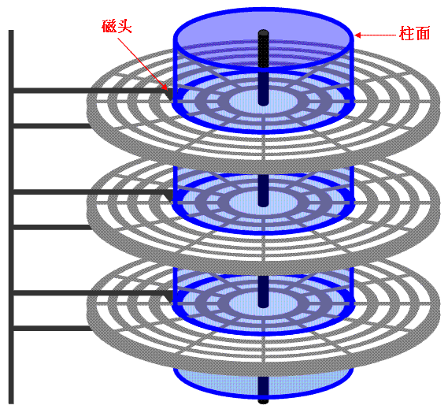

不难想象在读写数据时，操作系统要告诉磁盘你给我找到哪个扇区的哪个磁道(寻址)，转轴负责把盘转到哪个位置，磁头负责操作。
由此也不难看出，机械硬盘的读写速度大部分取决于它转的有多快(机械硬盘经常有个参数是 x rpm - 即每分钟转几圈)

## 固态硬盘(SSD)

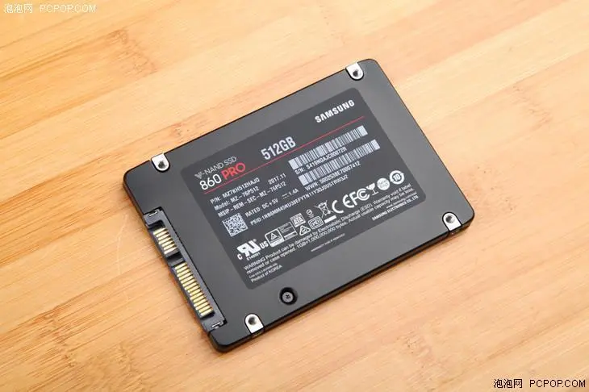

固态硬盘没有磁头、扇区、盘片等概念，取而代之的是"浮栅晶体管"，数据是存储在浮栅晶体管中的，目前有

* SLC: Single-Level Cell，即1bit/cell，一个浮动栅存储1个bit的信息，约10万次擦写寿命
* MLC: Multi-Level Cell，一个浮动栅存储2个bit的信息，约3000-5000次擦写寿命
* TLC: Trinary-Level Cell，一个浮动栅存储3个bit的信息，约1000-2000次擦写寿命

可见MLC/TLC不怎么适用于服务器和云

# 磁盘接口类型

磁盘作为一个硬件，有自己的插口类型，买的时候需要想想这块盘主板上能不能插进去，不能就只能"七天无理由"了

## IDE口

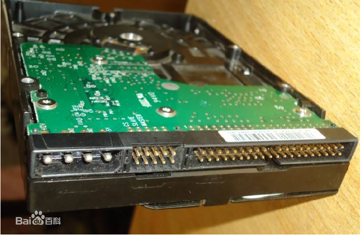

## SCSI口

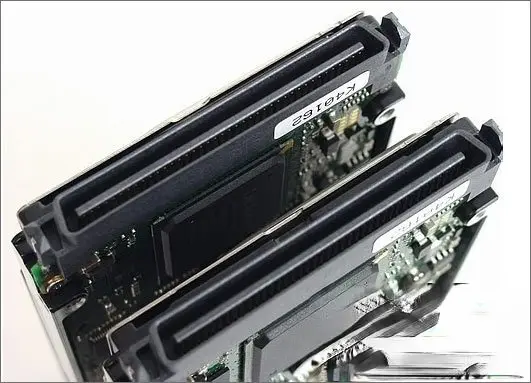

## SATA(Serial ATA）口

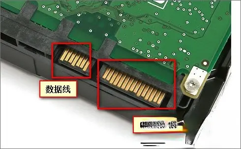

## SAS口

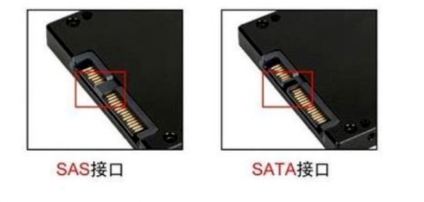

sas口比sata多一组针脚，本身兼容sata

## FC接口

fc接口是指光纤通道接口

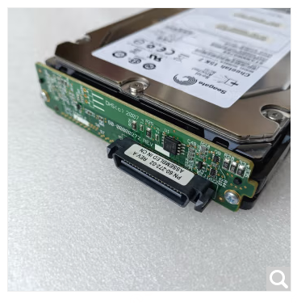

## .m2接口

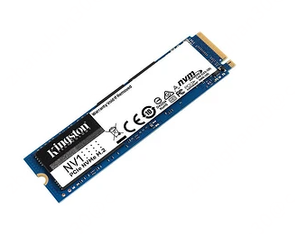

## 小结

不同的口速度不一样，相同口的不同代的速度也不一样，需要时自行百度或者和供应商咨询吧

# 块(BLOCK)

操作系统和磁盘打交道不是1个字节1个字节这么操作的，而是将相邻的扇区组合在一起，形成一个块，再对块进行整体的操作
(块在Windows下叫做簇)。每个簇或者块可以包括2、4、8、16、32、64等2的n次方个扇区。从这种机制上不难看出，磁头移动到了位置后磁盘不能白转，一次要尽可能读写更多数据出来。
看到这里可能好奇，ssd没有扇区，还有块的概念么？答案是有，块毕竟是操作系统和磁盘打交道的基本对象，并不会因为你是ssd于是就你贵你有理。
此外如果就读写1字节也要操作1个磁盘块么？答案是“对“，那是你以为你读写了1字节，操作系统底层做的事可比你想得多。

# 磁盘raid

首先认知到一点，磁盘这个玩意是会坏的，就算你不碰它，它也有自己的寿命(比如ssd的擦写次数)。
那么为了防止磁盘坏了之后数据丢失或者系统出问题，通常会对磁盘特别是数据磁盘进行raid。

raid的意思是把一堆盘组在一起，组在一起之后能怎么样取决于raid的级别

* raid-0: 把一堆磁盘组合起来当作一块磁盘使用，其大小是所有磁盘大小之和，写入的数据会散落在不同的底层磁盘上，于是读和写的时候都是直接操作多个磁盘并行进行，属于快。
  但是一块磁盘坏了其中写的数据没有任何备份
* raid-1: 就是1份数据同时写多个磁盘，也叫磁盘镜像，其大小是这组磁盘中的最小值。如果一个磁盘坏了也不影响使用，属于安全。
* raid-10: 就是两个磁盘先组raid-1构成一个逻辑磁盘，这堆逻辑磁盘再组raid-0，属于又安全又快

raid还有其他模式，个人没怎么用过，有兴趣可自行阅读材料

# 文件系统

磁盘装上去之后操作系统需要操作它来读写文件和管理文件夹。要管理这些文件和文件夹，就涉及到操作系统具体采用什么格式存储文件和文件夹，
以及怎么存储这些文件和文件夹的元数据(比如记录文件存在哪个块里面，以及块内的具体位置)。
因此磁盘需要选择一种文件系统的类型进行格式化，不同的文件系统类型对于文件和文件夹的管理有自己的套路。目前windows常用ntfs、linux常用的ext4。

磁盘一定格式化才能开始读写文件，一些云厂商在挂载云硬盘时就不会给你格式化，租户需要登录云主机后自己分区和格式化
(这很合理，你想想自己装个电脑，买个2T的硬盘会直接都分给C盘么)

# 总结

磁盘主要分成机械盘和ssd而且还有接口的区分，买盘时候需要确定接口主板能用以及接口能满足速度要求；
操作系统和磁盘不是1个字节1个字节打交道的，而是1个块1个块打交道的；
为了防止单盘故障数据丢失或者为了加快读写，磁盘可以进行raid；
不同的raid级别提供的效果不一样，0=最快读写，1=多副本，其余的有兴趣可以查文档；磁盘挂到操作系统上需要分区和选择一个文件系统进行格式化，不格式化操作系统无法读写文件

