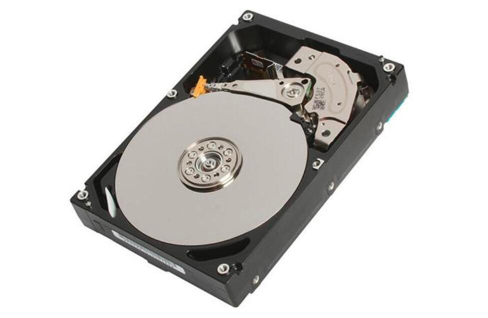

# 常见的磁盘类型

磁盘是存储数据的介质，常见的磁盘有

* 机械硬盘(HDD): 性价比的代名词，大容量低成本的首选

* 固态硬盘(SSD):
  速度和贵的代名词，靠花钱就能得到体验的典型代表

# 磁盘接口类型

磁盘作为一个硬件，有自己的插口类型，买的时候需要想想这块盘主板上能不能插进去，不能就只能"七天无理由"了

有关不同接口的介绍，这篇文档图文并茂，本文就不赘述了: [https://zhidao.baidu.com/question/1184205156940974379.html](https://zhidao.baidu.com/question/1184205156940974379.html)

主要使用的是SAT，特别有些是能支持PCIe的。

# 磁盘RAID

首先认知到一点，磁盘这个玩意是会坏的，就算你不碰它，它也有自己的寿命。那么为了防止磁盘坏了之后数据丢失或者系统出问题，通常会对磁盘特别是数据磁盘进行RAID。
磁盘的raid有很多中级别(也就是玩法)，如果为了数据的可靠性，防止一块盘坏了就不能读写了，可以使用raid 1；如果要为了读写最快，那么就raid
0。 通俗一些的讲解的话，raid 1就是一份数据同时写多个磁盘，也叫磁盘镜像。raid 0就是把一堆磁盘当作一块磁盘使用，写入的数据会散落在不同的底层磁盘上，
于是读和写的时候都是直接操作多个磁盘并行进行。其他的raid模式，我个人没怎么用过

# 文件系统

磁盘装上去之后操作系统需要操作它来读写文件。于是一个文件在磁盘上要采用什么格式读写以及一堆文件和文件夹怎么管理就需要文件系统的支持。
文件系统有很多中，包含windows常用的ntfs以及linux常用的ext4都是文件系统。一个磁盘不才用一个文件系统进行格式化，操作系统是没法用的。
一些云厂商在挂载云硬盘时就不会给你格式化，租户需要登录云主机后自己分区和格式化
(这很合理，你想想自己装个电脑，买个2T的硬盘会直接都分给C盘么)

# 总结

磁盘主要分成机械盘和ssd而且还有接口的区分，买盘时候需要确定接口主板能用；为了防止单盘故障数据丢失或者为了加快读写，磁盘可以进行raid；
不同的raid级别提供的效果不一样，0=最快读写，1=多副本，其余的有兴趣可以查文档；磁盘挂到操作系统上需要分区和选择一个文件系统进行格式化，不格式化操作系统无法读写文件

