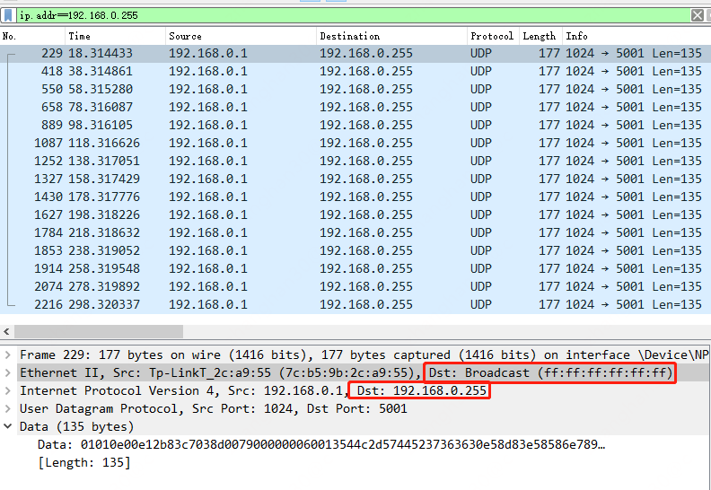
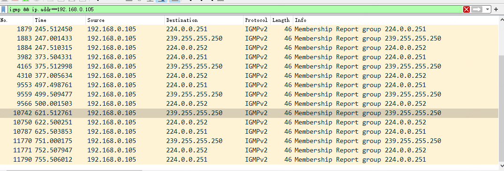

# vtep

云主机的二层报文从网卡上发出来需要进行封装，到了目标地址需要进行解封。这个封装和解封是谁负责呢？是vxlan的vtep负责

```plantuml
@startuml
!include  https://plantuml.s3.cn-north-1.jdcloud-oss.com/C4_Container.puml

Container(vm1, 10.0.0.2)
Container(vtep1, 192.168.1.5, vtep)
vm1 -d-> vtep1
Container(vm2, 10.0.0.3)
Container(vtep2, 192.168.1.6, vtep)
vm2 <-d- vtep2

vtep1 <-r-> vtep2
@enduml
```

10.0.0.2的包要发给10.0.0.3，是由192.168.1.5上的vtep程序封装为vxlan的包，然后将包发给192.168.1.6的vtep程序，由它解封后转给10.0.0.3

# vtep怎么彼此知道对方存在？

## 通过组播加入

和二层一样，三层也有单播和广播协议的存在。

* 单播就是1对1通信，个人计算机访问百度、阿里、腾讯、京东，都是知道了对方的ip地址后直接发包过去通信，形成和对方服务器的1对1通信。
* 广播就是对子网内的所有机器通信，ip地址分为网络号 + 主机号，如果目标地址的主机号的每一个bit都是1，那就是对这个子网进行广播。
  比如对192.168.0.0/24进行广播，目标ip就要是192.168.0.255，目标mac = ff:ff:ff:ff:ff:ff



上图就是我家的路由器在广播，虽然不知道它在广播什么鬼东西

在单播和广播之上，ip网络还有组播。这是因为广播首先很浪费带宽，有些机器并不想收到广播，但还是被迫收到了；其次有些机器并不在广播的子网里，如果他也想收到包咋弄，一个广播只在子网内有用。组播的意思是在ip网内选定一组机器，给这一组进行进行通信。

ipv4有专门的用于组播的ip地址段，

* 224.0.0.0～224.0.0.255为预留的组播地址（永久组地址），地址224.0.0.0保留不做分配，其它地址供路由协议使用
* 224.0.1.0～224.0.1.255是公用组播地址，可以用于Internet；
* 224.0.2.0～238.255.255.255为用户可用的组播地址（临时组地址），全网范围内有效；
* 239.0.0.0～239.255.255.255为本地管理组播地址，仅在特定的本地范围内有效

所以你可以理解为一个组播ip就是一个组的标号



比如这就是我的机器在对外组播(IGMP)，虽然也不知道这两个组是干嘛的


