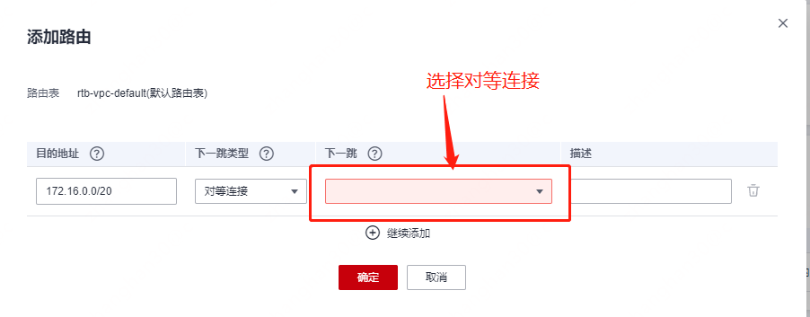

# 租户网络组网

## 租户网络

组网是一个租户用云的开始，他首先需要规划在云上需要多少个网络，每个网络的用途是什么。这个网络在云上通常称为vpc，是一个二层隔离域

```plantuml
@startuml
!include  https://plantuml.s3.cn-north-1.jdcloud-oss.com/C4_Container.puml

Boundary(vpc1, vpc-1, 172.16.0.0/20) {
    Boundary(subnet1, subnet-1, 172.16.0.0/24) {
        Container(172.16.0.1, 172.16.0.1, port)
    }
    Boundary(subnet2, subnet-2, 172.16.1.0/24) {
        Container(172.16.1.1, 172.16.1.1, port)
    }
    System(vrouter1, vr-1, router) #red
    
    vrouter1 <--> 172.16.0.1
    vrouter1 <--> 172.16.1.1
}
Boundary(vpc2, vpc-2, 172.16.16.0/20) {
    Boundary(subnet3, subnet-1, 172.16.16.0/24) {
        Container(172.16.16.1, 172.16.16.1, port)
    }
    Boundary(subnet4, subnet-2, 172.16.17.0/24) {
        Container(172.16.17.1, 172.16.17.1, port)
    }
    System(vrouter2, vr-2, router) #red
    vrouter2 <--> 172.16.16.1
    vrouter2 <--> 172.16.17.1
}

@enduml
```

如图所示，假设租户创建了2个vpc，并分别规划vpc的cidr为172.16.0.0/20和172.16.16.0/20。之后，他继续为每个vpc规划了2个子网。
创建完子网后，通常云会自动创建路由器将所有子网连接起来，并在每个子网中充当网关。

此时，租户完成了2个租户网络的创建，这两个网络中的云主机未来能够在子网间彼此通信，但是不具有出网能力。

## 创建云主机绑定浮动ip

现在租户开始创建第一台云主机，假设是个nginx，并购买了一个浮动ip: 6.6.6.6，此时的网络结构图变成

```plantuml
@startuml
!include  https://plantuml.s3.cn-north-1.jdcloud-oss.com/C4_Container.puml

System(6.6.6.6, 6.6.6.6, floating ip) #orange

Boundary(vpc1, vpc-1, 172.16.0.0/20) {
    Boundary(subnet1, subnet-1, 172.16.0.0/24) {
        Container(172.16.0.1, 172.16.0.1, port)
        Container(172.16.0.2, 172.16.0.2, vm-port) #green
        172.16.0.2 <-l->172.16.0.1
    }
    Boundary(subnet2, subnet-2, 172.16.1.0/24) {
        Container(172.16.1.1, 172.16.1.1, port)
    }
    System(vrouter1, vr-1, router) #red
    
    vrouter1 <--> 172.16.0.1
    vrouter1 <--> 172.16.1.1
    6.6.6.6 <-->vrouter1: nat 172.16.0.2 <-> 6.6.6.6
}
Boundary(vpc2, vpc-2, 172.16.16.0/20) {
    Boundary(subnet3, subnet-1, 172.16.16.0/24) {
        Container(172.16.16.1, 172.16.16.1, port)
    }
    Boundary(subnet4, subnet-2, 172.16.17.0/24) {
        Container(172.16.17.1, 172.16.17.1, port)
    }
    System(vrouter2, vr-2, router) #red
    vrouter2 <--> 172.16.16.1
    vrouter2 <--> 172.16.17.1
}

@enduml
```

创建的云主机ip是172.16.0.2，浮动ip"6.6.6.6"被绑定在vr-1上，并且配置了和172.16.0.2之间的snat以及dnat规则，使得172.16.0.2的所有出网数据路径为
"172.16.0.2 -> 172.16.0.1 -> snat -> 6.6.6.6"，外网通过6.6.6.6访问的路径为"6.6.6.6 -> dnat -> 172.16.0.1 -> 172.16.0.2"。
通过这个配置，使得172.16.0.2能够使用6.6.6.6出网，外部也能使用6.6.6.6访问到172.16.0.2

## 创建后台服务器并配置出网独立带宽

现在租户开始配置web应用服务器2台并打算使用一个独立的带宽来为这两台服务器出网进行服务。
这种行为非常正常，因为6.6.6.6被视作业务系统的入口，专门为c端用户访问准备的，最好不要混杂其它网络流量。

```plantuml
@startuml
!include  https://plantuml.s3.cn-north-1.jdcloud-oss.com/C4_Container.puml

System(6.6.6.6, 6.6.6.6, floating ip) #orange
System(7.7.7.7, 7.7.7.7, floating ip) #orange

Boundary(vpc1, vpc-1, 172.16.0.0/20) {
    Boundary(subnet1, subnet-1, 172.16.0.0/24) {
        Container(172.16.0.1, 172.16.0.1, port)
        Container(172.16.0.2, 172.16.0.2, vm-port) #green
        172.16.0.2 <-l->172.16.0.1
    }
    Boundary(subnet2, subnet-2, 172.16.1.0/24) {
        Container(172.16.1.1, 172.16.1.1, port)
        Container(172.16.1.2, 172.16.1.2, vm-port) #green
        Container(172.16.1.3, 172.16.1.3, vm-port) #green
        
        172.16.1.1 <--> 172.16.1.2
        172.16.1.1 <--> 172.16.1.3
    }
    System(vrouter1, vr-1, router) #red
    
    vrouter1 <--> 172.16.0.1
    vrouter1 <--> 172.16.1.1
    6.6.6.6 <-->vrouter1: nat 172.16.0.2 <-> 6.6.6.6
    7.7.7.7 <-->vrouter1: snat 172.16.1.0/24 <-> 7.7.7.7
}
Boundary(vpc2, vpc-2, 172.16.16.0/20) {
    Boundary(subnet3, subnet-1, 172.16.16.0/24) {
        Container(172.16.16.1, 172.16.16.1, port)
    }
    Boundary(subnet4, subnet-2, 172.16.17.0/24) {
        Container(172.16.17.1, 172.16.17.1, port)
    }
    System(vrouter2, vr-2, router) #red
    vrouter2 <--> 172.16.16.1
    vrouter2 <--> 172.16.17.1
}

@enduml
```

两台后台服务器分别是172.16.1.2和172.16.1.3。租户在nginx上完成反向代理，使得172.16.0.2和他们之间的网络路径是
"172.16.0.2 <-> 172.16.0.1 <-> 172.16.1.1 <-> 172.16.1.2(3)"。
随后，在vr1上继续添加snat规则，172.16.1.0/24 -> 7.7.7.7，从而实现172.16.1.0/24整个子网都能通过7.7.7.7上网

## 在vpc-2部署一些企业内部管理应用

租户打算在vpc-2上部署一些企业员工使用的应用，比如在线文档，并希望员工播VPN才能访问，于是购买一个新的浮动ip 9.9.9.9

```plantuml
@startuml
!include  https://plantuml.s3.cn-north-1.jdcloud-oss.com/C4_Container.puml

System(6.6.6.6, 6.6.6.6, floating ip) #orange
System(7.7.7.7, 7.7.7.7, floating ip) #orange
System(9.9.9.9, 9.9.9.9, floating ip) #orange
Person(用户, 用户)
Boundary(vpc1, vpc-1, 172.16.0.0/20) {
    Boundary(subnet1, subnet-1, 172.16.0.0/24) {
        Container(172.16.0.1, 172.16.0.1, port)
        Container(172.16.0.2, 172.16.0.2, vm-port) #green
        172.16.0.2 <-l->172.16.0.1
    }
    Boundary(subnet2, subnet-2, 172.16.1.0/24) {
        Container(172.16.1.1, 172.16.1.1, port)
        Container(172.16.1.2, 172.16.1.2, vm-port) #green
        Container(172.16.1.3, 172.16.1.3, vm-port) #green
        
        172.16.1.1 <--> 172.16.1.2
        172.16.1.1 <--> 172.16.1.3
    }
    System(vrouter1, vr-1, router) #red
    
    vrouter1 <--> 172.16.0.1
    vrouter1 <--> 172.16.1.1
    6.6.6.6 <-->vrouter1: nat 172.16.0.2 <-> 6.6.6.6
    7.7.7.7 <-->vrouter1: snat 172.16.1.0/24 <-> 7.7.7.7
}
用户 <-r-> 6.6.6.6
Person(员工, 员工)
Boundary(vpc2, vpc-2, 172.16.16.0/20) {
    Boundary(subnet3, subnet-1, 172.16.16.0/24) {
        Container(172.16.16.1, 172.16.16.1, port)
        Container(172.16.16.2, 172.16.16.2, vm-port) #green
        
        172.16.16.2<-r->172.16.16.1
    }
    Boundary(subnet4, subnet-2, 172.16.17.0/24) {
        Container(172.16.17.1, 172.16.17.1, port)
        Container(172.16.17.2, 172.16.17.2, vm-port) #green
        172.16.17.2<-l->172.16.17.1
    }
    System(vrouter2, vr-2, router) #red
    vrouter2 <--> 172.16.16.1
    vrouter2 <--> 172.16.17.1
    9.9.9.9 <-->vrouter2: nat 172.16.16.2 <-> 9.9.9.9
}

员工 <-l-> 9.9.9.9
@enduml
```

9.9.9.9作为浮动ip挂在了vr2上，映射到了172.16.16.2这台云主机。租户在这台云主机上安装vpn软件，并且把172.16.1.3-172.16.1.254当做可用ip分配给了vpn，于是整个vpc-2的subnet-1就不能再建云主机了，否则ip地址和vpn的范围可能冲突。
租户选择把在线文档系统部署在172.16.17.2上。员工vpn拨入后的访问路径就是
"172.16.16.x <-> 172.16.16.1 <-> 172.16.17.1 <-> 172.16.17.2"

## 希望在vpc-2部署堡垒机用来运维vpc-1内的云主机

租户觉得每次运维vpc-1内的机器总需要`ssh root@6.6.6.6`
也不是个事，毕竟6.6.6.6对应的服务器是个nginx，本身就部署有很多关键的转发规则。如果每次运维vpc-1内的机器都得从6.6.6.6进去，玩意哪一天谁把nginx搞挂了就麻烦了。
于是他就希望在vpc-2内弄一个堡垒机，员工播vpn上来后再通过堡垒机访问vpc-1

```plantuml
@startuml
!include  https://plantuml.s3.cn-north-1.jdcloud-oss.com/C4_Container.puml

System(6.6.6.6, 6.6.6.6, floating ip) #orange
System(7.7.7.7, 7.7.7.7, floating ip) #orange
System(9.9.9.9, 9.9.9.9, floating ip) #orange
Person(用户, 用户)
Boundary(vpc1, vpc-1, 172.16.0.0/20) {
    Boundary(subnet1, subnet-1, 172.16.0.0/24) {
        Container(172.16.0.1, 172.16.0.1, port)
        Container(172.16.0.2, 172.16.0.2, vm-port) #green
        172.16.0.2 <-l->172.16.0.1
    }
    Boundary(subnet2, subnet-2, 172.16.1.0/24) {
        Container(172.16.1.1, 172.16.1.1, port)
        Container(172.16.1.2, 172.16.1.2, vm-port) #green
        Container(172.16.1.3, 172.16.1.3, vm-port) #green
        
        172.16.1.1 <--> 172.16.1.2
        172.16.1.1 <--> 172.16.1.3
    }
    System(vrouter1, vr-1, router) #red
    
    vrouter1 <--> 172.16.0.1
    vrouter1 <--> 172.16.1.1
    6.6.6.6 <-->vrouter1: nat 172.16.0.2 <-> 6.6.6.6
    7.7.7.7 <-->vrouter1: snat 172.16.1.0/24 <-> 7.7.7.7
}
用户 <-r-> 6.6.6.6
Person(员工, 员工)
Boundary(vpc2, vpc-2, 172.16.16.0/20) {
    Boundary(subnet3, subnet-1, 172.16.16.0/24) {
        Container(172.16.16.1, 172.16.16.1, port)
        Container(172.16.16.2, 172.16.16.2, vm-port) #green
        172.16.16.2<-r->172.16.16.1
    }
    Boundary(subnet4, subnet-2, 172.16.17.0/24) {
        Container(172.16.17.1, 172.16.17.1, port)
        Container(172.16.17.2, 172.16.17.2, vm-port) #green
        Container(172.16.17.3, 172.16.17.3, vm-port) #pink
        172.16.17.2<-l->172.16.17.1
        172.16.17.3<-r->172.16.17.1
    }
    System(vrouter2, vr-2, router) #red
    vrouter2 <--> 172.16.16.1
    vrouter2 <--> 172.16.17.1
    9.9.9.9 <-->vrouter2: nat 172.16.16.2 <-> 9.9.9.9
}

员工 <-l-> 9.9.9.9
@enduml
```

于是他建了一个新的虚拟机172.16.17.3，并需要使用vpc对等连接将vpc-1和vpc-2连接到一起。

## vpc对等连接

从之前的图上都不难发现，vpc-1和vpc-2的两个路由之间没有"线路"，彼此是隔离的，需要有一条线路他们连在一起。
这条线路不能使用挂载在他们上的互联网浮动ip，因为浮动ip有可能随时会被租户释放。

```plantuml
@startuml
!include  https://plantuml.s3.cn-north-1.jdcloud-oss.com/C4_Container.puml

System(6.6.6.6, 6.6.6.6, floating ip) #orange
System(7.7.7.7, 7.7.7.7, floating ip) #orange
System(9.9.9.9, 9.9.9.9, floating ip) #orange
Person(用户, 用户)
Person(员工, 员工)
Boundary(云内, 云内) {
    Boundary(vpc1, vpc-1, 172.16.0.0/20) {
        Boundary(subnet1, subnet-1, 172.16.0.0/24) {
            Container(172.16.0.1, 172.16.0.1, port)
            Container(172.16.0.2, 172.16.0.2, vm-port) #green
            172.16.0.2 <-l->172.16.0.1
        }
        Boundary(subnet2, subnet-2, 172.16.1.0/24) {
            Container(172.16.1.1, 172.16.1.1, port)
            Container(172.16.1.2, 172.16.1.2, vm-port) #green
            Container(172.16.1.3, 172.16.1.3, vm-port) #green
            
            172.16.1.1 <--> 172.16.1.2
            172.16.1.1 <--> 172.16.1.3
        }
        System(vrouter1, vr-1, router) #red
        
        vrouter1 <--> 172.16.0.1
        vrouter1 <--> 172.16.1.1
        6.6.6.6 <-->vrouter1: nat 172.16.0.2 <-> 6.6.6.6
        7.7.7.7 <-->vrouter1: snat 172.16.1.0/24 <-> 7.7.7.7
    }
    用户 <-r-> 6.6.6.6
    
    Boundary(vpc2, vpc-2, 172.16.16.0/20) {
        Boundary(subnet3, subnet-1, 172.16.16.0/24) {
            Container(172.16.16.1, 172.16.16.1, port)
            Container(172.16.16.2, 172.16.16.2, vm-port) #green
            172.16.16.2<-r->172.16.16.1
        }
        Boundary(subnet4, subnet-2, 172.16.17.0/24) {
            Container(172.16.17.1, 172.16.17.1, port)
            Container(172.16.17.2, 172.16.17.2, vm-port) #green
            Container(172.16.17.3, 172.16.17.3, vm-port) #pink
            172.16.17.2<-l->172.16.17.1
            172.16.17.3<-r->172.16.17.1
        }
        System(vrouter2, vr-2, router) #red
        vrouter2 <--> 172.16.16.1
        vrouter2 <--> 172.16.17.1
        9.9.9.9 <-->vrouter2: nat 172.16.16.2 <-> 9.9.9.9
    }
    
    员工 <-l-> 9.9.9.9
    
    Boundary(虚拟互联网, 云内公共网络, 100.64.0.0/10) {
        Container(100.64.0.2, 100.64.0.2, port)
        Container(100.64.0.3, 100.64.0.3, port)
        vrouter1 <-u-> 100.64.0.2
        vrouter2 <-u-> 100.64.0.3
        100.64.0.2 <-l-> 100.64.0.3
    }
}
@enduml
```

常见的做法是把路由器连到一个公共网络，这个网络首先肯定是一个新的二层广播域，ip地址使用100.64.0.0/10。于是两个vpc的路由器彼此通过这个新的公共网络进行了连接。
对等连接被建立，数据记录为"vr-1 <-> vr-2"。

现在梳理一下vpc-2用vpc播进来的员工如何用172.16.17.3管理171.16.0.0/24和171.16.1.0/24两个网段下的机器，不妨假设在在172.16.17.3上使用`ssh root@172.16.0.2`

* 172.16.17.3 -> 172.16.0.2: 查表走默认路由即网关172.16.17.1

```json
{
  "eth": {
    "src_mac": "mac of 172.16.17.3",
    "dst_mac": "mac of 172.16.17.1"
  },
  "ip": {
    "src": "172.16.17.3",
    "dst": "172.16.0.2"
  }
}
```

包从二层转交给了网关(172.16.17.1)，然后就结束了。
因为vr-2(172.16.17.1)中没有路由说明172.16.0.2要转交给100.64.0.2，
而是基于默认路由规则给了vr自己的网关，这个网关必然不会是100.64.0.2。于是租户还得配置对等连接的路由:

* 172.16.0.0/20 -> 100.64.0.2(配成对端路由的公共网络ip)

路由的配置是双向的，租户还得在vpc-1上配置回包路径

* 172.16.17.3 -> 100.64.0.3

配置完成后，包的路径为

* 172.16.17.3 -> 172.16.0.2: 查表走默认路由即网关172.16.17.1

```json
{
  "eth": {
    "src_mac": "mac of 172.16.17.3",
    "dst_mac": "mac of 172.16.17.1"
  },
  "ip": {
    "src": "172.16.17.3",
    "dst": "172.16.0.2"
  }
}
```

* vr-2查路由表: 172.16.0.0/20 -> 100.64.0.2，再查路由表 100.64.0.0/10 ->
  100.64.0.3，于是通过100.64.0.3这个接口转发ip包

```json
{
  "eth": {
    "src_mac": "mac of 100.64.0.3",
    "dst_mac": "mac of 100.64.0.2"
  },
  "ip": {
    "src": "172.16.17.3",
    "dst": "172.16.0.2"
  }
}
```

* vr-1收到包后看到的目标地址是172.16.0.2，查路由表得 172.16.0.0/24 -> 172.16.0.1，于是

```json
{
  "eth": {
    "src_mac": "mac of 172.16.0.1",
    "dst_mac": "mac of 172.16.0.2"
  },
  "ip": {
    "src": "172.16.17.3",
    "dst": "172.16.0.2"
  }
}
```

数据从vcc-2的二层递给vr-2，vr-2在通过公共网络的二层递给vr-1，vr-1最后用vpc-1的二层发给172.16.0.2，回包路径就不再赘述，可自行推演。

特别注意，因为回包只配了"172.16.17.3 -> 100.64.0.3"
，因此从172.16.17.x网段的别的机器上过来的包，因为回包时没有路由而在vr-1上直接转给了默认网关，这个默认网关肯定不会是100.64.0.3，默认网关也肯定没有下一跳路由于是就给丢了。
所以实现了租户的预期，只能通过172.16.17.3来作为堡垒机访问vpc-1。
配好了之后，租户给6.6.6.6这个ip加了一个防火墙规则: "6.6.6.6:22 inbound/outbound drop"，从而避免了外面的闲人没事干暴破6.6.6.6的登录密码。

当然，实际的配置过程不可能让租户知道公共网络的存在，一切都是通过界面点击完成的



# 总结

租户在云上组网要从vpc开始；vpc是一个隔离二层网络，有独立的vni号(如果二层模型使用的是vxlan)，
租户在vpc内划分子网，这些子网默认都会被路由连接起来从而彼此之间能通信；浮动ip是落在路由上的，通过dnat转换给指定的vm；
如果vm要出网，则浮动ip绑给路由后需要基于这个浮动ip设置snat规则，在使用体验上就是选一个浮动ip，
然后再设置snat规则(当然，为了转发高效，通常会使用单独的虚拟设备来做nat网关而不是什么都加到路由上)；
路由创建后通常会选择加入一个公共网络，这个网络的ip是100.64.0.0/10，被称为Carrier-Grade Nat；
当两个vpc之间要通信时，需要进行vpc对等连接然后两边配置路由策略进行转发，这也就意味着2个vpc的网段不能有重叠。
