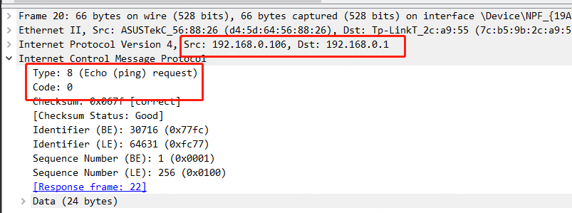
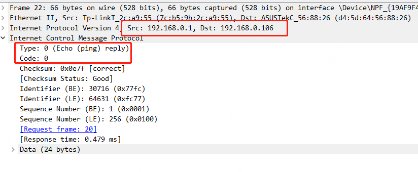
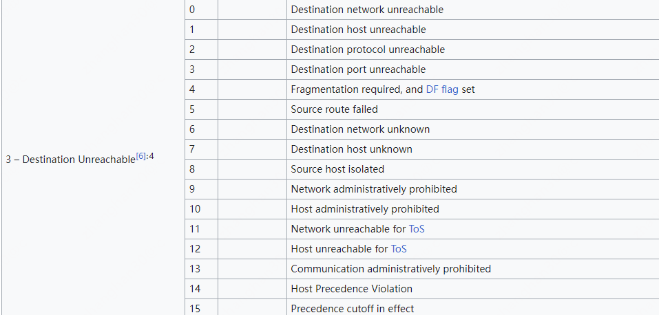
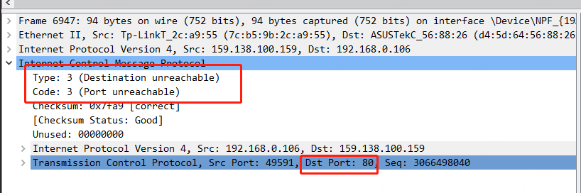
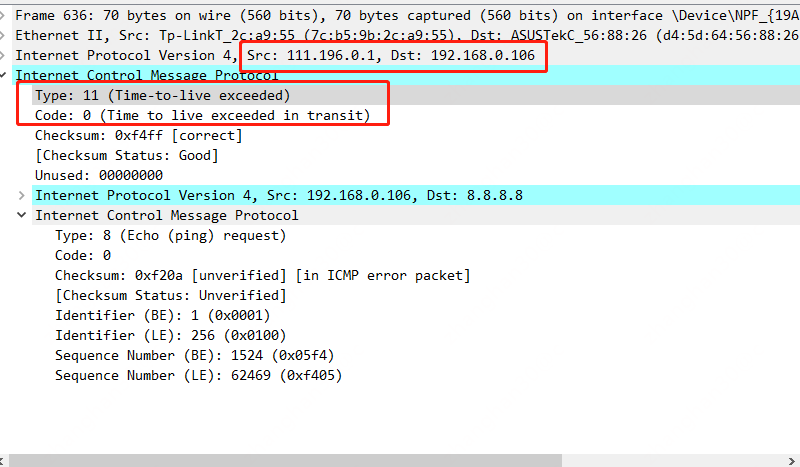

# ping & icmp

ping是常见的指令，它能检测目标主机是不是存在。支持ping指令工作的网络协议是icmp协议。
icmp是以ip协议为基础的网络层协议，可以认为它位于ip协议的上层，但不是传输层协议。

# icmp的类型

icmp的功能可不止检查主机是否存在，它的数据格式为


其中第一个字节是功能类型，第二个字节是在不同功能类型下的状态编码。下面来看几个主要类型

## ping请求(type = 8 & code =0)

ping指令使用icmp发送类型=8，编码为0的请求，该请求为"请求回显（ping请求）"



上图是我本机ping网关的数据包

## ping请求回复(type = 0 & code = 0)



如果被ping的主机存在，它会回答ping请求，回答时type = 0, code = 0

## 目标不可达(type =3)

ping请求通常会有几种状态，一种是没人响应、一种是目标不可达(type = 3)，目标不可达的具体原因由code进行描述



常见的有

* 0 = 目标网络不可达，意味着传输过程中有个路由器没有到达目标子网的任何路由
* 1 = 目标主机不可达，意味着目标子网的路由不知道怎么投递数据或主机已经掉线
* 2 = 目标协议不可达，意味着目标主机解析了ip头的协议类型部分，然后没有找到能够处理这种协议类型的上层协议栈
* 3 = 目标端口不可达，意味着目标主机解析了传输层的端口号，然后没有找到能处理这个端口号的程序(或者通过iptables进行了配置)

```shell
iptables -t filter -A INPUT -p tcp -m tcp --dport 80 -j REJECT
```



* 4 = 传输要求部分片，但是必须要分片
* 7 = 目标主机未知，可能是目标子网路由器内进行arp但是没有应答
* 9 & 10 = 源主机被目标端禁止进行icmp

## 进行路由追踪(type = 11)

icmp的类型11代表ttl已经耗尽



## 进行路由器发现(type = 9 & type = 10)

参考
[[https://en.wikipedia.org/wiki/ICMP_Router_Discovery_Protocol](https://en.wikipedia.org/wiki/ICMP_Router_Discovery_Protocol)]
的介绍，
这个类型主要是给主机用来发现周边路由器的。主机启动后使用type = 10进行组播(224.0.0.2)或广播，
然后周边路由器使用type = 9进行应答。这个功能平时很少用，这个协议也不是路由器之间交换网络路径的协议。

```text
When a host boots up, it sends solicitation messages to IP multicast address 224.0.0.2
In response, one or more routers may send advertisement messages
```

# igmp

## 组

igmp是组管理协议。它可以被主机用来声明加入一个组或者离开一个组。
组是网络上的一个概念，在组出现前，网络通信或者点到点，或者进行全网络广播。
全网络广播使得相当多的，并不想收到消息的主机收到网络数据，同时也很难控制广播的范围。
由此，网络上的计算机就可以通过igmp声明进入一个组，这个组具有特定的业务含义。
比如vxlan的vtep就可以通过将组的id和vni号进行对应来声明自己负责的vni清单。
如果网络上对应的组id有其它成员，那么同一组的所有vtep就彼此知晓了对方的存在，从而可以在后续的包封装和解封时进行点对点通信
(当然这并不是什么推荐的方法)

## 广播地址 & 组播地址

在ip地址的主机号部分，每一位都是1的ip是子网的广播ip。
比如192.168.0.0/24中的192.168.0.255就是广播ip。
所有位都是1的是全网广播ip(255.255.255.255)。
dhcp协议使用了全网广播地址作为ip地址分配请求的目标地址，这是因为它也不知道自己属于什么子网，因此没有办法预先填写网络号。

组播地址和广播地址不同，组没有子网的概念，它的ip地址段为"224.0.0.0"-"239.255.255.255"，其中224.0.0.0-224.0.0.255是保留的。
组播ip的后23位是组号，也就是组id。因此每一个组播ip代表一个组。

## 广播数据 & 组播数据在路由器上的转发

路由器是3层交换设备，类似于2层网络的交换机。交换机通过mac地址学习来实现2层网络源网卡到目标网卡的单播。
当mac地址ff:ff:ff:ff:ff:ff的广播数据到来时交换机向所有端口转发。
路由器也如此，它有若干的接口联入若干个子网。当子网和子网之间的单播/广播数据通信时，它查路由表进行转发。
当组播数据到达时，因为它无法预期组播目标具体在哪个子网里，因此会进行所有端口的数据转发
(当然实际中有各种各样的算法来降低全端口转发的成本)。
由于广播和组播会对网络造成不同程度的流量压力，因此路由器通常会提供开启/关闭3层网络广播/组播的能力。

## igmp协议

在理解了组播地址和组的前提下，就很好理解igmp协议。它就是用来给主机声明加入某个组或者离开某个组用的，它一共有v1、v2、v3，3个版本。

* v1没有离开组的通知，如果一个组员离开了，它是不会主动发送任何通知的，其它组成员不得不通过超时时间或心跳之类的来自行管理组员的生命周期
* v2增加了离开组的消息等功能
* v3增加过滤某些组员消息等功能

它的核心就是声明我要加入组和我要离开组以及维护组成会员

## 组播的主要用途

通过组播地址可以完成对多个特定主机的单一数据包通信没，这种技术广泛的应用在ip广播，企业内部视频推送等场景。
比如下图

```plantuml
@startuml
!include  https://plantuml.s3.cn-north-1.jdcloud-oss.com/C4_Container.puml

Boundary(儿童娱乐区, 儿童娱乐区, "组播id=1") {
    System(广播音箱1, 广播音箱, 草丛内植物造型广播音箱)
    System(广播音箱2, 广播音箱, 动物造型广播音箱)
}
Boundary(泳池, 泳池, "组播id=2") {
    System(立柱音箱1, 广播音箱, 立柱音箱)
    System(立柱音箱2, 广播音箱, 立柱音箱)
}
@enduml
```

某游乐园内的广播设施按照如此分组，那么当需要在儿童娱乐区广播时，则将采集到的声音讯号使用udp协议+广播ip组在网络内进行发送。
通过识别广播组的id，儿童娱乐区的音箱收到udp数据并将讯号在喇叭上发声: "请各位家长看管好你家熊孩子，不要践踏草坪"

在此注意，组播的传输层基本会使用udp协议，这是因为通讯不是点对点的，接收方首先不确定存在，且也不会像tcp协议这样进行应答。
因此组播应用通常必须容忍数据的丢失。

# 总结

icmp有多种类型和编码，可用于除去ping之外的很多中用途；
网络上的主机可以通过组播ip加入一个特定的组，igmp用于组成员进行加入组和离开组的宣告；
组播地址没有子网的概念，大量与广播和视频推送有关的应用使用udp+组播ip实现单个数据包推送内容给多个目的源

# 进一步阅读

[路由协议介绍](..%2F%E8%B7%AF%E7%94%B1%E5%8D%8F%E8%AE%AE%E4%BB%8B%E7%BB%8D)