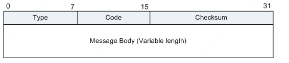

# ping & icmp

ping是常见的指令，它能检测目标主机是不是存在。支持ping指令工作的网络协议是icmp协议。
icmp是以ip协议为基础的网络层协议，可以认为它位于ip协议的上层，但不是传输层协议。

# icmp的类型

icmp的功能可不止检查主机是否存在，它的数据格式为



其中第一个字节是功能类型，第二个字节是在不同功能类型下的状态编码。下面来看几个主要类型

## ping请求(type = 8 & code =0)

ping指令使用icmp发送类型=8，编码为0的请求，该请求为"请求回显（ping请求）"


上图是我本机ping网关的数据包

## ping请求回复(type = 0 & code = 0)


如果被ping的主机存在，它会回答ping请求，回答时type = 0, code = 0

## 目标不可达(type =3)

ping请求通常会有几种状态，一种是没人响应、一种是目标不可达(type = 3)，目标不可达的具体原因由code进行描述


常见的有

* 0 = 目标网络不可达，意味着传输过程中有个路由器没有到达目标子网的任何路由
* 1 = 目标主机不可达，意味着目标子网的路由不知道怎么投递数据或主机已经掉线
* 2 = 目标协议不可达，意味着目标主机解析了ip头的协议类型部分，然后没有找到能够处理这种协议类型的上层协议栈
* 3 = 目标端口不可达，意味着目标主机解析了传输层的端口号，然后没有找到能处理这个端口号的程序(或者通过iptables进行了配置)

```shell
iptables -t filter -A INPUT -p tcp -m tcp --dport 80 -j REJECT
```


* 4 = 传输要求部分片，但是必须要分片
* 7 = 目标主机未知，可能是目标子网路由器内进行arp但是没有应答
* 9 & 10 = 源主机被目标端禁止进行icmp

## 进行路由追踪(type = 11)

icmp的类型11代表ttl已经耗尽


## 进行路由器发现(type = 9 & type = 10)

参考
[[https://en.wikipedia.org/wiki/ICMP_Router_Discovery_Protocol](https://en.wikipedia.org/wiki/ICMP_Router_Discovery_Protocol)]
的介绍，
这个类型主要是给主机用来发现周边路由器的。主机启动后使用type = 10进行组播(224.0.0.2)或广播，
然后周边路由器使用type = 9进行应答。这个功能平时很少用，这个协议也不是路由器之间交换网络路径的协议。

```text
When a host boots up, it sends solicitation messages to IP multicast address 224.0.0.2
In response, one or more routers may send advertisement messages
```
