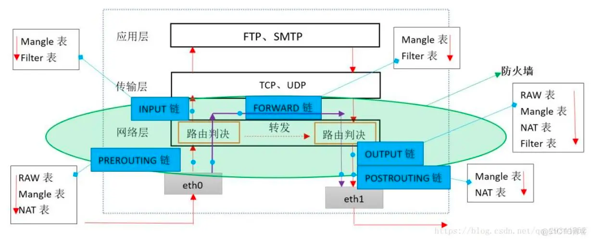

# 简介

iptables是一个用于包过滤和转发的软件，基本所有linux操作系统都支持iptables。

# 核心机制

iptables的核心机制就是基于链(chain)和表(table)对网络数据包进行操作。一共有4个表，5个链

5个链卡在数据传输的5个阶段

* PREROUTING: 指包还没有基于目标地址解析
* INPUT: 指包经过解析后发现目标ip是给自己的
  (所以可见dnat规则要放在PREROUTING链，否则会被认为是发给当前主机的进入INPUT链)
* FORWARD: 指包经过解析后发现是另一个子网的ip，要自己基于路由规则转发(需要打开转发)
* OUTPUT: 指包由本机发出或者是转发的
* POSTROUTING: 已经经过路由决策准备发回去，(可见比如SNAT等机制要放在这里处理，否则源地址不会被改变)

4张表用来做不用的事

