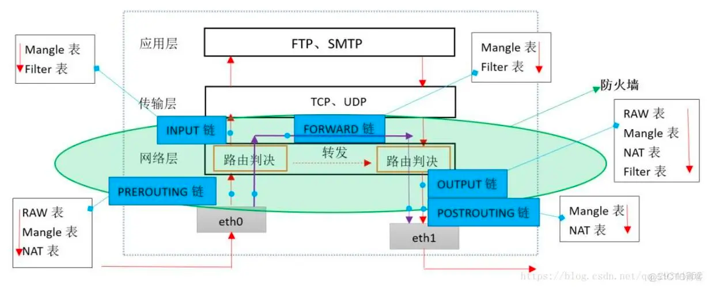

# 简介

iptables是一个用于包过滤和转发的软件，基本所有linux操作系统都支持iptables。

# 核心机制

iptables的核心机制就是基于链(chain)和表(table)对网络数据包进行操作。一共有4个表，5个链



5个链卡在数据传输的5个阶段

* PREROUTING: 指包还没有基于目标地址解析
* INPUT: 指包经过解析后发现目标ip是给自己的
  (所以可见dnat规则要放在PREROUTING链，否则会被认为是发给当前主机的进入INPUT链)
* FORWARD: 指包经过解析后发现是另一个子网的ip，要自己基于路由规则转发(需要打开转发)
* OUTPUT: 指包由本机发出或者是转发的
* POSTROUTING: 已经经过路由决策准备发回去，(可见比如SNAT等机制要放在这里处理，否则源地址不会被改变)

4张表用来做不同的事

# RAW表

这张表主要用来表达哪些数据包不进行ip_conntrack的追踪且要求跳过nat规则。

比如说

```plantuml
@startuml
!include  https://plantuml.s3.cn-north-1.jdcloud-oss.com/C4_Container.puml

Boundary(子网1, 子网, 192.168.0.0/24) {
    System(主机1, 192.168.0.108) #red
}
Boundary(子网2, 子网, 192.168.1.0/24) {
    System(主机2, 192.168.1.100) #orange
   
}
System(nat, nat)

主机1 <-u-> nat
主机2 <-u-> nat

@enduml
```

192.168.0.0/24和192.168.1.0/24都接入了nat网关，并希望使用nat网关上的互联网地址访问外网。那么常规上来说nat网关就需要配置2个子网的snat规则

```shell
ipables -t nat -A POSTROUTING -j SNAT -s 192.168.0.0/24 --to-source x.x.x.x
ipables -t nat -A POSTROUTING -j SNAT -s 192.168.1.0/24 --to-source x.x.x.x

```

但这样的配置方法就有一个问题: 两个子网间进行互相访问时看到的源地址为"x.x.x.x"。
于是，为了防止子网间的互相访问被nat规则进行干扰，需要在raw表加入规则

```shell
ipables -t raw -A PREROUTING -j NOTRACK -s 192.168.0.0/24
ipables -t nat -A PREROUTING -j NOTRACK -s 192.168.1.0/24
```

这样，首先让两个子网之间不再进行ip_conntrack；其次，raw表规则命中会使得数据包不经过nat表，从而避免了源地址被转换。

# MANGLE表

这张表主要用来修改数据包的TOS标志位和做一些数据包标记，这些数据包的标记将可以在后续比如路由(ip route指令相关)时使用。
需要注意的，mangle表打的标记只有iproute2的工具组件能够识别。net-tools的工具组件因为不使用netlink接口所以不能支持。

下面举一个例子

```plantuml
@startuml
!include  https://plantuml.s3.cn-north-1.jdcloud-oss.com/C4_Container.puml

Boundary(子网1, 子网, 192.168.0.0/24) {
    System(主机1, 192.168.0.108) #red
}
Boundary(子网2, 子网, 192.168.1.0/24) {
    System(主机2, 192.168.1.100) #orange
   
}
System(网关, 网关)
Boundary(子网3, 子网, 10.0.0.0/24) {
    System(10.0.0.1, 10.0.0.1, 联通线路)
}
Boundary(子网4, 子网, 10.1.0.0/24) {
    System(10.1.0.1, 10.1.0.1, 电信线路)
}

主机1 <-u-> 网关
主机2 <-u-> 网关

网关 <-u-> 10.0.0.1
网关 <-u-> 10.1.0.1

@enduml
```

假设要对两个网络(192.168.0.0/24和192.168.1.0/24)
执行策略路由，从192.168.0.0/24发出的数据包走联通线路，从192.168.1.0/24发出的数据包走电信线路。那么就需要在网关上操作mangle表进行打标

```shell
iptable -t mangle -A PREROUTING -j MARK -s 192.168.0.0/24 --set-mark 1
iptable -t mangle -A PREROUTING -j MARK -s 192.168.1.0/24 --set-mark 2

```

该指令将来自不同子网的数据包进行标记，分别标记为1和2，其中PREROUTING的意思是在数据包路由之前，这是显而易见的，否则还怎么进行策略路由。

随后还要使用`ip route`指令(注意不是`route`指令)添加路由规则

```shell
ip route add default via 10.0.0.1 table 10
ip route add default via 10.1.0.1 table 20

ip rule add from all fwmark 1 table 10
ip rule add from all fwmark 2 table 10
```

上面的两个指令添加2个默认路由，并分别新建2个路由表，然后指定匹配了iptables标签1的走10.0.0.1，匹配了2的走10.1.0.1

# NAT表

顾名思义，做nat地址转换用的表，通常用于记录snat和dnat规则。

```plantuml
@startuml
!include  https://plantuml.s3.cn-north-1.jdcloud-oss.com/C4_Container.puml

Boundary(子网1, 子网, 192.168.0.0/24) {
    System(主机1, 192.168.0.108) #red
}
Boundary(子网2, 子网, 192.168.1.0/24) {
    System(主机2, 192.168.1.100) #orange
   
}
System(网关, 网关)
Boundary(子网3, 子网, 10.0.0.0/24) {
    System(10.0.0.1, 10.0.0.1, 联通线路)
}
Boundary(子网4, 子网, 10.1.0.0/24) {
    System(10.1.0.1, 10.1.0.1, 电信线路)
}

主机1 <-u-> 网关
主机2 <-u-> 网关

网关 <-u-> 10.0.0.1
网关 <-u-> 10.1.0.1

@enduml
```

同样使用这张图，假设10.0.0.1和10.1.0.1都需要对网络访问进行snat，这样使得两个192子网的主机能够上网

```shell
iptables -t nat -A POSTROUTING -j SNAT -s 192.168.0.0/16 --to-source x.x.x.x
```

在指令中，将整个192.168.0.0/16子网的规则进行了定义。

# FILTER表

做包过滤规则的表，常见的防火墙acl规则都是现在这个表里。例如要丢弃所有来自192.168.0.0/16的包

```shell
iptables -t filter -A INPUT 192.168.0.0/16 -j DROP
iptables -t filter -A FOWARD 192.168.0.0/16 -j DROP

```

这样无论是192.168.0.0/16子网的主机给当前主机发包，还是当前主机作为网关转包，都会将数据丢弃

# 表优先级

raw—>mangle—>nat—>filter

# 总结

iptables定义了一系列包接收和转发的规则，它具有5个链和4张表；
raw表用于决定哪些包不会使用nat规则，mangle表可以用来给包打标从而使得所有基于iproute2组件的工具能够利用这些标记，
nat表记录地址转换规则，filter表记录包规律规则；优先级上，raw—>mangle—>nat—>filter 

# 下一步阅读

[icmp & igmp简介](..%2Ficmp%20%26%20igmp%E7%AE%80%E4%BB%8B)
