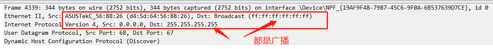
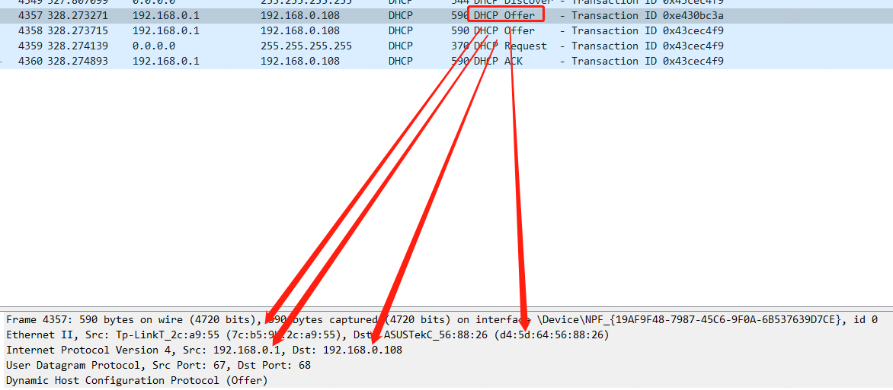
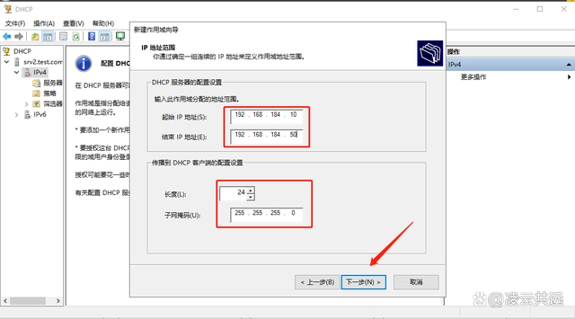

# ip地址动态获取

主机需要配置ip地址才能在三层网络中通信，在一个企业内部，ip地址的使用和分配经常是受到严格管理的，否则就会发生ip地址冲突的情况。ip地址冲突是指网路中发现同一个ip对应了多个不同的mac(
二层网络地址)，导致数据包不清楚应当向谁发送。

管理ip地址的方式有几种

* 弄个表格记录ip的分配(静态分配)
* 弄个服务自动在一个池子中分配ip(dhcp)

# 静态分配 vs 动态分配

静态分配是指由人工分配ip地址，每个主机到分配者那去领用一个可用ip，在主机退网之后再把分配的ip还给分配者。这种适用于小型的公司或企业，个人办公电脑和服务是长时间在这个公司内使用的。
但是如果你去咖啡厅要问服务员说：麻烦您给我分个ip，会不会是一种很好的体验？因此这时候需要动态的地址分配，当连上一个网络后，连网主机主动申请获取ip地址。能够实现动态ip分配的服务是dhcp服务。

# dhcp

首先需要注意的是，dhcp是一个应用层服务，它的数据要使用到udp协议。

上图是一个捕捉到dhcp请求数据，它的二层目标地址采用广播，ip地址源为0.0.0.0(因为请求主机此刻根本不知道自己的ip是什么)
，目标端为255.255.255.255(请求主机也不知道自己应当向哪个网段去广播，因此选择了全网广播)

dhcp服务器收到这个请求后回复响应，告知请求的主机被分配的ip是什么

这时可见回包的目标ip已经是决定分给请求主机的ip。ip被分配后有租期，租期到之前被分配的主机要续租，否则这个ip
dhcp就有可能分给别人。由此可见,咖啡厅什么的租期最好不太长，否则人来人往，租期又长，过一会ip地址池就耗尽了。
dhcp能够分配的ip是由管理员人工输入的，他们通常会从企业的可用ip地址段中切出来一个网段给dhcp，否则还要记得哪个网段的哪些ip分配给dhcp，很麻烦

# 总结

ip地址可以由dhcp动态分配；其机制是在三层和二层都进行全网广播，既然是全网广播，那么二层广播域内的所有主机都能收到广播；收到广播后，非dhcp服务器会因为应用层没有查程序处理对应的数据包都丢弃，dhcp服务器会给请求者分配ip；
分配的ip有租期，租期到后要向dhcp服务器续租，否则这个ip就会被dhcp分配给别人