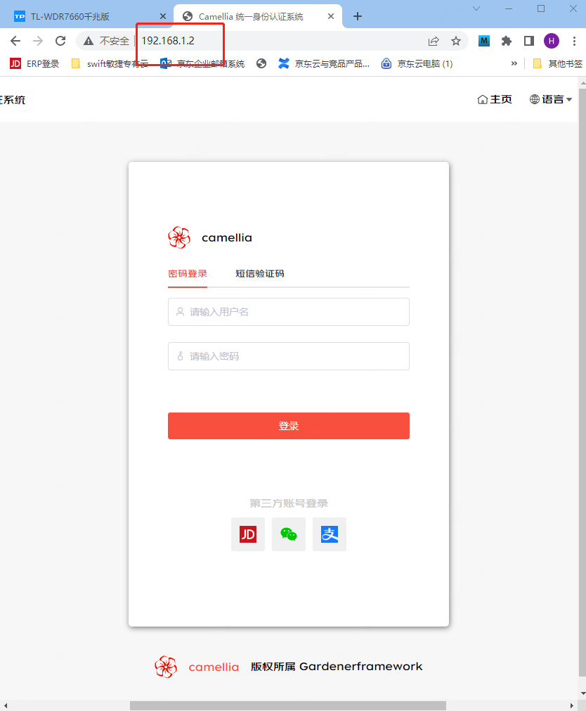
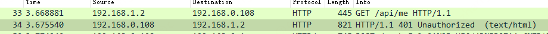
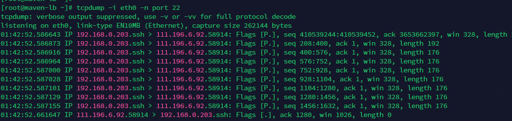
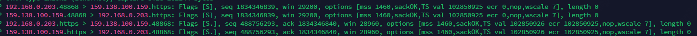

# 家里的机器如何上网

家里的机器能上网，其路由路径如下图所示

```plantuml
@startuml
!include  https://plantuml.s3.cn-north-1.jdcloud-oss.com/C4_Container.puml

Boundary(子网1, 子网, 192.168.0.0/24) {
    System(主机1, 192.168.0.108, 我的电脑/LAN口)
    Container(port1, 192.168.0.1, 路由器网关)
    主机1<-r-> port1
}
Boundary(子网2, 子网, 192.168.1.0/24) {
    System(主机2, 192.168.1.1, 联网光猫) #orange
    Container(port2, 192.168.1.2, WAN口)
    port2 <-r-> 主机2
}

System(网站, 网站)

System(路由器, 家用路由器) #red
port1 <-u-> 路由器
路由器 <--> port2
主机2 <--> 网站
@enduml
```

意味着个人计算机通过家用路由器的网关功能将数据交给家用路由器，家用路由器再将它转交给光猫实现的内部数据到达互联网。

不过数据的流向是双向的，服务器收到请求回会给请求端回包


有没有思考过，为什么网站能把数据包回给我的家用电脑，我的家用电脑的ip不是我的局域网ip么，这个数据怎么跑回来的？

```plantuml
@startuml
!include  https://plantuml.s3.cn-north-1.jdcloud-oss.com/C4_Container.puml

Boundary(子网1, 子网, 192.168.0.0/24) {
System(主机1, 192.168.0.108, 我的电脑/LAN口)
Container(port1, 192.168.0.1, 路由器网关)
主机1<-r-> port1
}
Boundary(子网2, 子网, 192.168.1.0/24) {
System(主机2, 192.168.1.1, 联网光猫) #orange
Container(port2, 192.168.1.2, WAN口)
port2 <-r-> 主机2
}

Boundary(机房, 机房) {
    System(网站, 网站)
    System(192.168.0.108, 192.168.0.108, 其它服务器)
}

System(路由器, 家用路由器) #red
port1 <-u-> 路由器
路由器 <--> port2
主机2 <--> 网站
网站 -[dashed]l->192.168.0.108: 为什么数据不往这发？
@enduml
```

上图中假设网站所在的机房也有一台机器ip是192.168.0.108，按照回包的目标地址，为啥不是这台机器收到数据？
192.168.0.0/24的网段是内网网段，任何公司、企业、家庭都会使用这个网段，为啥这个数据不转发给这些人，而是回到了正确的机器上。
原因是因为nat网络地址转换做了文章。

# snat(源地址映射转换)

nat提供的一种功能是snat，也就是对发送源的地址进行转换。
说白了就是改写ip包的源地址字段后转发，使得接收端认为这个包应当回给网关而不是原始发出包的主机，网关收到数据后再将数据包的目的端改回发包的主机地址。

## 一个简单粗暴的例子

假设 192.168.0.108 -> 6.6.6.6，其中192.168.0.108/24网段的网关是192.168.0.1，而这个家用路由器的公网ip是7.7.7.7

数据包将这么被转换

* 首先是192.168.0.108 发给 192.168.0.1的三层ip包:

```json
{
  "src": "192.168.0.108",
  "dst": "6.6.6.6"
}
```

* 192.168.0.1向互联网发的ip包:

```json
{
  "src": "7.7.7.7",
  "dst": "6.6.6.6"
}
```

这里ip源地址被改变，变成了7.7.7.7

* 6.6.6.6的回包

```json
{
  "src": "6.6.6.6",
  "dst": "7.7.7.7"
}
```

此时注意回包的ip是家用路由器的地址，而不是192.168.0.108(即发送源)

* 家用路由器查映射表发现这个包应当回给192.168.0.108，于是构造这个ip数据包转发

```json
{
  "src": "6.6.6.6",
  "dst": "192.168.0.108"
}
```

路由器看到是同子网，查arp表找到192.168.0.108的mac，直接二层封装后投递

## 如何对地址进行映射

在讲解地址转换的机制之前，首先需要认知到，tcp和udp协议有端口号的概念，其中以tcp协议为例子，数据从
192.168.0.108:16890发出，需要6.6.6.6:443端口接收。
6.6.6.6的数据不能随便从一个任意的端口返回，也需要从6.6.6.6:443发出，回给192.168.0.108:16890

于是，在snat上，服务将192.168.0.108:16890|6.6.6.6:443这对进行记录，然后通常采用和源主机一样的端口(在此是16890)修改源ip并转发改数据包

```json
{
  "src": {
    "addr": "7.7.7.7",
    "port": 16890
  },
  "dst": {
    "addr": "6.6.6.6",
    "port": 443
  }
}
```

关系对照表更新为 "192.168.0.108:16890|6.6.6.6:443 <-> 7.7.7.7:16890|6.6.6.6:443"

根据tcp协议的原理，回包为

```json
{
  "src": {
    "addr": "6.6.6.6",
    "port": 443
  },
  "dst": {
    "addr": "7.7.7.7",
    "port": 16890
  }
}
```

这时snat查记录表，知道这个数据是应当回给192.168.0.108:16890。

通过这样的机制，实际上snat就只修改了数据包的原地址，因此也符合了snat的名字

snat的配置可通过iptables完成:

```shell
iptable -t nat -A POSTROUTING -o eth1 -j MASQUERADE
```

或者

```shell
iptables -t  nat -A  POSTROUTING -s 192.168.1.0/24 -o eth0  -j SNAT --to-source x.x.x.x
```

MASQUERADE叫做伪装，用于那种出网ip不怎么固定的情况，比如adsl拨号上网

-o 是指定转发的网卡，这个网卡需要是能出网的那个

# dnat

dnat是反向的映射，它实现将内网的主机暴露在公网上，映射的方式有两种，一种叫做全映射，一种叫端口映射。

## 端口映射

端口映射的意思就是将nat网关上的某个端口映射为内网某个ip的某个端口，如图


家用路由器都支持这种功能，有的叫虚拟主机，有的就叫dnat转发。
上面是我添加的一条规则， 将我电脑直连路由器(WAN口地址为192.168.1.2)上的80端口映射为192.168.0.108的8080端口。我电脑的ip是192.168.0.108。

这样任何访问http://192.168.1.2的请求都会被转发到我的电脑(WAN的ip可以被理解为是一个外部ip，不是我的电脑所在的局域网的ip)

实际测试一下，在浏览器输入网址后能正常打开网页



我拿自己的手机通过192.168.1.2刷了一下我自己机器的网站(通过dnat访问)，再看看收到的数据包



可见，从我手机的视角出发，它访问的是192.168.1.2，但是我电脑收到的数据显示，请求来源为192.168.1.2，目标地址是我电脑的ip:
192.168.0.108。
目标地址被转换，同时**源地址**也被转换。
目标地址被转换不难理解，192.168.1.2必然需要转换这个ip来让真正的服务接收到请求。

源地址的转换也合情合理，因为如果不转换，从192.168.0.108的视角出发就要将数据返回给请求方的ip(手机的ip为192.168.0.107)，
192.168.0.107和我的机器同子网，我的机器直接arp查到mac后回包，于是从我手机的角度就懵了: 自己访问的是192.168.1.2:80，
结果数据包从另外一个ip(192.168.0.108:80)被回了。
基于tcp/ip协议栈的原理，这个包直接被丢弃(因为这个ip之前没有和自己三次握手过)，看到的现象就是网页根本打不开

## 全映射

全映射就是把内网主机的所有端口都原封不动的映射到dnat网关上，访问访问网关 == 访问内网机器。
大量的云有所谓的浮动ip，实现的是将一个公网ip绑定给某个云主机，机制就是这个。

展示一张从我家电脑ssh gardenerframework.io的抓包:



```text
您的iP地址是：[111.196.6.92] 来自：中国北京北京朝阳 联通
```

可见客户端地址没有被修改，目标的ip从浮动ip改为了vpc内网主机的ip(192.168.0.203)，也就是被dnat了。在此可能会好奇，为什么这次源地址没有被修改？
理由很简单，因为源地址和192.168.0.203不在一个子网，192.168.0.203需要从网关回包，既然是云服务了，sdn自然肯定能保证这个数据包走回到dnat节点然后被正确转发回请求端。

下面这张图有点烧脑子，是在192.168.0.203上执行后的抓包

```shell
curl https://auth.gardenerframework.io/api/me -k
```



* "192.168.0.203.48868 > 159.138.100.159.https"的意思是数据从192.168.0.203上发出，目标为159.138.100.159:443
* "159.138.100.159.48868 > 192.168.0.203.https"的意思是159.138.100.159执行dnat转换，改写目标地址为192.168.0.203，
  同时发现源地址和目标地址位于同一子网，这样回包不经过网关，自然肯定也不经过dnat，于是**改写源地址**
  为159.138.100.159，告知后台服务麻烦你把包回给正确的dnat节点
* "192.168.0.203.https > 159.138.100.159.48868"的意思是192.168.0.203照做，ack包回给159.138.100.159:48868
* "159.138.100.159.https > 192.168.0.203.48868"是dnat节点查表得知应当将包回给192.168.0.203:48868

到此一次发包和回包结束

# nat vs 三层网关

看到这里也许有些疑惑，跨子网通信将数据包交给网关转发。从内网访问外网将数据包交给nat，这两之间有什么区别？

区别很明显：

**路由转发不修改ip地址的任何信息，只是包转发**

例如"192.168.0.108 -> 192.168.0.1(路由器lan口) -> 192.168.1.2(路由器wan口) -> 192.168.1.100"的过程中，

* 192.168.0.108查路由表发现包要转给192.168.0.1
* 192.168.0.1查路由表发现包要转给192.168.1.2
  (因为在接入192.168.1.0/24网络后，主机内会自动有一条与该网络转发相关的路由，通常都是走获得了这个网络ip的网卡)
* 192.168.1.2将包发给同子网内的192.168.1.100
* 回包过程则是192.168.1.100查路由表发现包要发给192.168.1.1(因为目标地址是192.168.0.108，属于跨子网，需要扔给网关)
  ，然后就废了，因为192.168.1.1没有配置说去往192.168.0.0/24的路由是什么。除非登录到那个网关上配一条路由: 192.168.0.0/24
  gateway=192.168.1.2，否则包到这里后192.168.1.1就按照默认路由转发到不知道哪里去了

结论就是网不通

打开snat后，整个过程变成了这样

* 192.168.0.108查路由表发现包要转给192.168.0.1
* 192.168.0.1基于snat规则将源地址改写为192.168.1.2
* 192.168.1.2将包发给同子网内的192.168.1.100
* 192.168.1.100回包回给192.168.1.2
* 192.168.1.2基于地址映射规则将包回给192.168.0.108

网是通的

# 总结

nat完成地址转换，如果内网机器要访问外网则需要配置snat，外网需要访问内网则需要配置dnat；
dnat发现请求的源ip和被映射的主机位于同一子网时除了改写目标地之外还会改写源地址以保证数据正确的按照路由回来，否则就只改目标地址；
路由配置跨子网时要双向配通，或者路由器本身同时是两个子网的网关，否则要不配好路由，要不用snat方案代替
