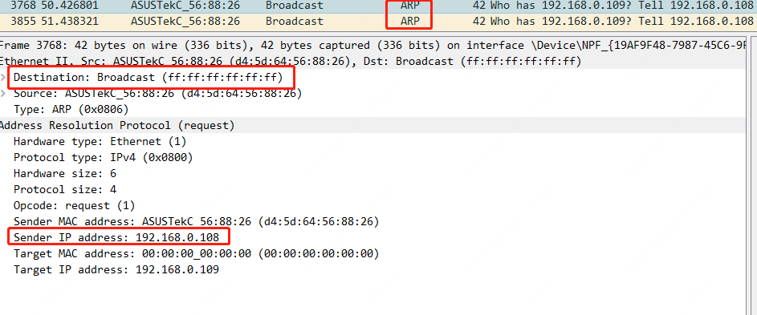

# 三层网络模型

如二层网络一样，三层网络也有多种实现方式，除去ip协议外，还有另外一种IPX/SPX协议也是三层网络协议。不过目前当提及三层网络时，主要说的是ip协议。

# ip地址 & 子网

ip协议中有2个重要的概念，一个是ip地址，另一个是子网。

在命令行输入`ifconfig`或者`ipconfig`可以查看当前主机的ip地址和子网掩码


ip地址是一个32位的整数(常规上分成4个字节，用"."进行分割)，其由网络号+主机号构成，将ip地址与子网掩码进行按位与将获得网络号

```c++
unsigned int32 ip = 0x0A000001;
unsigned int32 mask = 0xffffff00;
unsigned int32 network = ip & mask;
assert network == 0x0A000000;
```

上面这段代码示例了ip为10.0.0.1，子网掩码为255.255.255.0的网络号求值过程，最终结果为10.0.0.0

网络号相同的主机位于同一个子网，子网内的主机之间彼此通过arp协议互相发现后直接通信，跨子网的主机的网络数据则需要网关转发

# 目标为子网内/子网外之间的主机通信

## 同子网

当目标ip和当前主机位于同一个子网时，当前主机首先发arp包查询目标主机的mac地址。
因为从二层协议的角度出发，它并不知道什么ip地址，它只想知道目标主机的mac，如果不知道目标注解的mac，二层网络则不知道数据包应当怎么发送。



上图是192.168.0.108要向192.168.0.109通信前，发出arp包查询ip和mac对应关系的请求，由于首先不知道目标的mac是什么，因此需要发送一个目标mac为
ff:ff:ff:ff:ff:ff的二层广播，二层广播域内的所有主机都将收到这个数据包。收到后，主机将要查询的ip和自己的ip进行对比，如果相符，则由自己主机与查ip的主机进行点对点直接通信。
由于192.168.0.109这台机器并不存在，因此没有对应的arp应答。

下面对192.168.0.1执行ping。按照流程，108发送arp要求解析地址


上图是192.168.0.1对192.168.0.108的arp请求的响应。
响应的结果中包含了目标主机的mac以及目标主机的ip(与请求一致)

## 跨子网

跨子网通信时，源主机是根本不发arp请求的，下面是192.168.0.108/24尝试ping跨子网的主机(192.168.1.100)时抓取的arp包。


如图，当要和跨子网的机器(192.168.1.100)通信时，根本不会由源主机发起arp请求。
图中只有网关(192.168.0.1)询问其它主机mac地址的请求。

将请求地址的范围扩大，请求互联网地址20.205.243.166(同样是跨子网通信)后的抓包数据如下


图中可见，包的3层ip地址是互联网地址没有变化，但是2层的目标mac地址为网关地址

```text
arp -a

接口: 192.168.0.108 --- 0x4
  Internet 地址         物理地址              类型
  192.168.0.1           7c-b5-9b-2c-a9-55     动态
```

意味着在跨子网通信时，目标的ip不会被改变，而目标的mac成了网关的mac，从而这个数据包在二层网络上先到了网关，再由网关转发到目标主机上

互联网主机的回包也是一样，它先回给网关，然后网关再回给请求主机


当然，内网的机器能和互联网的机器通信还需要nat(网络地址转换)才能实现，但这不是本文的重点


发个ping 192.168.1.100的其它机器的图，发现mac地址的转换也是一样

# 路由器

从上文可见，子网掩码将三层网络划分为一个又一个的小型网络，子网内的机器彼此不需要三层交换设备，通过二层的arp地址查询到mac后直接通信。但是当要跨子网时，就需要三层的交换设备将一个子网的包转发到另一个子网。
这种网络设备通常就叫*路由器*


家家户户其实都有这个，也一眼能看出来蓝色口插宽带，白色口插个人pc。大致的连法如下图所示

```plantuml
@startuml
!include  https://plantuml.s3.cn-north-1.jdcloud-oss.com/C4_Container.puml

System(个人电脑, 个人电脑)
System(路由器, 路由器) #red
System(光猫, 光猫) #orange

个人电脑 <-r-> 路由器
路由器 <-r-> 光猫
@enduml
```


从机制上理解，家庭路由的蓝色口被分配了宽带厂商给的那个光猫所在网段的ip
(我家是192.168.1.2，可见联通光猫的ip段是192.168.1.1/24)，蓝色口的互联网数据转发到联通光猫的网关。所以我家能上网的数据路径是

```plantuml
@startuml
!include  https://plantuml.s3.cn-north-1.jdcloud-oss.com/C4_Container.puml

Boundary(子网1, 子网, 192.168.0.0/24) {
    System(主机1, 192.168.0.108, 我的电脑/白色网口)
    Container(port1, 192.168.0.1, 路由器网关)
    主机1<-r-> port1
}
Boundary(子网2, 子网, 192.168.1.0/24) {
    System(主机2, 192.168.1.1, 联网光猫) #orange
    Container(port2, 192.168.1.2, 蓝色网口)
    port2 <-r-> 主机2
}

System(网站, 网站)

System(路由器, 家用路由器) #red
port1 <-u-> 路由器
路由器 <--> port2
主机2 <--> 网站
@enduml
```

在实际上，子网也是一个又一个的由路由器联通，最终彼此互联

# 路由表

路由表是指数据在同子网内和跨子网的时候怎么走，相当于数据的地图。比如

```text
Kernel IP routing table
Destination     Gateway         Genmask         Flags Metric Ref    Use Iface
default         gateway         0.0.0.0         UG    100    0        0 eth0
169.254.169.254 192.168.0.254   255.255.255.255 UGH   100    0        0 eth0
192.168.0.0     0.0.0.0         255.255.255.0   U     100    0        0 eth0
```

* "default gateway 0.0.0.0"的意思是，如果数据不知道发哪里(路由表中没有表达数据怎么发送)，那就发走网关
* "192.168.0.0 0.0.0.0 255.255.255.0"的意思是，192.168.0.0/24的数据不需要下一跳，因为属于子网内，因此直接查arp表后获取mac发送

在上文中，网关一般指的就是路由器。

# 路由一致性

当一个子网的主机将包交给网关发送给另一个子网后，对端主机回的包必须经过源主机所在子网的相同网关转发。

如图，构造2个子网，一个为192.168.0.0/24，一个为192.168.1.0/24

```plantuml
@startuml
!include  https://plantuml.s3.cn-north-1.jdcloud-oss.com/C4_Container.puml

Boundary(子网1, 子网, 192.168.0.0/24) {
    System(主机1, 192.168.0.108, 主机1)
    Container(port1, 192.168.0.1, 路由器网关)
    主机1<-r-> port1
}
Boundary(子网2, 子网, 192.168.1.0/24) {
    System(主机2, 192.168.1.100, 主机2) #orange
    Container(port2, 192.168.1.1, 路由器网关)
    port2 <-r-> 主机2
}

System(路由器, 家用路由器) #red
port1 <-u-> 路由器
路由器 <--> port2
@enduml
```

108给192.168.1.100发送数据时，网关为192.168.0.1，该网关在192.168.1.0/24下也同样是网关，数据从192.168.1.1接口转出，到达192.168.1.100；
回包时，192.168.1.100按照路由规则，将跨子网的通信交给192.168.1.1，回包从192.168.0.1转出，回到192.168.0.108。
对108而言，路由是"一致"的。

但如果网络结构变成这样

```plantuml
@startuml
!include  https://plantuml.s3.cn-north-1.jdcloud-oss.com/C4_Container.puml

Boundary(子网1, 子网, 192.168.0.0/24) {
    System(主机1, 192.168.0.108, 主机1)
    Container(port1, 192.168.0.1, 路由器1网关) #red
    Container(port3, 192.168.0.2, 路由器2网关) #orange
    主机1-r-> port1
    port3 -[dotted,#red]->主机1: X
}
Boundary(子网2, 子网, 192.168.1.0/24) {
    System(主机2, 192.168.1.100, 主机2) #orange
    Container(port2, 192.168.1.1, 路由器2网关) #orange
    Container(port4, 192.168.1.2, 路由器1网关) #red
    port2 <-r- 主机2
    port4 -->主机2
}

System(路由器1, 家用路由器) #red
System(路由器2, 家用路由器) #orange
port1 -u-> 路由器1
port4 <-u- 路由器1
路由器2 <-d- port2
路由器2 -d-> port3
@enduml
```

现在192.168.0.0/24和192.168.1.0/24都有自己的网关，分别是192.168.0.1和192.168.1.1；
两个网关在对方子网还有1个接口，分别是192.168.0.2/192.168.1.2。

192.168.0.108现在对192.168.1.100发包

* 按照路由配置: default 192.168.0.1，108将包交给红色网关
* 网关将包给到1.100(从1.2转发)
* 1.100的路由是: default 192.168.1.1，它将回包给交橙色网关
* 橙色网关从0.2转发回包
* 108收到回包但发现回报的mac和自己默认路由的网关的mac不一致，认为是错误包或有人恶意攻击而丢弃

从108的视角出发，路由是"不一致"的

# 总结

ip地址的构成分为子网+主机；子网内的主机通过arp彼此发现后直接通信，跨子网需要网关转发；网关通常是个路由设备，将多个不同的子网相连；
最后，当数据从子网出去时，出的路径和回来的路径都要经过同一个网关，需要保持一致。

# 下一步阅读

[ip地址动态获取与dhcp介绍](..%2Fip%E5%9C%B0%E5%9D%80%E5%8A%A8%E6%80%81%E8%8E%B7%E5%8F%96%E4%B8%8Edhcp%E4%BB%8B%E7%BB%8D)