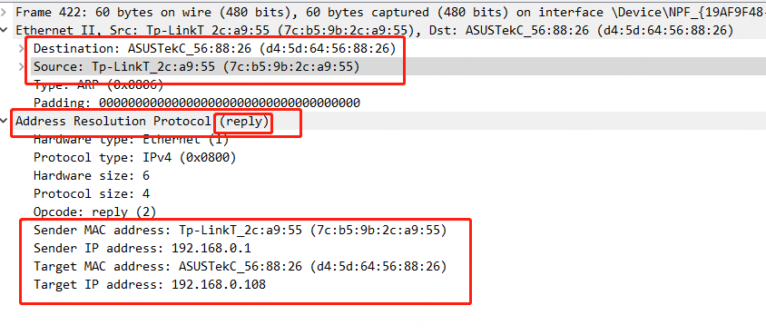
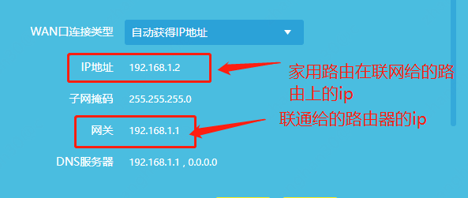

# 三层网络模型

如二层网络一样，三层网络也有多种实现方式，除去ip协议外，还有另外一种IPX/SPX协议也是三层网络协议。不过目前当提及三层网络时，主要说的是ip协议。

# ip地址 & 子网掩码

在命令行输入`ifconfig`或者`ipconfig`可以查看当前主机的ip地址和子网掩码


ip地址是一个32位的整数(常规上分成4个字节，用"."进行分割)，其由网络号+主机号构成，将ip地址与子网掩码进行按位与将获得网络号

```c++
unsigned int32 ip = 0x0A000001;
unsigned int32 mask = 0xffffff00;
unsigned int32 network = ip & mask;
assert network == 0x0A000000;
```

上面这段代码示例了ip为10.0.0.1，子网掩码为255.255.255.0的网络号求值过程，最终结果为10.0.0.0

网络号相同的主机位于同一个子网，子网内的主机之间彼此通过arp协议互相发现后直接通信，跨子网的主机的网络数据则需要网关转发

# 目标为子网内/子网外之间的主机通信

## 同子网

当目标ip和当前主机位于同一个子网时，当前主机首先发arp包查询目标主机的mac地址。
因为从二层协议的角度出发，它并不知道什么ip地址，它只想知道目标主机的mac，如果不知道目标注解的mac，二层网络则不知道数据包应当怎么发送。


上图是192.168.0.108要向192.168.0.109通信前，发出arp包查询ip和mac对应关系的请求，由于首先不知道目标的mac是什么，因此需要发送一个目标mac为
ff:ff:ff:ff:ff:ff的二层广播，二层广播域内的所有主机都将收到这个数据包。收到后，主机将要查询的ip和自己的ip进行对比，如果相符，则由自己主机与查ip的主机进行点对点直接通信。



上图是192.168.0.1对192.168.0.108的arp请求的响应
(此处查询的ip已经变成了192.168.0.1，不是上面例子中的109，因此不存在问109的mac是什么，其它主机回答的情况)

可见目标主机就发送目标mac为查询主机的数据包，响应arp的请求

## 跨子网

跨子网通信时，源主机是根本不发arp请求的


如图，当要和跨子网的机器(192.168.1.100)通信时，根本不会由源主机发起arp请求
(图中的192.168.0.1是网关，不是正在执行ping命令的机器)


当请求的机器是互联网机器时(当然也是跨子网)，可见从三层网络的视角出发，目标地址还是互联网服务器的地址(20.205.243.166)
。但是注意看目标的二层mac，是网关(192.168.0.1)的地址

```text
arp -a

接口: 192.168.0.108 --- 0x4
  Internet 地址         物理地址              类型
  192.168.0.1           7c-b5-9b-2c-a9-55     动态
```

意味着在跨子网通信时，目标的ip不会被改变，而目标的mac成了网关的mac，从而这个数据包在二层网络上先到了网关，再由网关转发到目标主机上

互联网主机的回包也是一样，它先回给网关，然后网关再回给请求主机


当然，内网的机器能和互联网的机器通信还需要nat(网络地址转换)才能实现，但这不是本文的重点


发个ping 192.168.1.100的其它机器的图，发现mac地址的转换也是一样

# 路由器

从上文可见，子网掩码将三层网络划分为一个又一个的小型网络，子网内的机器彼此不需要三层交换设备，通过二层的arp地址查询到mac后直接通信。但是当要跨子网时，就需要三层的交换设备将一个子网的包转发到另一个子网。
这种网络设备通常就叫*路由器*


家家户户其实都有这个，也一眼能看出来蓝色口插宽带，白色口插个人pc。大致的连法如下图所示

```plantuml
@startuml
!include  https://plantuml.s3.cn-north-1.jdcloud-oss.com/C4_Container.puml

System(个人电脑, 个人电脑)
System(路由器, 路由器) #red
System(光猫, 光猫) #orange

个人电脑 <-r-> 路由器
路由器 <-r-> 光猫
@enduml
```



从机制上理解，家庭路由的蓝色口被分配了宽带厂商给的那个光猫所在网段的ip
(我家是192.168.1.2，可见联通光猫的ip段是192.168.1.1/24)，蓝色口的互联网数据转发到联通光猫的网关。所以我家能上网的数据路径是

```plantuml
@startuml
!include  https://plantuml.s3.cn-north-1.jdcloud-oss.com/C4_Container.puml

Boundary(子网1, 子网, 192.168.0.0/24) {
    System(主机1, 192.168.0.108, 我的电脑/白色网口)
    Container(port1, 192.168.0.1, 路由器网关)
    主机1<-r-> port1
}
Boundary(子网2, 子网, 192.168.1.0/24) {
    System(主机2, 192.168.1.1, 联网光猫) #orange
    Container(port2, 192.168.1.2, 蓝色网口)
    port2 <-r-> 主机2
}

System(网站, 网站)

System(路由器, 家用路由器) #red
port1 <-u-> 路由器
路由器 <--> port2
主机2 <--> 网站
@enduml
```

也由此可见，子网一个又一个的由路由器联通，最终彼此互联

# 路由表


我的个人pc跨子网的数据之所以能够知道发送给192.168.0.1，还需要有路由表的配置。途中的这条记录的意思是，所有跨子网的数据包都发给192.168.0.1。路由表可以自行设置。

# 总结

ip地址的构成分为子网+主机；子网内的主机通过arp彼此发现后直接通信，跨子网需要网关转发；网关通常是个路由设备，将多个不同的子网相连。