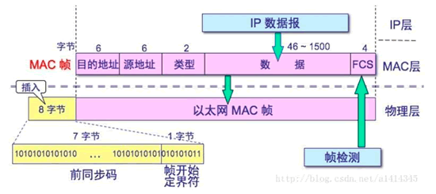

# 二层网络类型

二层网络一般指的是在物理传输线路上直接传输的网络协议，它通常要承载来自三层网络协议(如ip协议)的数据。
二层网络的数据传输协议有很多种，常见的有以太网，令牌环网，光纤通道等等。
不过由于以太网过于流行和普及，因此如果没有特别的声明，通常二层网络说的都是以太网。
本文也主要介绍以太网

# 广播域

## 基本概念

网络的二层有几种数据的发送方式:

* 已知目标地址的点对点发送
* 目标地址未知的广播发送



上图是一个以太网的帧格式概览，可见帧包含了二层网络的2个地址，源地址 & 目标地址。需要注意的是这两个地址不是我们常说的ip地址，而是网卡地址。
在mac/linux上敲`ifconfig`，可以得到大致如下的结果

```text
en0: flags=8863<UP,BROADCAST,SMART,RUNNING,SIMPLEX,MULTICAST> mtu 1500
	options=6463<RXCSUM,TXCSUM,TSO4,TSO6,CHANNEL_IO,PARTIAL_CSUM,ZEROINVERT_CSUM>
	ether 88:66:5a:4d:b7:78  
	inet 172.22.67.22 netmask 0xffffff00 broadcast 172.22.67.255
	...

```

其中"ether 88:66:5a:4d:b7:78"就是网卡的mac地址，"inet 172.22.67.22"是三层网络ip地址。

通常在二层网络通信时，源和目标是已知的，因此源地址和目标地址分别填写两个主机的mac即可，这种通信方式是单播通信

然而部分场景下不知道目标主机的地址或者本身就是一个广而告之的数据，这时目的地址就会使用"ff:ff:ff:ff:ff:ff"，也就是二层广播地址。
比如arp协议在询问哪台主机具有ip192.168.0.2时就会发送二层广播

。用一张梗图来看，就是"谁他妈买小米儿！"，这句吆喝只要在声音可达的范围内，所有人都能听到


## 广播风暴

声音能够传播的范围是有限的，那么一个二层广播帧能传播的范围是不是也是有限的呢？答案为“是，不过这是因为人为限制的”。

首先要意识到，世界的所有设备其实都已经通过互联网进行了链接，也就是数以千万的主机都连在一张网上。

在这种情况下，如果一个网友发送了一个广播帧，按照常规的理解，他的家庭路由器会转发该帧到互联网上。
互联网的交换机同样转发该帧给接口上的其它交换机，接收到的交换机再按照广播的逻辑继续向下转发，形成一传十，十传百的效果。

```plantuml
@startuml
!include  https://plantuml.s3.cn-north-1.jdcloud-oss.com/C4_Container.puml

Person(网友, 网友) #red

System(家用路由器, 家用路由器)
System(交换机1, 交换机1)
System(交换机2, 交换机2)
System(交换机3, 交换机3)
System(交换机4, 交换机4)
System(交换机5, 交换机5)
System(交换机6, 交换机6)
System(交换机7, 交换机7)

网友 <-d->家用路由器
家用路由器 <-r-> 交换机1
交换机1 <-[#red]d->交换机2
交换机1 <-[#red]d->交换机3
交换机2 <-d->交换机4
交换机2 <-[#red]r->交换机3
交换机2 <-d->交换机5
交换机3 <-d->交换机6
交换机3 <-d->交换机7
@enduml
```

首先，这样的网友在全世界有数以十亿个。每个网友都发送一个广播帧，在没有广播域的情况下就要在全互联网传播，且传播范围成指数级增长。
这将导致网络内出现大量的广播数据，严重影响了网络的性能。

其次需要注意，交换机1、2、3具有一个小小的环路，而广播数据是在交换机的全端口上进行传输，所以可见会有广播包在1,2,3内一直转圈出不去。
那么，如果交换机1上还连接着千家万户的上网路由器会怎么样呢？会让这个环路内的广播数据越来越多，最终导致传输数据量超过交换机的承受能力，整个网络拥塞。

可见，不限制广播域会使得广播数据像暴风一样席卷整个网络，造成网络瘫痪。
因此，必须要限制广播数据的传播范围。于是一个广播数据能传播的最大范围就被称为广播域，在同一个广播域内的网络设备都能接收到这个广播帧。
超出或不在这个广播域的网络设备不能接收到广播数据帧。

在这样的背景下，如果一个主机发送arp协议查询某个主机的mac地址。若被查询的主机和查询主机不在一个广播域下，将使得被查询的主机收不到二层广播的包，从而无法响应arp请求。
从而造成查询主机无法与它进行下一步通信。

# 交换机

交换机是目前较为常见的二层网络硬件设备，它主要用于二层网络的数据转发。它完成的主要使命就是把一个端口收到的二层数据帧转发给其目的地址指向的端口

```plantuml
@startuml
!include  https://plantuml.s3.cn-north-1.jdcloud-oss.com/C4_Container.puml

Container(aa, aa:aa:aa:aa:aa:aa, 网卡1) #red
Container(bb, bb:bb:bb:bb:bb:bb, 网卡2) #red
Container(cc, cc:cc:cc:cc:cc:cc, 网卡3)
Container(dd, dd:dd:dd:dd:dd:dd, 网卡4)

Boundary(交换机, 交换机) {
    Container(接口1, 接口1) #red
    Container(接口2, 接口2) #red
    Container(接口3, 接口3)
    Container(接口4, 接口4)
}

接口1 <-d- aa
接口2 -d-> bb
接口3 -d-> cc
接口4 -d-> dd


接口1 -r-> 接口2

@enduml
```

为了屏蔽ip地址等3层网络带来的概念干扰，网卡只给出mac地址。现在假设网卡1要单独给网卡2发送数据，这个数据会从网卡1上到交换机接口，然后由交换内部找到网卡2的出口，单独从这个出口转发给网卡2。
同样插在交换机上的网卡3和4接受不到数据包。

那么，作为交换机如何知道网卡2插在自己的接口2上呢？其方法当然不是网络工程师去修改配置文件，而是交换机本身具有mac地址学习能力。它的大致原理如下

* 交换内有一个叫做nac地址表的东西，它表达了mac地址和接口的绑定关系
* 这张表上来当然是空的
* 当网络内的计算机要通信时，从二层的角度出发既然我不知道该发给谁，那我就全发；交换机将单播数据发送给了所有接口
  (看起来就是进行了一次广播)；发完之后把二层数据的源地址总而言之先加入到表中，代表如果有人回应了，要从这个接口发回去
* 如果目标地址在网络中真实存在，那它会回数据，回的数据中必然包含了它的mac地址，于是交换机就把目标地址的包从哪个接口回来的也记下来，
  从而成功完成学习
* 经过了学习，mac地址表长这样

| mac地址             | 接口  |
|-------------------|-----|
| aa:aa:aa:aa:aa:aa | 接口1 |
| bb:bb:bb:bb:bb:bb | 接口2 |

广播的逻辑则和单播有一些区别，如果网卡1发送1个广播数据包，而在交换机上，网卡1、2、3在一个广播域内，网卡4不在，则交换机将数据转发给接口2和3。
至于交换机怎么知道1，2，3在一个广播域的，可以通过人工配置vlan以及其它的一些技术手段完成，这部分超出了本文的目标，有兴趣可自行查阅资料。

```plantuml
@startuml
!include  https://plantuml.s3.cn-north-1.jdcloud-oss.com/C4_Container.puml

Container(aa, aa:aa:aa:aa:aa:aa, 网卡1) #red
Container(bb, bb:bb:bb:bb:bb:bb, 网卡2) #red
Container(cc, cc:cc:cc:cc:cc:cc, 网卡3) #red 
Container(dd, dd:dd:dd:dd:dd:dd, 网卡4) 

Boundary(交换机, 交换机) {
    Container(接口1, 接口1) #red
    Container(接口2, 接口2) #red
    Container(接口3, 接口3) #red
    Container(接口4, 接口4)
}

接口1 <-d- aa
接口2 -d-> bb
接口3 -d-> cc
接口4 -d-> dd


接口1 -r-> 接口2
接口2 -r-> 接口3

@enduml
```

# 总结

本文简单介绍了二层的以太网的数据发送方法以及广播域的概念并介绍了交换机这种常见的二层网络设备以及它的mac地址学习和数据广播发送的能力

# 下一步阅读

[通过v(x)lan进行二层多租户隔离](..%2F%E9%80%9A%E8%BF%87v%28x%29lan%E8%BF%9B%E8%A1%8C%E4%BA%8C%E5%B1%82%E5%A4%9A%E7%A7%9F%E6%88%B7%E9%9A%94%E7%A6%BB)

