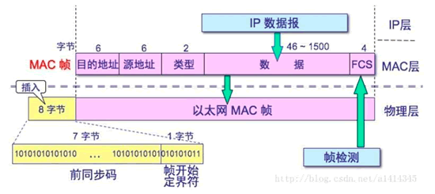
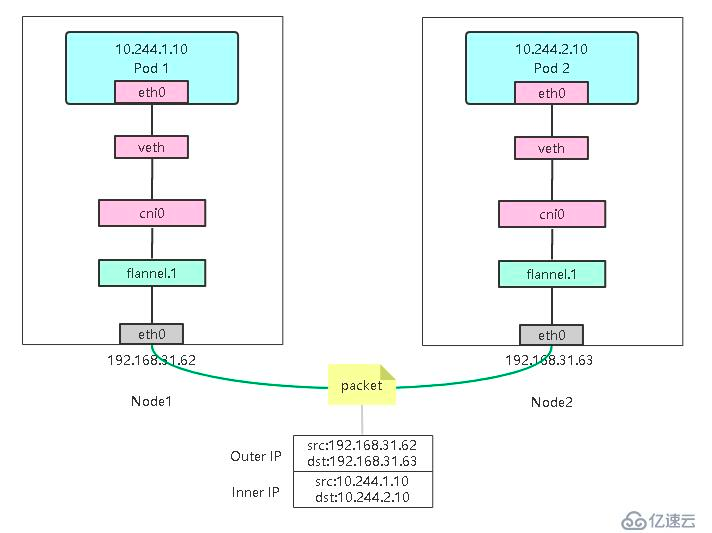

# 二层网络类型

二层网络一般指的是在物理传输线路上直接传输的网络协议，它通常要承载来自三层网络协议(如ip协议)的数据。
二层网络的数据传输协议有很多种，常见的有以太网，令牌环网等等，本文后面的介绍主要以以太网为主。

# 广播域

## 基本概念

网络的二层有几种数据的发送方式:

* 已知目标地址的点对点发送
* 目标地址未知的广播发送



上图是一个以太网的帧格式概览，可见帧包含了二层网络的2个地址，源地址 & 目标地址。需要注意的是这两个地址不是我们常说的ip地址，而是网卡地址。
在mac/linux上敲`ifconfig`，可以得到大致如下的结果

```text
en0: flags=8863<UP,BROADCAST,SMART,RUNNING,SIMPLEX,MULTICAST> mtu 1500
	options=6463<RXCSUM,TXCSUM,TSO4,TSO6,CHANNEL_IO,PARTIAL_CSUM,ZEROINVERT_CSUM>
	ether 88:66:5a:4d:b7:78 
	inet6 fe80::806:cf4c:2b09:2da8%en0 prefixlen 64 secured scopeid 0x6 
	inet 172.22.67.22 netmask 0xffffff00 broadcast 172.22.67.255
	nd6 options=201<PERFORMNUD,DAD>
	media: autoselect
	status: active

```

其中"ether 88:66:5a:4d:b7:78"就是网卡的mac地址，"inet 172.22.67.22"是三层网络ip地址。

通常在二层网络通信时，源和目标是已知的，因此源地址和目标地址分别填写两个主机的mac即可。然而部分场景下不知道目标主机的地址或者本身就是一个广而告之的数据，这时目的地址就会使用"
ff:ff:ff:ff:ff:ff"，也就是二层广播地址。比如arp协议在询问哪台主机具有ip
192.168.0.2时，就会发送二层广播。用一张梗图来看，就是"谁他妈买小米儿！"，这句吆喝只要在声音可达的范围内，所有人都能听到


在知晓了二层广播客观存在的前提下，就可以开始介绍广播域的概念

首先要意识到，世界的所有设备其实都已经通过互联网进行了链接，也就是一位中国的网友和一位美国的网友，在同一时间能访问百度，那么证明他们都具有到百度服务器的物理线路，同时也证明了这两个网友之间其实有物理可达的线路。

```plantuml
@startuml
!include  https://plantuml.s3.cn-north-1.jdcloud-oss.com/C4_Container.puml

Person(中国网友, 中国网友) #red
Person(美国网友, 美国网友)

System(pc1, pc)
System(pc2, pc)

System(家庭路由1, 家庭路由)
System(家庭路由2, 家庭路由)

System(互联网, 互联网)

中国网友--> pc1
美国网友--> pc2

pc1-->家庭路由1
pc2-->家庭路由2

家庭路由1-->互联网
家庭路由2-->互联网
@enduml
```

那为什么中国网友不可能直接和美国网友的主机之间直接通信呢，因为常规来说两个网友都在自己家的"局域网(LAN)"内，一个局域网就是一个二层广播域

```plantuml
@startuml
!include  https://plantuml.s3.cn-north-1.jdcloud-oss.com/C4_Container.puml

Person(中国网友, 中国网友) #red
Person(美国网友, 美国网友)

System(pc1, pc)
System(pc2, pc)

System(家庭路由1, 家庭路由)
System(家庭路由2, 家庭路由)

Boundary(互联网, 互联网) {
    System(交换机1, 交换机) #red
    System(交换机2, 交换机) 
}


中国网友--> pc1
美国网友--> pc2

pc1-->家庭路由1
pc2-->家庭路由2

家庭路由1-->交换机1
交换机1<-r->交换机2
家庭路由2-->交换机2
@enduml
```

在此不妨将互联网的规模缩小"亿点点"，假设互联网其实只有2台交换机。按照常规转发规则，二层广播数据在交换机上的所有接口都应当被转发。
所以中国网友发出的广播数据包应当透过自家家的路由器、红色交换机和蓝色交换机，最终达到美国网友的机器上。美国网友的数据包也一样，能够通过相同的机制广播到中国网友的机器上，甚至2个网友在知道了对方的mac地址后可以点对点直接通信。这时，两个网友位于
**同一个广播域**内。

不过，美国网友似乎并不太友善，他发现自己的广播数据能够被中国网友接收到后，开始疯狂地发送广播数据给中国网友，搞得中国网友的网络全堵了。对此中国网友很生气，认为为什么自己的局域网能收到来自别人局域网的广播数据。他要求进行二层网络的隔离。

## vlan

在IEEE 802.1q的标准中改进了802.1的以太网帧，引入了vlan
tagging技术。它为以太网帧附加上一个vlan的编号，并且转发以太网二层数据的交换机需要在端口上配置自己能够转发和接收vlan编号，如果这个编号不在自己的职责范围内，相关的二层网络数据将被丢弃。

```plantuml
@startuml
!include  https://plantuml.s3.cn-north-1.jdcloud-oss.com/C4_Container.puml

Person(中国网友, 中国网友) #red
Person(美国网友, 美国网友)

System(pc1, pc)
System(pc2, pc)

System(家庭路由1, 家庭路由)
System(家庭路由2, 家庭路由)

Boundary(互联网, 互联网) {
    Boundary(交换机1, 交换机)  {
        System(port1, port) #red
        System(port2, port, vlan 1) #red
        port1 <-[dotted]r-> port2: X
       
    }
    Boundary(交换机2, 交换机) {
        System(port3, port)
        System(port4, port, vlan 2)
        port3 <-[dotted]l-> port4: X
    } 
}


中国网友--> pc1
美国网友--> pc2

pc1-->家庭路由1
pc2-->家庭路由2

家庭路由1-->port1
port2<-[dotted]r->port4: X
家庭路由2-->port3
@enduml
```

如上图所示，中国网友连接的交换机有一个端口被划入vlan 1，美国网友连接的交换机上的端口被划入vlan
2。这样，二层网络数据被转发时因为vlan号不匹配，数据就会被双方的交换机丢弃。特别是两个网友接入的交换机接口没有vlan
tag。那么这些数据包都不会被有vlan tag的端口转发，更不要说还要跨2个vlan tag根本不同的端口。从直观上感受就是家里断网了(
直接接入设备的网络转发出了问题)

于是，为了解决这个问题，交换机就要升级为路由器(具备3层网络转发能力)

```plantuml
@startuml
!include  https://plantuml.s3.cn-north-1.jdcloud-oss.com/C4_Container.puml

Person(中国网友, 中国网友) #red
Person(美国网友, 美国网友)

System(pc1, pc)
System(pc2, pc)

System(家庭路由1, 家庭路由)
System(家庭路由2, 家庭路由)

Boundary(互联网, 互联网) {
    Boundary(交换机1, 路由器)  {
        System(port1, port) #red
        System(port2, port, vlan 1) #red
        port1 <-r-> port2
    }
    Boundary(交换机2, 路由器) {
        System(port3, port)
        System(port4, port, vlan 2)
        port3 <-l-> port4
    } 
    Boundary(路由器3, 路由器) {
        System(port5, port, vlan 1)
        System(port6, port, vlan 2)
        port5 <-l-> port6
    } 
}


中国网友--> pc1
美国网友--> pc2

pc1-->家庭路由1
pc2-->家庭路由2

家庭路由1-->port1
port2<-d->port5
port4<-d->port6
家庭路由2-->port3
@enduml
```

如上图所示，数据包在路由器内部通过查看路由表，由路由程序在不同vlan端口之间转发。于是，美国网友和中国网友之间网络也许依然能通(
取决于3层网络的转发)，但是美国网友再也不能向中国网友发送广播数据，即无法突破广播域。

# 二层网络模型

理解了广播域后，开始介绍集中云常用的不同网络模型

## 扁平网络

扁平网络就是指接入网络的所有设备都在一个广播域内，设备A和B之间二层网络直接可达。这种网络模型主要适用于非常小的范围以及较少的设备。比如家庭、咖啡厅的计算和和手机上网。

云基本不会采用这种网络模型，因为不同租户之间的网络在二层上根本没有办法隔离，彼此之间可以通过2层广播或甚至知道mac之后直接点对点通信。

## vlan网络

vlan网络就是指通过vlan将不同用途的设备进行分离，比如一个vlan用来部署在线生产的业务系统(如商城)
，一个vlan用来给员工接入办公电脑，一个vlan用来提供开发和测试用的服务器等。这些vlan之间的二层隔离，即使知道ip和mac也无法通信。

vlan是云可能会采用的一种网络模型。云在部署的过程中向机房申请一个专用的vlan号段。不同的vpc被分配不同的vlan号从而实现不同租户之间的网络隔。不过，使用vlan作为云的底层网络支撑只能适用于租户规模小，云部署不跨机房的场景。
这是vlan的天然缺陷造成的(vlan号只有1024个，且通信需要两个可能属于不同运营商的机房彼此对齐vlan号段等)。
此外，实操的过程中还可能出现机房运维自己已经记不清哪些vlan被分配，哪些vlan没分配，将已经分配的vlan当作未使用分配给云的情况。

## 3层隧道封装

3层网络隧道封装是指使用3层网络的数据部分封装2层的帧，通过3层网络将数据运输到目标地点后再解封，将封装的2层数据从3层网络数据中解包后投递给正确的2层网络设备(
如虚拟网卡)。这种模式也有很多种落地方案，其中较为常用的是vxlan



vxlan的工作原理是

* 虚拟机/容器发送的二层数据包从虚拟网卡发出被vxlan程序(如flannel)截获
* vxlan程序不是将二层数据包直接通过物理网卡转发，而是首先查询对应虚拟设备所属的vni号(效果类似vlan tag)
  并确定二层数据的目标mac地址所在的虚拟设备在哪个物理机上(图中192.168.31.62认为应当发送给192.168.31.63)
* vxlan程序将二层数据包封装到udp数据报文中(实际可以看出vxlan程序实际工作在应用层)，即"装车"
* 二层数据包通过ip协议通过若干物理交换机和路由器后到达目标物理机，即通过"隧道"
* 目标物理机的vxlan程序收到数据包后解出原始二层数据，即"卸车"，确定vni和目标mac指向的二层虚拟设备确实在自己的主机上后进行投递

通过3层网络封装，首先不需要云所在的机房提供准确的vlan段，也不需要在跨机房部署的时候来自不同运营商的机房之间还要协调双方均未使用的号段。
vni的段长是24位，意味着有1600万个可用隔离域。因此vxlan或其它可靠的3层隧道封装协议是目前云的底层网络模型首选

# 总结

二层网络有很多协议，插网线的以太网是较为常见的一种；二层网络有广播域的概念，不同vlan
tag的二层数据包彼此之间不能突破广播域的屏障；vlan的能力是有上限的，它只有1024个编号，且很难突破机房边界，于是需要3层隧道封装技术，比如vxlan。

