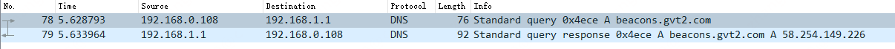

# ip地址 vs 域名

三层网络的主机彼此之间有ip就能通信，而且部分企业内部使用业务系统时通过输入ip + 端口的方式也能打开网页。不过这种方式通常很难记，因为ip更不具有任何业务表达。
为了让应用的访问者能够更简单的记住业务应用的访问地址，域名服务(**D**omain **N**ame **S**erver)被推出。

常见的域名是一个"."分的英文字符串，比如"auth.gardenerframework.io"，其中

* io代表顶级域名，通常是一个国家的缩写或者一个通用的机构类型缩写，比如com = 公司、org = 组织、edu = 学校等等
* gardenerframework是二级域名，通常是机构/公司要对外表达的名字，比如jd = 京东、qq = 腾讯
* auth是三级域名，表达当前应用在这个机构内的作用或子机构，比如auth为认证或登录

通常来说域名就到三级，相对于ip来说，显然域名好记的多。

# dns

域名的使用需要依赖dns服务，他的使命是将域名解析ip，因为最终三层还是需要ip来进行通信

上图查询"beacons.gvt2.com"域名的请求和响应，dns服务器回答请求端是域名的ip为"58.254.149.226"
。这时浏览器就可以调用三层网络协议栈给的接口去发送http

图中还有一个细节，恢复的ip前面有一个字母"A"，代表这个记录是地址记录。dns服务支持很多记录类型

* A(AAAA)记录: 域名到地址的解析(AAAA为到ipv6的解析)
* CNAME记录: 域名别名，比如

此时google返回说你查的这个有个别名是www-wide.1.google.com

* TXT记录: 一般指某个主机名或域名的标识和说明，通常在网络服务商，要求证明填写域名的人添加一条TXT记录以证明域名被自己所有

dns服务器还有很多其它的数据类型，不过以上三种比较常用

此外，dns也是应用层协议，它使用的是udp包作为承载方式。

# dns级联和集群

一个dns服务器不可能承载全世界的所有dns域名，因此全世界的dns服务器需要构成一个庞大的集群彼此交换数据

上图是一个dns递归和迭代查询的图，递归查询指的是上级dns服务器如果不知道域名，它向上级dns进行查询。
迭代查询是本地发起查询后，上级dns说不知道这个域名，但是可以告诉你也许谁知道，本地dns根据清单挨个询问下一家dns服务器发起查询。
可见迭代查询时，本地程序的自主权更高一些，比如可以设置迭代次数。而递归查询，开发人员更省心一些～

这篇博客"[https://www.cnblogs.com/kevingrace/p/9359989.html](https://www.cnblogs.com/kevingrace/p/9359989.html)"
介绍了bind如何配置转发，也就是上级dns

# 域名服务器的自动发现和设置

在个人电脑上或者云主机上可能都没有主动设置过域名服务器，那么这些设备怎么找到合适的dns呢？

答案是：或者将dns设置到云主机的弹性网卡上或者通过dhcp请求的响应回复dns服务器的位置

# 总结

域名比ip好记，一般就到3级(大部分域名服务商实际上也只给3级)；
要想用dns那么就要设置dns服务器，本地可以设置，也可以使用网关提供的，设置的通常是常见的dns，比如8.8.8.8；
主机的dns查询先向本地/网关设置的dns服务器请求，第一次查询找不到的时候，由于这些服务器也设置了上级dns的地址
或者使用递归模式或者将上级dns的地址返回给主机进行迭代查。

