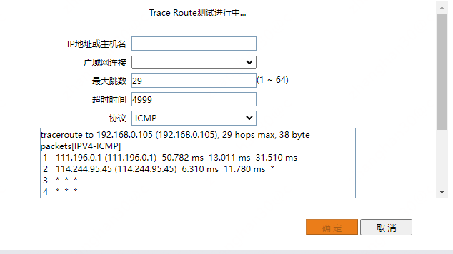
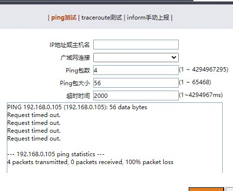
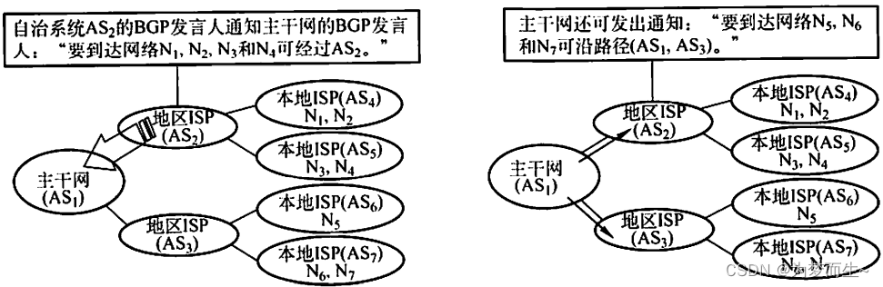

# 路由表

在
[[三层网络与数据交换机制介绍](..%2F%E4%B8%89%E5%B1%82%E7%BD%91%E7%BB%9C%E4%B8%8E%E6%95%B0%E6%8D%AE%E4%BA%A4%E6%8D%A2%E6%9C%BA%E5%88%B6%E4%BB%8B%E7%BB%8D)]
一文中，简单介绍过子网、路由器和路由表。一个简单的认知就是路由器将不同的子网连接到一起，子网和子网之间想要通信，必须通过路由器的协助。
那么互联网的ip也有网络号和主机号，也就是互联网其实也是一个又一个的子网，这些网之间的数据交换也通过路由器完成的。

# 家庭网络

当一个家庭用网时通常来讲一个路由器就够了，它将计算机组成一个子网后与光猫的子网进行数据交换。

```plantuml
@startuml
!include  https://plantuml.s3.cn-north-1.jdcloud-oss.com/C4_Container.puml

Boundary(子网1, 子网, 192.168.0.0/24) {
    System(主机1, 192.168.0.108, 我的电脑/白色网口)
    Container(port1, 192.168.0.1, 路由器网关)
    主机1<-r-> port1
}
Boundary(子网2, 子网, 192.168.1.0/24) {
    System(主机2, 192.168.1.1, 联网光猫) #orange
    Container(port2, 192.168.1.2, 蓝色网口)
    port2 <-r-> 主机2
}

System(网站, 网站)

System(路由器, 家用路由器) #red
port1 <-u-> 路由器
路由器 <--> port2
主机2 <--> 网站
@enduml
```

需要注意的是，192.168.0.1(由于是红色的，因此叫做小红)
是192.168.0.0/24的默认路由，它负责把192.168.1.0/24的去往其它子网的数据包转出去。在转出去之前，它也要根据自己的路由表查数据怎么转。
在它的内部会有一张这样的路由表

```text
Destination     Gateway         Genmask         Flags Metric Ref    Use Iface
default         gateway         0.0.0.0         UG    100    0        0 WAN
192.168.0.0     0.0.0.0         255.255.255.0   U     100    0        0 eth0
```

也就是说

* 默认情况下，数据从WAN口出(送往联通光猫)，并发送给192.168.1.1/24的网关，即192.168.1.1
* 去往192.168.0.0/24的数据，因为本身自己就有这个子网的ip，直接查mac地址发送

基于这样的路由表，它把上网的包发给了192.168.1.1(联通的光猫，因为其在图上是橘黄色的，就称为橘猫)，现在来看看互联网的回包。

首先在发送数据到互联网之前，192.168.1.1肯定是要用SNAT将内网地址转成联通给我们的互联网地址将包发出去，然后网站响应了数据后将数据返回给192.168.1.1的互联网地址，光猫根据SNAT的转换规则转换回发送前的内网地址。
那么这个内网地址应该是"192.168.1.2"？还是"192.168.0.108"？在此不妨假设是"192.168.0.108"

现在橘猫开始查自己的路由表，它的路由表长这样

```text
Destination     Gateway         Genmask         Flags Metric Ref    Use Iface
default         gateway         0.0.0.0         UG    100    0        0 光口
192.168.1.0     0.0.0.0         255.255.255.0   U     100    0        0 eth0
```

很好，没有有关192.168.0.0/24网络的任何信息，按照默认路由将数据发送给光口，光口虽然看到是个内网地址，但是本着转发的责任，无奈地说”好吧好吧，我发还不行吗“，于是响应就又回互联网去了

在橘猫上尝试使用它提供的路由追踪功能追踪一把路由看看(测试时主机ip已经变成**192.168.0.105**)



可以看到下一条路由是个互联网地址(111.196.0.1)，包果不其然转到互联网上去了

再实际ping一把，当然ping不通



于是，当橘猫在snat上如果将源地址映射为192.168.0.105，那么由于它没有通过192.168.0.0/24子网的路由，
导致我们的个人电脑无法收到响应数据从而于无法收到网站的响应从而打不开页面。

因此，真正的答案只能是小红在把上网的包递给橘猫前，首先使用了snat将源地址改为192.168.1.2，
这样回包才能先回到1.2，然后再由小红在192.168.0.0/24网段的网卡回给192.168.0.108

也就会说，如果想要橘猫能传包给192.168.0.0/24，需要告诉橘猫 192.168.0.0/24 ->
192.168.1.2，这样数据包会返回到小红，然后再根据路由表，从网口返回给192.168.0.108。

看到这里肯定很好奇，这两个路由器连到一起了，难道小红不能告诉他么自己能通往192.168.0.0/24么？还得人配？
答案是非常不幸，除非两个路由能彼此交换路径，否则互相只能手配。

我们现在不妨给家里加一个路由器，然后子网配置为192.168.2.0/24，这个路由器我买的时候是蓝色的，不妨叫它小蓝

```plantuml
@startuml
!include  https://plantuml.s3.cn-north-1.jdcloud-oss.com/C4_Container.puml

Boundary(子网1, 子网, 192.168.0.0/24) {
    System(主机1, 192.168.0.108, 我的电脑/白色网口)
    Container(port1, 192.168.0.1, 路由器网关)
    主机1<-r-> port1
}
Boundary(子网2, 子网, 192.168.1.0/24) {
    System(主机2, 192.168.1.1, 联网光猫) #orange
    Container(port2, 192.168.1.2, 蓝色网口) #red
    Container(port4, 192.168.1.3, 蓝色网口) #blue
    port2 <-d-> 主机2
    port4 <-d-> 主机2
}
Boundary(子网3, 子网, 192.168.2.0/24) {
    Container(port3, 192.168.2.1, 路由器网关)
    System(port6, 192.168.2.100, 另一台电脑)
    port6 -l-> port3 
}
System(网站, 网站)

System(路由器, 家用路由器, 小红) #red
System(路由器2, 家用路由器, 小蓝) #blue
port3<-u->路由器2
port1 <-u-> 路由器
路由器 <--> port2
路由器2 <--> port4
主机2 <--> 网站
@enduml
```

现在问题来了，我想和小蓝上面的电脑(192.168.2.100)互相ping一下，做得到还是做不到呢？
答案是做不到。因为

* 小红上没有子网192.168.2.0/24的任何转发规则，我也没能从路由器的页面上找到怎么添加以及关闭snat
* 小蓝上也一样，没有任何有关192.168.0.0/24的转发规则以及关闭snat
* 橘猫作为小红和小蓝的默认路由，也打算袖手旁观~无法添加转发规则

因此，这两个子网只是物理层能通(线连上了而已)

虽然它们都已经是个成熟的路由器了，但是还是彼此不能有效沟通

# 路由协议的必要性

家里几个路由器谁和谁也不同步子网路由信息的情况在互联网上也很常见

假设互联网上存在4个子网

```plantuml
@startuml
!include  https://plantuml.s3.cn-north-1.jdcloud-oss.com/C4_Container.puml

Boundary(子网1, 子网, 6.0.0.0) {
    Container(路由器1, 路由器接口, 6.0.0.1)
}
Boundary(子网2, 子网, 7.0.0.0) {
    Container(路由器2, 路由器接口, 7.0.0.1)
}
Boundary(子网3, 子网, 8.0.0.0) {
    Container(路由器3, 路由器接口, 8.0.0.1)
}
Boundary(子网4, 子网, 9.0.0.0) {
    Container(路由器4, 路由器接口, 9.0.0.1)
}
@enduml
```

如果这4个子网的路由器是同一个，如下图所示

```plantuml
@startuml
!include  https://plantuml.s3.cn-north-1.jdcloud-oss.com/C4_Container.puml

System(路由器, 路由器)
Boundary(子网1, 子网, 6.0.0.0) {
    Container(路由器1, 路由器接口, 6.0.0.1)
}
Boundary(子网2, 子网, 7.0.0.0) {
    Container(路由器2, 路由器接口, 7.0.0.1)
}
Boundary(子网3, 子网, 8.0.0.0) {
    Container(路由器3, 路由器接口, 8.0.0.1)
}
Boundary(子网4, 子网, 9.0.0.0) {
    Container(路由器4, 路由器接口, 9.0.0.1)
}

路由器 -l-> 路由器1
路由器 -d-> 路由器2
路由器 -d-> 路由器3
路由器 -r-> 路由器4
@enduml
```

这种情况下，这个路由器不需要人工设置路由，操作系统会基于接入的子网自动设置(家用路由器也是如此)

如果4个子网由不通的路由器连，如下图

```plantuml
@startuml
!include  https://plantuml.s3.cn-north-1.jdcloud-oss.com/C4_Container.puml

System(路由器01, 路由器1)
System(路由器02, 路由器2)
Boundary(子网1, 子网, 6.0.0.0) {
    Container(路由器1, 路由器接口, 6.0.0.1)
}
Boundary(子网2, 子网, 7.0.0.0) {
    Container(路由器2, 路由器接口, 7.0.0.1)
}
Boundary(子网3, 子网, 8.0.0.0) {
    Container(路由器3, 路由器接口, 8.0.0.1)
}
Boundary(子网4, 子网, 9.0.0.0) {
    Container(路由器4, 路由器接口, 9.0.0.1)
}

路由器01 -l-> 路由器1
路由器02 -d-> 路由器2
路由器02 -d-> 路由器3
路由器01 -r-> 路由器4
@enduml
```

于是两个路由器上都需要彼此设置路由，路由器1上的为

```text
Destination     Gateway         
7.0.0.0         7.0.0.1        
8.0.0.0         8.0.0.1         
```

路由器2

```text
Destination     Gateway         
6.0.0.0         6.0.0.1        
9.0.0.0         9.0.0.1         
```

通过何种配置，才能让4个子网除去在物理链路之上，还能在网络层上真正连接在一起。
不过，由于这些路由都是手配的。明天9.0.0.1挂掉了，要把路由切换为9.0.10.1，还是需要网络工程师要人肉配。
这种方式在小规模网络还能通过人力支撑，但是要知道，互联网上的路由器成千上万，全人配不现实。
因此需要路由器之间能够彼此交换信息。
为了解决这个问题，在网络层引入了路由交换协议，简称为路由协议。

# 主要的路由交换协议

## 内部网关协议(IGP)

首先需要注意到，路由交换协议实质上就是路由器之间彼此发现以及交换路由信息的网络数据包格式以及算法，
业界对于发现以及交换的方法有着非常多的实现方法。
那么为了路由器之间彼此能够使用统一的协议进行发现和信息交换，一个运营商内部通常会指定一种算法作为路由交换协议使用。
因此，这种在运营商内部使用的路由交换协议就叫IGP(Interior Gateway Protocol)，意思是内部网关协议。
IGP不是一个具体的协议，而是一类在运营商内使用的路由交换协议的统称。

### RIP

RIP(Route Information Protocol)：最简单的路由协议，此协议通常用在网络架构较为简单的小型网络环境，30秒广播一次路由表，最大跳数是15跳，基于矢量路由协议搞定最短路径。
RIP的收敛速度较慢，意思是网络拓扑如果发生变化(比如哪个路由器挂了)，RIP全网更新状态的速度不高

### OSPF

OSPF(Open Shortest Path First): 开放式最短路径优先，只有在链路状态发生变化时才泛洪告知周边邻居更新自己的路由表

### IS-IS

IS-IS(Intermediate System-to-Intermediate System，中间系统到中间系统)，也是链路状态算法，不过有了层次的概念。
IS-IS在路由域内采用两级的分层结构。一个大的路由域被分成一个或多个区域（Areas）。并定义了路由器的三种角色：Level-1、Level-2、Level-1-2。区域内的路由通过Level-1路由器管理，区域间的路由通过Level-2路由器管理

### 小结

以上几种协议都是IGP协议，用于一个运营商内部

## 外部网关协议(EGP)

不同运营商之间的路由器因为IGP协议选用的不同以及网络的规模受限，使得不同运营商的路由器想要互相交换信息具备了极高的挑战。
于是运营商和运营商之间还需要一种标准化的协议来互相交换路由信息。
这种在运营商和运营商之间的路由协议族被称为(Exterior Gateway Protocol)

### AS

AS是自治系统，通常一个运营商会有多个AS，整个网络由多个运营商的多个AS构成。AS内部使用的路由协议就是IGP，跨AS之间进行路由交换就是EGP。
因此可以形象地将AS理解是一个国家，一个国家内彼此沟通的语言(协议)可以理解为IGP，国家和国家之间进行沟通的语言(协议)是EGP。

### BGP

边界网关协议(Border Gateway Protocol)是EGP协议族中的事实标准。



它要求每一个AS给出一个自己的发言人(BGP Peer)，这个发言人和其它AS的发言人之间彼此交换路由信息。
比如上图中，AS2的发言人向其它AS的BGP Peer通告自己可以联通N1、N2以及N3和N4。
其它AS的BGP Peer收到这个信息，那么肯定可以通过IGP告知内部的路由器去往N1、N2以及N3和N4的数据包投递给AS2的发言人

# 总结

从一个小型网络开始可以看出路由策略需要正确设置才能通信；大型网络有成千上万的设备，全靠人是不行的，需要路由器自己彼此之间能互通有无，即路由协议；路由协议主要分为IGP和EGP两种，一种是AS内部自己用的，一种是AS之间彼此交换信息的；
路由协议的核心是彼此或者通过广播/组播的模式发现邻居，或者通过人工配置的形式发现邻居，然后与邻居之间交换路由信息，并通过这种彼此的交换，实现全网的网络联通

# 下一步阅读

[网络数据交换技术总结](..%2F%E7%BD%91%E7%BB%9C%E6%95%B0%E6%8D%AE%E4%BA%A4%E6%8D%A2%E6%8A%80%E6%9C%AF%E6%80%BB%E7%BB%93)

