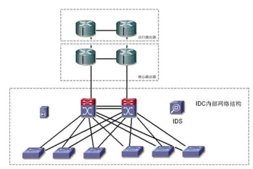
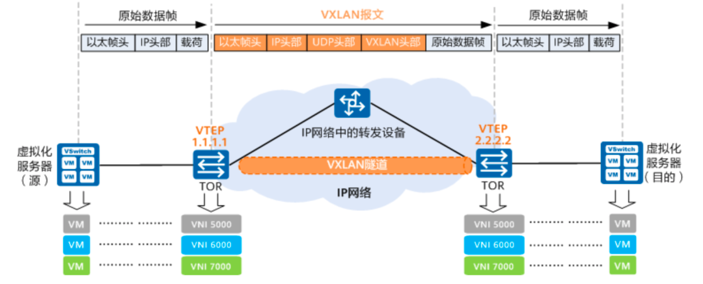

# 支持多租户时机房的刚需

需要认知到，除非是超大型公司去自建，否则一个机房内有很多家企业和单位。
它们租用机房内的一个区域，部署自己的硬件和网络来达成自己的业务目标。
于是，一个机房能够支持多个租户的网络需求是硬性需求。

那么从[[二层网络和常用设备简介](..%2F%E4%BA%8C%E5%B1%82%E7%BD%91%E7%BB%9C%E5%92%8C%E5%B8%B8%E7%94%A8%E8%AE%BE%E5%A4%87%E7%AE%80%E4%BB%8B)]
内可以了解到，网络具有广播数据的存在，这个广播数据是从二层网络发出的，从而导致一个广播域的所有主机都能收到数据。
那么，如果一个广播域内存在不同企业的主机，它们彼此之间不希望收到其它企业的数据，也不希望自己的数据被其它企业收到，该怎么做呢？
答案是使用vlan技术进行广播域的隔离。

# vlan

在IEEE 802.1q的标准中改进了802.1的以太网帧，引入了vlan
tagging技术。它为以太网帧附加上一个vlan的编号，并且转发以太网二层数据的交换机需要在端口上配置自己能够转发和接收vlan编号，如果这个编号不在自己的职责范围内，相关的二层网络数据将被丢弃。

```plantuml
@startuml
!include  https://plantuml.s3.cn-north-1.jdcloud-oss.com/C4_Container.puml

System(pc1, 主机1) #red
System(pc2, 主机2)
System(pc3, 主机3) #red


Boundary(交换机1, 交换机1)  {
    System(port1, port1, vlan 1) #red
    System(port2, 出口port, trunk) #red
    System(port5, port3, vlan 1) #red
    port1 <-[dotted]-> port2
    port1 <-[dotted]r-> port5
    port5 <-[dotted]-> port2
   
}
Boundary(交换机2, 交换机2) {
    System(port3, port2, vlan 2)
    System(port4, 入口port, trunk)
    port3 <-[dotted,#red]l-> port4: X
} 

pc1-->port1
pc2-->port3
pc3 --> port5
port2<-[dotted]r->port4
@enduml
```

如上图所示，主机1连接的交换机有一个端口被划入vlan 1，主机3的交换机接口也是vlan 1。
于是主机1发送给主机2的数据能够在两个交换机接口间进行转发。

如果主机1要给主机2发送数据，则它的数据包会从port1发出，到达交换机的出口port。
这个port通常会配置trunk模式，这个模式不检查vlan标记，然后将数据转给交换机2的入口port(同样是trunk模式)。

交换机2查自己的mac表，看到应当转发给port2，但是它发现接口2的vlan号是2，因此拒绝转发，数据包在此被丢弃。

广播数据也是如此，port1和3在一个广播域内，port2因为vlan号不同，广播数据到它这里也会被丢弃。因此vlan隔离的广播域。

由此，不同企业在机房内可以通过划分vlan保证二层数据在自己的vlan内传播，其它vlan无法收到请求，自己也不会收到来自其它vlan的请求。
二层网络通过vlan进行了隔离(单播数据和广播数据在不同vlan中都无法直接在二层上互通)。

# vlan的局限性

vlan有效地进行了广播域的隔离，也成为了一些小规模的云选取的多租户网络隔离的技术方案。但是vlan有显著的问题

* vlan的编号之后10位，意味着只能有1024个vlan，其规模是受限的
* 在广播域被硬隔离的情况下，vlan号即使一样也收不到数据

有关第二条可能会感觉到奇怪，什么叫广播域硬隔离。
一个简单的例子是两个不同的机房，其广播域当然是硬性隔离的。
但如果机房之间连接上专线呢？答案是估计也是隔离的，因为机房1和机房2规划自己的vlan使用时显然没有互相通气，
如何保证机房1内的vlan1和机房2内的vlan1都能分配给同一个租户？

此外，机房内也不是二层广播通达的



为了保证机房网络的可用性，基本所有机房都会冗余布线，这也就导致了机房内存在大量的环路。二层数据广播在环路内处理不好就引发广播风暴。
因此一个机房内也需要限制广播的范围。限制了二层广播的范围也就意味着arp这类的广播数据无法突破广播域进行传播。
无法突破广播域也就意味着另一个广播域内的，即使同vlan的主机也收不到arp请求，导致这些主机的ip地址无法被有效解析，从而导致无法通信。
由此可见，vlan是一种可行的多租户网络隔离技术，但是其应用规模和范围较为受限

# L2 over L3

既然vlan有这样那样的限制，那么就需要一种新的技术

* 不对网络造成巨大的广播影响
* 能够不受底层广播域的限制
* 支持海量多租户

有关问题1，可以通过3层隧道封装的形式，将二层数据包封装在三层的数据中，
然后通过提前学习和交换所有二层数据的目标mac所在的主机的ip地址的形式来获得在同一个二层目标空间内的主机ip，
通过点对点单播或组播的方式，将二层的广播数据发送给指定的主机，而不是全网广播。

有关问题2，三层网络数据是通过连接在不同广播域的路由器转发，而不是交换机，因此不受广播域的限制
(如果你认为受，那你想想你还怎么上互联网)。

有关问题3，既然这是个新的协议，那要支持多少个租户还不是你想怎么设计就怎么设计。

# vxlan

vxlan就是一种利用上层网络封装二层协议的技术，它一般来说有一个服务程序(或支持vxlan转发的交换机)被称为vtep，
网络二层数据包首先经过vtep封装后进行ip数据包的载荷部分，再由三层网络发送给目标的vtep。
目标vtep收到后解开ip数据包，取出二层网络数据帧，再将它转给目标网卡



在图中，1.1.1.1和2.2.2.2就是vtep，他们通过学习或者其它交换技术彼此知道对方负责的虚拟机的mac地址清单。
所以当两边的虚拟机想要通信时，其底层的宿主机将数据交给vtep，由vtep将二层网络数据整个封装到ip数据包内转发。
接收方解封装后向后转发给正确的虚拟机。

在vxlan中，二层网络隔离的标记从vlan tag变更为vni，vni的段有24位，能支持1600万个网络。

# vtep发现机制

vtep需要进行彼此发现以及交换由自己承载的网卡的vni编号和mac地址。它使用的机制主要有2种。

## 数据面flood-and-learn

当vtep启动后，它利用ip组播协议宣称自己加入了若干个广播组，这些组的组号都和自己上面的vni号相关。
加入后询问该组的成员都有谁，其它具备相同vni号的vtep响应组播协议说明自己在上面，然后彼此交换mac表。

可以发现这种互相发现的玩法其实也没比广播好多少，而且组播协议没有认证机制，随便可以有个谁就加入到组内然后给你发一堆假的mac表来捣乱，

## EVPN控制面学习

上面的做法让vtep在网络中造成一堆组播流量(泛洪流量)，现在已经没有什么成熟厂商再继续使用了，
取而代之的是使用BGP EVPN的方式进行控制面学习。

下文摘抄自华为的vxlan介绍手册[[https://support.huawei.com/enterprise/zh/doc/EDOC1100218004?section=j009](https://support.huawei.com/enterprise/zh/doc/EDOC1100218004?section=j009)]

```text
原有的VXLAN实现方案没有控制平面，是通过数据平面的流量泛洪进行VTEP发现和主机信息（包括IP地址、MAC地址、VNI、网关VTEP IP地址）学习的，
这种方式导致数据中心网络存在很多泛洪流量。为了解决这一问题，VXLAN引入了EVPN作为控制平面，
通过在VTEP之间交换BGP EVPN路由实现VTEP的自动发现、主机信息相互通告等特性，从而避免了不必要的数据流量泛洪。
```

有关bgp，evpn等名次超出了本文的范围，将在其它文档中进行展开。
总而言之就是，主流的玩法已经不是通过组播泛洪来搞了。

# 总结

机房内有很多租户，这些租户的二层网络需要隔离，彼此之间不能随便通信；
vlan支持二层网络隔离但是限制很多；
L2 over L3是一种扩展vlan的方案，主流实现之一是vxlan；
vxlan中的vtep需要互相发现，其中EVPN控制面学习是主流方法

# 下一步阅读

[三层网络与数据交换机制介绍](..%2F%E4%B8%89%E5%B1%82%E7%BD%91%E7%BB%9C%E4%B8%8E%E6%95%B0%E6%8D%AE%E4%BA%A4%E6%8D%A2%E6%9C%BA%E5%88%B6%E4%BB%8B%E7%BB%8D)