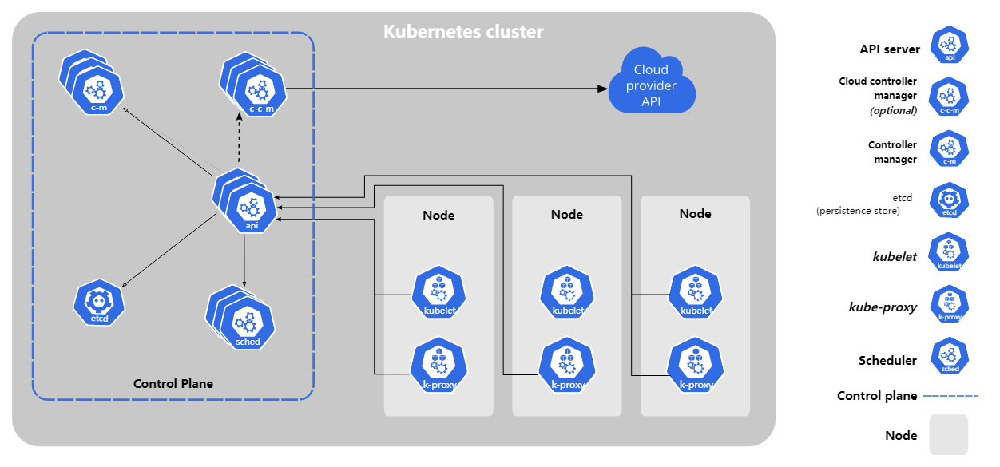

# k8s简介

k8s是一个容器调度和管理系统，它管理底层的物理机(也可以是云主机)，将应用运转所需的容器调度到集群的虚拟机上，并保证容器按照既定的副本数工作。
当容器或底层设施发生问题时，再进行重新调度。

# k8s节点的主要类型

```plantuml
@startuml
!include  https://plantuml.s3.cn-north-1.jdcloud-oss.com/C4_Container.puml

System(k8s_master, k8s master) #red
System(k8s_worker, k8s worker) #green
k8s_master <-r- k8s_worker
@enduml
```

k8s作为一个主机集群管理系统，分为k8s master和k8s worker两种节点类型。

* k8s master主要是集群的控制节点，通常不承担工作负载的调度
* k8s worker是集群的工作节点，运行工作负载

在规模较小的集群下，k8s master和worker可以合并在一起，变成这样

```plantuml
@startuml
!include  https://plantuml.s3.cn-north-1.jdcloud-oss.com/C4_Container.puml

Boundary(主机, 主机) {
    System(k8s_master, k8s master) #red
    System(k8s_worker, k8s worker) #green
}
@enduml
```

# k8s核心组件



这张图来自官网，我来稍微做下翻译

## 控制平面

k8s控制平台可以和上文中的"k8s master"画等号，它包括

* etcd: 至关重要的元数据存储数据库，etcd挂掉了 = 控制面板挂掉了，etcd丢数据了 = 集群里运行的应用负载等等之类的部署脚本，配置项之类的元数据有可能就没了。
  下面是官方原话。

```text
If your Kubernetes cluster uses etcd as its backing store, make sure you have a back up plan for those data.
```

* api server: 至关重要的接口，k8s的所有组件之间都是调用api server的功能，api挂了 = 控制平面挂了
* controller manager: k8s由一系列控制器，比如副本数控制器什么的，不同的控制器实现不同的集群功能，哪个挂了哪种功能就没了
* scheduler: 调度器，基于反亲和等一系列策略实现k8s的调度

## 工作节点

* kubelet: 相当于工作节点上的agent，负责pod的管理
* kube-proxy: 主要在k8s工作节点上实现k8s的"Service"资源的网络访问功能

组件间的协同逻辑大致是

* 要下管控指令给api server(比如创建pod)
* api server负责把指令持久化到etcd
* scheduler调api server取出要调度的pod并找到一台机器
* 告诉kubelet去创建pod
* pod状态由kubelet写回到api server并持久化到etcd

# k8s命令行工具

k8s的所有管理可以通过调api
server的接口完成([https://kubernetes.io/docs/concepts/overview/kubernetes-api/](https://kubernetes.io/docs/concepts/overview/kubernetes-api/))
，也就是你知道玩的明白，你可以用curl搞定一切。但是k8s知道你懒，所以提供了kubectl命令行工具。

