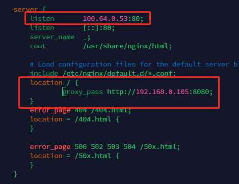
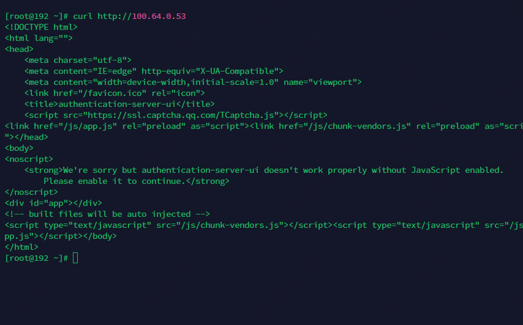

# 宗旨

本文旨在完成生产可用的k8s集群的网络规划并主要侧重流量切分，使得管理所需的流量与租户容器的流量以及访问存储和中间件的流量不会混杂在一起

# 前提与假设

* 当前规划是在1个可用域(region)内，跨可用域默认情况下应当认为会单独部署1套集群，而不是将本地集群的网络扩展到新的可用域
* 规划按照1个可用域有3个可用区(Availability Zone)执行

# 互相访问的情况

在划分网络前首先应当了解在云的集群部署后，容器云内外部可能发生的访问

## 进入云的访问

* 云租户的最终用户通过互联网线路访问云上的应用负载(pod)，其路径是从外部ip到云的ingress再经由service到pod
* 云租户(及其他应用程序)通过外部网络访问云的租户侧控制台和openApi，
  其路径是从外部ip到部署云控制台的网络(主要是云的管理网络)
* 企业运维人员(及其他应用程序)通过企业内网访问云的运维控制台和运维api，
  其路径是从办公网到机房网络到云的运维控制台部署的网络(主要是云的管理网络)

## 云对外的访问

* 云内pod访问互联网
* 云内pod彼此东西向访问
* 云内pod访问企业内部接口(如果有权限的话)
* 云的underlay主机访问企业内部接口(如果有权限的话)
* 云的underlay主机访问互联网

## 3层网络通畅性

要保证以上这些访问的可能，就要保证3层网络的通畅性。
3层网络的通常有2种和新方法

* ip和ip之间的直接通信
* ip与代理服务之间通信，由代理服务器转发

## 结论

### 入向

* 互联网对pod的访问一概需要使用ingress转发，因为pod在overlay网络中且ip变来变去，不支持从外部直接访问pod的ip
* 租户访问租户控制台需要从互联网通过nginx代理服务器转入云内
* 企业运维访问云的控制台需要访问办公网可达的机房网络入口，再由机房访问内部通过nginx反向代理的模式访问云内的运维控制台

### 出向

* pod访问互联网等价于云的底层设施访问互联网，需要设置能够通往互联网的snat转发
* pod的东西向通信由容器云原生实现
* pod和underlay主机访问企业内部接口，如果要实现ip和ip的直接通信，则pod的网络以及underlay网络与要访问的ip地址之间不得存在ip段冲突

# 网络类型

```plantuml
@startuml
!include  https://plantuml.s3.cn-north-1.jdcloud-oss.com/C4_Container.puml

Boundary(办公大楼, 办公网, 10.0.0.0/16) {
}

Boundary(生产机房, 生产机房) {
    Boundary(外部网络, 外部网络, 10.99.1.0/24)
    Boundary(业务网络1, 业务网络, 10.100.0.0/24)
    Boundary(业务网络2, 业务网络, 10.100.1.0/24)
    Boundary(业务网络3, 业务网络, 10.100.2.0/24)
    Boundary(业务网络4, 业务网络, 172.16.0.0/24)
    Boundary(云底层网络, 云底层网络, 100.64.0.0/17) {
        Boundary(云管理网络, 云管理网络, 100.64.0.0/19)
        Boundary(容器流量网络, 容器流量网络, 100.64.32.0/19) {
            Boundary(pod网络, pod网络, 10.240.0.0/16) #orange
            Boundary(k8s集群网络, k8s集群网络, 10.254.0.0/16) #orange
        }
        Boundary(存储访问网络, 存储访问网络, 100.64.64.0/19)
    }
    外部网络-d->业务网络1
    外部网络-d->业务网络2
    外部网络-d->业务网络3
    外部网络-d->业务网络4
    外部网络-d-> 云底层网络
@enduml
```

在一个机房内部会很多张网，基本可以划分为

* 办公网: 员工所在的网络
* 外部网络: 通过这个网络能够到达公网或从公网能够访问
* 业务网络: 各种各样生产系统所在的网络以及企业内部办公系统所在的网络(OA、ERP等)
* 云底层网络: 运行云的基础设施和辅助组件的网络，并进一步划分为云的管理和控制系统彼此交换数据的流量(云管理网络)
  ，pod的东西南北向流量(容器流量网络)以及云的底层宿主机与pod访问数据库，缓存，块存储等数据系统的流量(存储访问网络)
* pod网络: pod运行的层叠网络
* k8s集群网络: service运行的层叠网络

每一个网络如果用云的概念来表达，都可以被理解为一个vpc，这些vpc之间如果希望进行对等连接并达到互相访问的目标，则不能允许有重复ip地址段的出现。特别是如果pod想要直接访问业务系统的一个ip而不通过中间代理。

# ip地址规划

## 云底层网络ip地址规划

从云的底层网络角度出发，希望能够申请到一个17掩码的连续地址使用，这样一个region内的可用地址有30000+个。按照管理，存储，流量网络划分，每个段也有8000+个左右的ip，再按照3个az切分，每个az也保留有2000多个ip，足够宿主机的使用和扩容。
这样的一个段需要从企业的it部门申请亦或者可以使用100.64.0.0/17来获得1个region的地址，在第二个region可以使用100.64.128.0/17并以此类推，从而保证2个region之间的云底层设施的网络还有ip互访的可能。
但如果企业it反对，则需要考虑可用的地址空间以及云底层基础设施的扩容空间，毕竟整个网络需要切分为16个子网，不建议最终子网的主机规模小于1个C类，从而连续的网段至少为20位掩码。

## pod网络的ip地址规划

pod网络的ip地址规划主要来自于是否希望pod能够直接通过ip访问1个非互联网的地址。
如果希望的话，pod网络的网段也不能和希望访问的网段之间有ip地址段覆盖。
在k8s集群中，默认pod会去一个10网段较为靠后的地址空间，比如10.254.0.0/16之类的。

这里pod网络的掩码大小意味着能够承载的pod总数，16位掩码意味着承载6万个pod，每个pod就算1C也要6万C，按照一台服务器64C计算需要1000台，因此基本够用。

## k8s集群网络的ip地址规划

k8s集群的service运行的网络，不要和pod的网段有重叠，可以取10网段靠后的一个ip地址空间，比如10.253.0.0/16。

# 云底层网络的AZ扩展

当云需要支持多个AZ时，每一个网络在另一个AZ应当被视作水平拓展。意味

* 按照支持3个AZ出发，每一个region被分配的ip段应当被切分为4份，3份给每个AZ使用，留下1个段，如果AZ内的IP不够了最后1个段再切4份补充直到无法细分。
* 这些子网段默认都应当互相能够ping通，配置专线了路由的工作交给网络工程师
* 如果这些系统之间需要进行2层的网络广播，意味着AZ还需要采用大2层的方案保证两个3层子网下面的2层网络具备跨机房的广播能力
  (虽然不怎么推荐)

# 管理网络

管理网络是k8s集群节点之间进行心跳检查，api调用，etcd之间数据传输等流量的网络。云管平台，监控系统等管理云底座的应用也部署在这里。这样他们之间彼此调用就可以不需要走网关了，而是通过2层网络直通，性能较好。

```plantuml
@startuml
!include  https://plantuml.s3.cn-north-1.jdcloud-oss.com/C4_Container.puml

Boundary(管理网络, 管理网络, 100.64.0.0/19) {
    System(master, k8s master, k8s集群组件) #red
    System(worker, k8s worker, k8s集群组件) #red
    System(ingress, k8s ingress, k8s集群组件) #red
    System(dockerRepo, docker  repo)
    System(prometheus, prometheus)
    System(elk, elk)
    System(git, git)
    System(jenkins, jenkins)
    System(云管平台, 云管平台)
    System(数据库, 数据库)
    System(缓存, 缓存)
    System(消息队列, 消息队列)
    System(..., ...)
}
@enduml
```

该网络的主要流量构成为

* k8s集群与api server之间的通信
* etcd与api server之间的通信
* k8s集群与git、docker仓库等通信
* 监控、日志系统与k8s集群之间的通信
* 对云控制台的访问
* 告警系统等对互联网的访问

```plantuml
@startuml
!include  https://plantuml.s3.cn-north-1.jdcloud-oss.com/C4_Container.puml
Boundary(管理网络, 管理网络, 100.64.0.0/19) {
  Boundary(管理网络1, 100.64.0.0/21, AZ-1)
  Boundary(管理网络2, 100.64.8.0/21, AZ-2)
  Boundary(管理网络3, 100.64.16.0/21, AZ-3)
  Boundary(管理网络4, 保留段, 100.64.24.0/19)
}
@enduml
```

在1个AZ的子网内，建议

* k8s集群从开始向后拿地址(从100.64.0.0开始向后)
* 云管平台的应用和组件从后往前拿地址(从100.64.31.254开始向前)
* 不划分子网，保持子网内通信直接通过网卡点对点转发不经过路由，特别是监控采集系统的流量全都经过网关可能造成网关的很大压力

# 容器流量网络

容器流量网络的作用是给容器云的pod提供东西向和南北向网络通信，也就是单独给租户用的网络。这个网络理论上能够从互联网访问进来，并能够访问互联网。原则上来说，k8s容器流量网络只有k8s集群的节点。
这也是为什么说管理网的那一堆应用最好从后往前拿ip，这样可以使得k8s节点在容器流量网络中的ip和管理的ip在位数靠近，好记。

```plantuml
@startuml
!include  https://plantuml.s3.cn-north-1.jdcloud-oss.com/C4_Container.puml

Boundary(容器流量网络, 容器流量网络, 100.64.32.0/19) {
    System(k8smaster, k8s master)
    System(k8swoker, k8s worker)
    System(k8ingress, k8s ingress)
}
@enduml
```

该网络的主要流量构成为

* pod和集群内外部的数据和调用流量

```plantuml
@startuml
!include  https://plantuml.s3.cn-north-1.jdcloud-oss.com/C4_Container.puml
Boundary(容器流量网, 容器流量网, 100.64.32.0/19) {
  Boundary(容器流量网1, 100.64.32.0/21, AZ-1)
  Boundary(容器流量网2, 100.65.40.0/21, AZ-2)
  Boundary(容器流量网3, 100.65.48.0/21, AZ-3)
  Boundary(容器流量网4, 保留段, 100.65.56.0/21)
}
@enduml
```

# 存储流量网络

该网络用于宿主机连接后台块存储设备、文件存储设备以及对象存储设备、数据库、缓存等给租户用的中间件。
该网络的存在有利于在访问流量峰值到达时，降低因后台数据访问而造成的容器网络数据拥塞。

```plantuml
@startuml
!include  https://plantuml.s3.cn-north-1.jdcloud-oss.com/C4_Container.puml
Boundary(存储访问网络, 存储访问网络, 100.64.64.0/19) {
  Boundary(存储访问网络1, 100.64.64.0/21, AZ-1)
  Boundary(存储访问网络2, 100.64.72.0/21, AZ-2)
  Boundary(存储访问网络3, 100.64.80.0/21, AZ-3)
  Boundary(存储访问网络4, 保留段, 100.64.88.0/21)
}
@enduml
```

该网络的主要流量构成为

* 物理机对远程块存储设备的数据访问流量
* pod对外部对象存储，文件存储等存储设施的直接访问流量
* pod对外部数据库，缓存等中间件的访问流量

该网络**推荐**使用一个独立的vlan号从而避免受到其它网络的二层数据干扰

## 服务器网卡规划

由网络规划可以导出服务器需要3块网卡，1个千兆(管理流量)，2个万兆(容器流量网络和存储流量网络)，实际采购过程中按预期的调用峰值和历史观测值执行。
此外，网卡之间是否进行bond(mode=1(active-backup))、是否和交换机之间执行双上联从而通过交换机堆叠或链路聚合等达成硬件高可用或高性能，
视**财力**和**财力**(确信)而为。 在预算紧张的情况下，网卡的合并规则是存储流量网与容器流量网合并，但**绝对**不推荐3合1模式

# 流量划分

网卡连接好后，大部分情况下宿主机会使用正确的网卡来发送请求。
比如说k8s worker要连接iscsi target，而这个存储服务器接入了存储网(至少把访问接口暴露给了存储网)，其访问地址是存储网的ip地址，
于是worker使用存储网网卡连接这个地址进行访问。这是操作系统的底层能力，它在程序进行客户端访问时，会选择正确的网卡发送该请求。
作为服务端时，则需要指定应用程序绑定的ip来确保流量从正确的网卡进来。
因此原则上来说，这3个网彼此之间不需要路由。需要对外访问的服务，主要在正确的网络上布置了自己的访问点即可。

下面给一个测试过的例子

* 一台机器有2个网卡: 100.64.0.53 + 192.168.0.53
* 这台机器的nginx监听: 100.64.0.53(流量从一个网卡进)
* nginx代理192.168.0.105:8080



* 从100.64.0.52 `curl http://100.64.0.53`



因此，只要节点上的出口ip的地址对，程序写的时候没抽疯非要指定从绑定的ip出发，就应该自动能通

# 入向流量

## 去往管理系统

```plantuml
@startuml
!include  https://plantuml.s3.cn-north-1.jdcloud-oss.com/C4_Container.puml
Boundary(管理网络1, 100.64.0.0/21, AZ-1){
    System(nginx, nginx, 负载均衡)
    System(云管平台, 云管平台)
    System(openApi, openApi)
    nginx <-d-> 云管平台
    nginx <-d-> openApi
}
Boundary(访问者网络, 公共网络) {
    Container(可访问ip, 可访问ip)
}
Boundary(互联网, 互联网) {
     System(F5, F5, 接入设备)
}
Boundary(其它业务网, 其它业务网) {
     System(客户端, 客户端)
}
nginx <-r->可访问ip
客户端 <-d->可访问ip
F5 <-d->可访问ip
@enduml
```

整体来说，管理网对外暴露的服务用nginx执行反向代理，其基于域名或者端口的模式进行内部转发。落地方式是

* 找一台具有多网卡的服务器，一根线接入管理网，一根接入一个公共网络
* 其在公共网络暴露一个ip，这个ip使得云外需要访问的主机可达

具体内部代理设备如何被云管理网外的设备访问，可以在具体实施时咨询机房管理员

## 去往pod

```plantuml
@startuml
!include  https://plantuml.s3.cn-north-1.jdcloud-oss.com/C4_Container.puml
  Boundary(容器流量网1, 100.64.32.0/21, AZ-1) {
    System(nginx, nginx, 负载均衡)
    System(ingress1, ingress)
    System(ingress2, ingress)
    System(ingress3, ingress)
    nginx <-d-> ingress1
    nginx <-d-> ingress2
    nginx <-d-> ingress3
}
Boundary(访问者网络, 公共网络) {
    Container(可访问ip, 可访问ip)
}
Boundary(互联网, 互联网) {
     System(F5, F5, 接入设备)
}
Boundary(其它业务网, 其它业务网) {
     System(客户端, 客户端)
}
nginx <-r->可访问ip
客户端 <-d->可访问ip
F5 <-d->可访问ip
@enduml
```

玩法一样