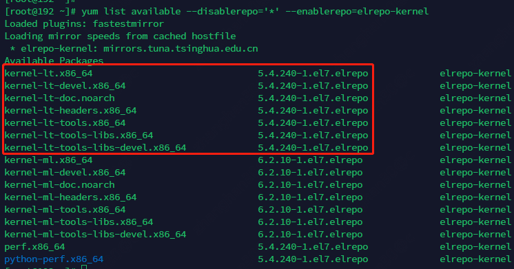
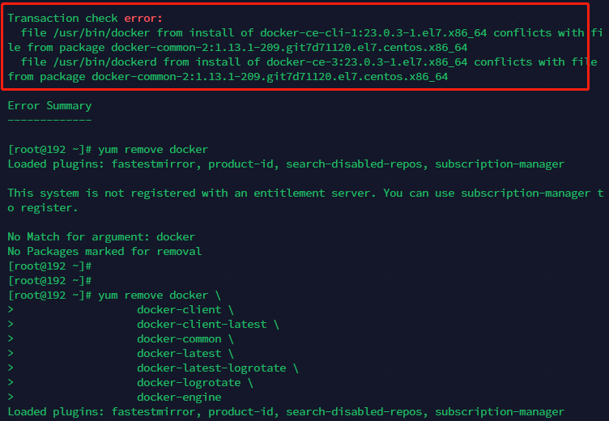
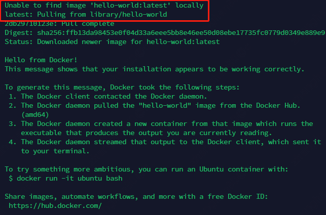
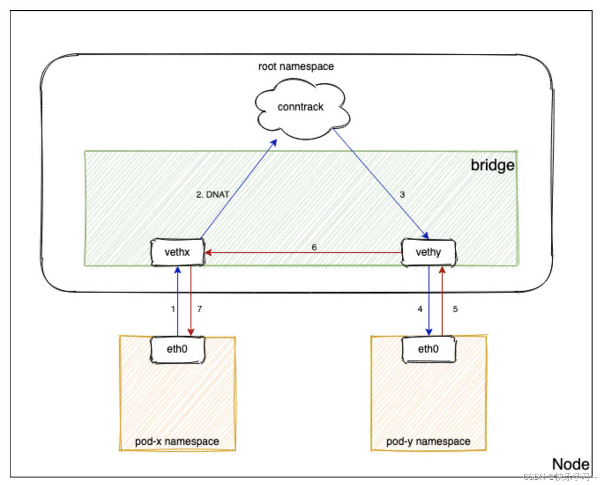

# 准备宿主机镜像

## 生成和配置ssh互信

## 升级操作系统内核

选用centos7.9版本，将内核升级为最新:

* `yum -y update`: 执行yum存储库更新
* `rpm --import https://www.elrepo.org/RPM-GPG-KEY-elrepo.org`: 导入内核库gpg公钥
* `yum install https://www.elrepo.org/elrepo-release-7.el7.elrepo.noarch.rpm` 把repo激活
* `yum list available --disablerepo='*' --enablerepo=elrepo-kernel` 看一下那些内核版本可用，lt代表长期支持的，不要装"ml"
  版本的，那些都是测试版本

**警告**: k8s在3.10版本上有bug，大集群会挂掉



* `yum --enablerepo=elrepo-kernel install kernel-lt` 安装lt版本
* `reboot` 重启
* `vim /etc/default/grub` 修改grub文件: 修改GRUB_DEFAULT=0，0是开
* `grub2-mkconfig -o /boot/grub2/grub.cfg`令其生效

## 修改时区和语言

* `timedatectl`: 查看时区，比如下面的就是错的，需要改

```text
[root@192 ~]# timedatectl
      Local time: Fri 2023-04-07 09:19:45 EDT
  Universal time: Fri 2023-04-07 13:19:45 UTC
        RTC time: Fri 2023-04-07 13:19:46
       Time zone: America/New_York (EDT, -0400)
     NTP enabled: yes
NTP synchronized: yes
 RTC in local TZ: no
      DST active: yes
 Last DST change: DST began at
                  Sun 2023-03-12 01:59:59 EST
                  Sun 2023-03-12 03:00:00 EDT
 Next DST change: DST ends (the clock jumps one hour backwards) at
                  Sun 2023-11-05 01:59:59 EDT
                  Sun 2023-11-05 01:00:00 EST
```

* `timedatectl set-timezone Asia/Shanghai`: 修改时区UTC+8

```text
[root@192 ~]# timedatectl
      Local time: Fri 2023-04-07 21:22:06 CST
  Universal time: Fri 2023-04-07 13:22:06 UTC
        RTC time: Fri 2023-04-07 13:22:07
       Time zone: Asia/Shanghai (CST, +0800)
     NTP enabled: yes
NTP synchronized: yes
 RTC in local TZ: no
      DST active: n/a
```

## 关闭交换分区

* `swapoff -a`: 暂时先关闭
* `vi /etc/fstab`: 打开文件挂载并在"/dev/mapper/centos-swap"前加上"#"
* `reboot`: 重启后`free -h`看效果，如果成功则

```text
[root@localhost ~]# free -h
              total        used        free      shared  buff/cache   available
Mem:           1.9G        166M        1.6G        8.5M        217M        1.6G
Swap:            0B          0B          0B
```

## 映射docker的镜像存储位置

默认情况下docker安装后的路径是:

```text
Docker Root Dir: /var/lib/docker
```

将路径修改为docker镜像和日志存储专用硬盘的位置。如果不确定自己装的docker一定是在这个目录，则可以先装完了再把目录拷贝过去

## 安装docker

* `yum install -y yum-utils`: 安装yum工具包
* `yum-config-manager --add-repo https://download.docker.com/linux/centos/docker-ce.repo`: 添加docker ce的源
* `yum install docker-ce docker-ce-cli containerd.io docker-buildx-plugin docker-compose-plugin`: 安装docker和官网推荐的全家桶，
  **不要**用`yum install docker`，那个装的是旧版本(如下)

```text
[root@192 ~]# docker -v
Docker version 1.13.1, build 7d71120/1.13.1
```

如果出错是这样



可能是之前装了docker没删干净，执行`yum remove docker docker-client docker-client-latest docker-common docker-latest docker-latest-logrotate docker-logrotate docker-engine`
删干净

* `docker -v`

```text
[root@192 ~]# docker -v
Docker version 23.0.3, build 3e7cbfd
```

* `systemctl enable docker`: 启用服务
* `systemctl start docker`: 启动服务
* `docker run hello-world`: 测试一下



需要注意的是，docker可能要上网拉镜像

## 切换cgroup驱动为systemd并设置一些镜像地址

* `systemctl --version`: 查看systemd版本
* `docker info`: 从docker info看下当前的是不是还是"cgroupfs"

```text
 Logging Driver: json-file
 Cgroup Driver: cgroupfs
 Cgroup Version: 1
```

* `vim /etc/docker/daemon.json`: 编辑docker的手续进程选项

```json
{
  "registry-mirrors": [
    "https://docker.mirrors.ustc.edu.cn",
    "https://hub-mirror.c.163.com",
    "https://reg-mirror.qiniu.com",
    "https://registry.docker-cn.com"
  ],
  "exec-opts": [
    "native.cgroupdriver=systemd"
  ]
}
```

cgroup是linux用来跟进程分组并管理资源用的组件，它有2套实现，systemd和cgroupfs。因为systemd现在大多数系统已经自带了，所以就不推荐使用cgroupfs了。
在此需要注意，docker切换为systemd后，k8s安装的时候也要使用systemd作为cgroup的控制器。否则k8s管理资源和docker实际使用就不是一套，容易出问题。

## 关闭防火墙

firewalld可能会对iptables的一些规则进行干扰造成网络通信问题，通过`systemctl disable firewalld`将服务关停

## 确认常见网络命令可用

检查

* tcpdump
* ping
* curl
* arp
* telnet
* traceroute
* nslookup
* iptables
* brctl

等常用网络命令的组件在当前系统可用，没有则最好安装一下

## 配置ssh公钥互信

* `ssh-keygen`: 生成访问密钥
* `cat  ~/.ssh/id_rsa.pub >> ~/.ssh/authorized_keys`: 自己和自己信任一下
* `chmod 600 ~/.ssh/authorized_keys`

## 开启ip转发和网桥直接转发使用iptables规则功能

* 加载overlay和br_netfilter模块

```shell
cat <<EOF | sudo tee /etc/modules-load.d/k8s.conf
overlay
br_netfilter
EOF
```

* 开启iptables转发

```shell
cat <<EOF | sudo tee /etc/sysctl.d/k8s.conf
net.bridge.bridge-nf-call-iptables  = 1
net.bridge.bridge-nf-call-ip6tables = 1
net.ipv4.ip_forward                 = 1
EOF
```

bridge-nf-call-iptables是个非常重要的参数，它主要解决两个相同宿主机上的pod通过service转发流量后，回包不应用iptables规则的问题。
经过参考[[https://blog.csdn.net/qq_43684922/article/details/127333368](https://blog.csdn.net/qq_43684922/article/details/127333368)]
给出的图



和[[nat网络地址转换介绍](..%2F..%2F..%2F..%2F%E7%BD%91%E7%BB%9C%2F%E5%9F%BA%E7%A1%80%E7%9F%A5%E8%AF%86%2Fnat%E7%BD%91%E7%BB%9C%E5%9C%B0%E5%9D%80%E8%BD%AC%E6%8D%A2%E4%BB%8B%E7%BB%8D)]

进行讲解:
pox-x通过service访问pod-y，在访问时，pod-x的网络流量到达service的ip，由service的ip经过dnat转换为pod-y的ip；同时将pod-x的ip作为源ip转发了包；
回包时，pod-y回给pod-x的包是pod-x的源ip，而此时pod-x和pod-y之间网桥在内部直接转发了包
(通常同一个主机上的pod在同一个子网以免包转来转去)而没有使用iptables，
这造成pod-x看到的回包的源ip是pod-y而不是service的ip，而这个ip没有和自己三次握手，于是连接失败。

bridge-nf-call-iptables = 1将解决这个问题，它的意思是，网桥直接做二次发包的时候也要经过iptables，这样回包经过iptables之后会发现这个访问是经过dnat来的，
从而要将源ip改回service的ip。

## 安装cri-dockerd插件

从很早以前，k8s就不再使用dockershim作为cri，改为使用cri-dockerd，因此需要安装cri-dockerd

* `wget https://github.com/Mirantis/cri-dockerd/releases/download/v0.3.1/cri-dockerd-0.3.1-3.el7.x86_64.rpm`: 引入repo的gpg
* `yum install cri-dockerd-0.3.1-3.el7.x86_64.rpm -y`: 安装组件
* `systemctl enable cri-docker`: 启用服务
* `service cri-docker start`: 启动服务
* `ll /run/cri-dockerd.sock`: 查看socket是否已经建立

```text
[root@localhost ~]# ll /run/cri-dockerd.sock
srw-rw----. 1 root docker 0 Apr 11 23:44 /run/cri-dockerd.sock
```

## 安装kubeadm & kubelet

kubeadm是k8s集群的初始化工具，kubelet则是节点agent，每个节点都要装

* 导入google repo(使用阿里进行替换)

```shell
cat <<EOF > /etc/yum.repos.d/kubernetes.repo
[kubernetes]
name=Kubernetes
baseurl=https://mirrors.aliyun.com/kubernetes/yum/repos/kubernetes-el7-x86_64/
enabled=1
gpgcheck=1
repo_gpgcheck=1
gpgkey=https://mirrors.aliyun.com/kubernetes/yum/doc/yum-key.gpg https://mirrors.aliyun.com/kubernetes/yum/doc/rpm-package-key.gpg
EOF
```

* 关闭selinux

```shell
setenforce 0
# SELINUX=permissive
vim /etc/selinux/config
```

* 下载并安装(实验装的是1.26)

```shell
# 先看自己装的哪个版本
yum list kubelet kubeadm
# 看好了再装
yum install -y kubelet kubeadm --disableexcludes=kubernetes
# 服务启动后也会不停重启，因为还没有集群
systemctl enable --now kubelet

```
