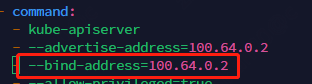
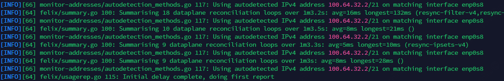

# 修改节点名称

k8s要求每个节点的hostname都不一样

```shell
hostnamectl set-hostname k8s-master-1
reboot

```

# 拉镜像

```shell
docker pull registry.aliyuncs.com/google_containers/pause:3.6
docker tag registry.aliyuncs.com/google_containers/pause:3.6 registry.k8s.io/pause:3.6

```

# 设置kubeadm配置文件

**警告**: ClusterConfiguration & KubeletConfiguration & KubeProxyConfiguration都是集群级的，不要乱写ip地址，有些ip地址写上了会被别的节点直接用。
麻烦的要死

```yaml
## 初始化配置
kind: InitConfiguration
apiVersion: kubeadm.k8s.io/v1beta3
## 加入集群的token
bootstrapTokens:
  - groups:
      - system:bootstrappers:kubeadm:default-node-token
    token: abcdef.0123456789abcdef
    ttl: 24h0m0s
    usages:
      - signing
      - authentication
## apiserver的地址
localAPIEndpoint:
  advertiseAddress: 100.64.0.2 #这里写上本地api server的地址
  bindPort: 6443
## 节点注册信息
nodeRegistration:
  criSocket: unix:///var/run/cri-dockerd.sock #这里写cri运行时的socket
  imagePullPolicy: IfNotPresent #拉镜像
  name: k8s-master-1 #这里写上节点名称
---
## 集群配置选项
kind: ClusterConfiguration
apiVersion: kubeadm.k8s.io/v1beta3
kubernetesVersion: 1.26.0 #要安装的版本
certificatesDir: /etc/kubernetes/pki #证书存哪
clusterName: kubernetes #集群的名字，不改也无所谓
imageRepository: registry.aliyuncs.com/google_containers #这些换上国内的镜像源 
controlPlaneEndpoint: "100.64.0.53:6443" # api server lb地址
## api server选项
apiServer:
  timeoutForControlPlane: 4m0s
## controller管理器选项
controllerManager:
  extraArgs:
    "node-cidr-mask-size": "24" #每个节点的cidr大小，不能超过整个pod cidr的大小
# etcd选项
etcd:
  local:
    imageRepository: registry.aliyuncs.com/google_containers #换上国内的源
    dataDir: /var/lib/etcd # 改成数据盘路径
#dns选项
dns:
  imageRepository: registry.aliyuncs.com/google_containers #阿里云镜像地址
##网络选项
networking:
  dnsDomain: gardenerframework.local #修改service的域名后缀
  serviceSubnet: "10.253.0.0/16" #cluster ip cidr
  podSubnet: "10.254.0.0/16" # pod cidr
---
## kubelet配置
kind: KubeletConfiguration
apiVersion: kubelet.config.k8s.io/v1beta1
cgroupDriver: systemd #使用systemd
# 不要指定ip，否则其它集群join过来的kubelet都要用这个配置，烦死了
#address: 100.64.0.2 #kublet工作在管理网网卡
maxPods: 110 #一个节点最多多少个pod，默认值就是110
---
# kubeproxy配置
apiVersion: kubeproxy.config.k8s.io/v1alpha1
kind: KubeProxyConfiguration
mode: "ipvs" #启用ipvs
```

官网对于每个选项的含义的连接:

* [https://kubernetes.io/docs/reference/config-api/](https://kubernetes.io/docs/reference/config-api/)

# 拉镜像

`kubeadm config images pull --config=xxx.yaml`

# 执行安装

然后空跑一下看看有没有报错`kubeadm init --dry-run --config xxx.yaml`，没啥问题后就可以开始安装。
装跪了也不用愁，重新`kubeadm init --config ?.yxml --upload-certs --v=5`，将报错涉及的文件删掉，kubelet服务停掉就能重新安装。

装的过程中可能会失败，失败后按照提示问题然后修复，常见的问题有比如kubelet拉不到镜像

```text
failed pulling image \"registry.k8s.io/pause:3.6\"
```

把这个镜像的镜像仓库换成阿里云的拉下来后`docker tag`

```shell
docker pull registry.aliyuncs.com/google_containers/pause:3.6
docker tag registry.aliyuncs.com/google_containers/pause:3.6 registry.k8s.io/pause:3.6

```

其它k8s组件启动不了的问题，可以用crictl查，kubeadm安装失败后有提示

装完了显示出来的类似这样的要记下来，token默认是1天有效

```text
kubeadm join 100.64.0.53:6443 --token abcdef.0123456789abcdef \
        --discovery-token-ca-cert-hash sha256:af3dd5986a21feb274fb3e21f5a734f8cc5f67b13dee2152d3cc58a54af11c8c \
        --control-plane --certificate-key 8f864f4a5085e07db45a763388a64ba50ae3f58c33efda5093d308e790ed8f5e

Please note that the certificate-key gives access to cluster sensitive data, keep it secret!
As a safeguard, uploaded-certs will be deleted in two hours; If necessary, you can use
"kubeadm init phase upload-certs --upload-certs" to reload certs afterward.

Then you can join any number of worker nodes by running the following on each as root:

kubeadm join 100.64.0.53:6443 --token abcdef.0123456789abcdef \
        --discovery-token-ca-cert-hash sha256:af3dd5986a21feb274fb3e21f5a734f8cc5f67b13dee2152d3cc58a54af11c8c 
```

# 检查manifest文件的地址监听是否正确

```text
ll /etc/kubernetes/manifests
-rw-------. 1 root root 2394 Apr 13 02:52 etcd.yaml
-rw-------. 1 root root 3368 Apr 13 02:52 kube-apiserver.yaml
-rw-------. 1 root root 2910 Apr 13 02:52 kube-controller-manager.yaml
-rw-------. 1 root root 1464 Apr 13 02:52 kube-scheduler.yaml
```

检查这些yaml的地址监听是否正确，通常来说只需要修改kube-apiserver.yaml



kubelet的配置文件在"/var/lib/kubelet/config.yaml"，通常不用管

# 安装cni

cni是网络插件，可以选择calico，因为它支持网络策略，flannel不支持网络策略。

[https://docs.tigera.io/calico/latest/getting-started/kubernetes/self-managed-onprem/onpremises#install-calico-with-kubernetes-api-datastore-more-than-50-nodes](https://docs.tigera.io/calico/latest/getting-started/kubernetes/self-managed-onprem/onpremises#install-calico-with-kubernetes-api-datastore-more-than-50-nodes)

该文档讲解了如何在50个以上的大集群上安装calico

总的来说就是

* 把编排文件下载下来

```shell
curl https://raw.githubusercontent.com/projectcalico/calico/v3.25.1/manifests/calico-typha.yaml -o calico.yaml
```

* 改一下typha daemon的副本数

```yaml
apiVersion: apps/v1beta1
kind: Deployment
metadata:
  name: calico-typha
  ...
spec:
  ...
  replicas: <number of replicas>
```

* 将流量网的ip地址段给到calico进行网卡绑定

```shell
## 按网段
kubectl set env daemonset/calico-node -n kube-system IP_AUTODETECTION_METHOD=cidr={容器网ip段}
## 或者按网卡
kubectl set env daemonset/calico-node -n kube-system IP_AUTODETECTION_METHOD=interface=enp0s8
```



然后就完事了

