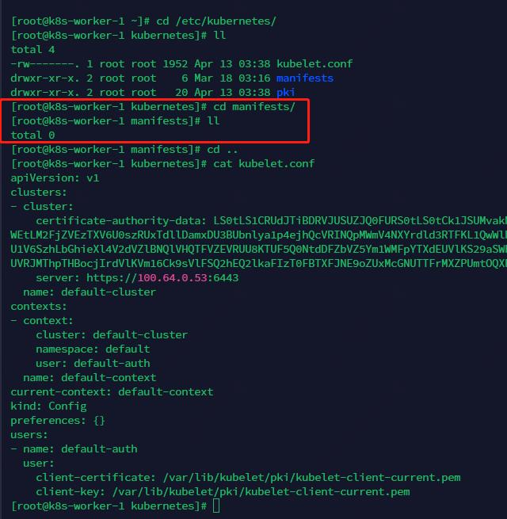

# 暂时

# 变更名称

```shell
hostnamectl set-hostname k8s-worker-1
reboot
```

# 拉镜像

```shell
docker pull registry.aliyuncs.com/google_containers/pause:3.6
docker tag registry.aliyuncs.com/google_containers/pause:3.6 registry.k8s.io/pause:3.6

```

# 编写配置文件

```yaml
# 加入集群的配置
kind: JoinConfiguration
apiVersion: kubeadm.k8s.io/v1beta3
## 加入集群的token
discovery:
  bootstrapToken:
    token: abcdef.0123456789abcdef
    apiServerEndpoint: 100.64.0.53:6443
    caCertHashes:
      - "sha256:aeca62fe59a5bf550a6b9dd46ce29cea61787f0305d9d7dd6f0a0ae5f008de53"
## 节点注册信息
nodeRegistration:
  criSocket: unix:///var/run/cri-dockerd.sock #这里写cri运行时的socket
  imagePullPolicy: IfNotPresent #拉镜像
  name: k8s-worker-1 #这里写上节点名称
```

# 执行

```shell
kubeadm join --config ?.yaml --v=5
```

# 检查manifest

感觉没什么好检查的

kubelet的监听地址也可以不用改

