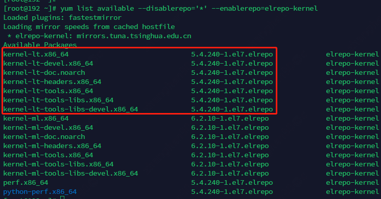
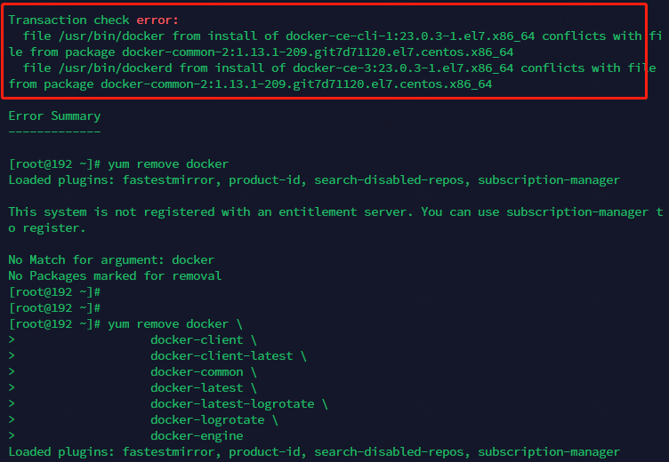
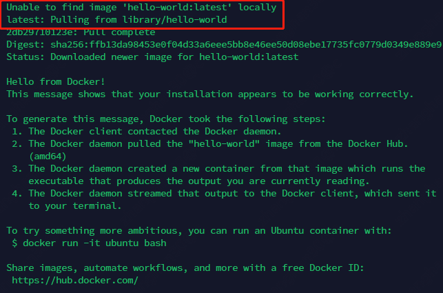
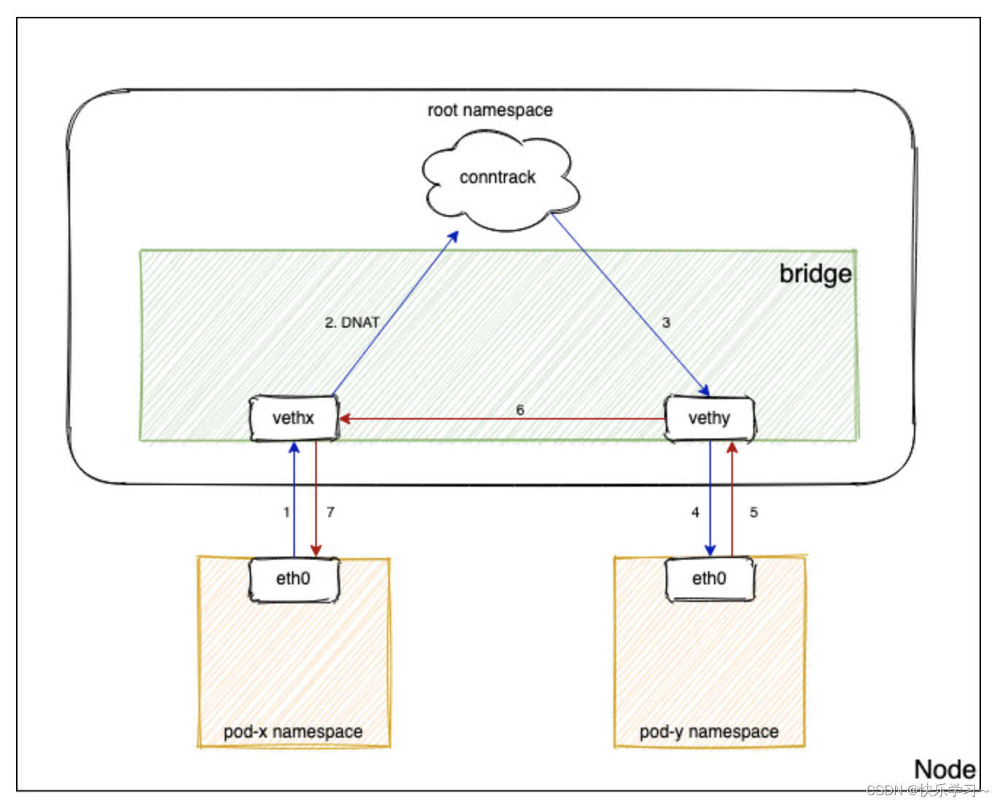

# 宗旨

本文在于指导如何建设一个用于**中小**规模生产的k8s集群。

# 前提条件

本文假设:

* 生产所需的主机(无论是物理机还是虚拟机)都能访问互联网。
  如果不具有该条件，则需要提前将所需的rpm包，镜像等导入到生产主机能够访问到的设备中
* 生产所需的主机使用基于**x86**的cpu架构，允许被重新格式化系统

# underlay网络规划

首先是生产集群的网络规划

## 管理网络

管理网络是k8s集群以及相关辅助设施和服务彼此之间通信的网络

```plantuml
@startuml
!include  https://plantuml.s3.cn-north-1.jdcloud-oss.com/C4_Container.puml

Boundary(管理网络, 管理网络, vlan-a) {
    System(git, git)
    System(dockerRepo, docker  repo)
    System(k8smaster, k8s master)
    System(etcd, etcd)
    System(elk, elk)
    System(jenkins, jenkins)
    System(prometheus, prometheus)
    System(容器云运维平台, 容器云运维平台)
}
@enduml
```

该网络的主要流量构成为

* k8s集群与api server之间的通信
* etcd与api server之间的通信
* k8s集群与git、docker仓库等通信
* 监控、日志系统与k8s集群之间的通信
* 企业容器云运维和运营人员通过企业内网与容器云运维(营)平台间的通信

该网络**推荐**使用一个独立的vlan号从而避免受到其它网络的二层数据干扰

在该网络进一步的ip地址规划中，**建议**

* 可以考虑从100.64.0.0/10网络中划分一段地址使用，该地址基本不会和企业内部的ip段冲突，
  从而避免当企业内部的运维想要管理该网络的设备，或者该网络的设备想要访问在企业内部已经建设好的设施时可能无法有效配置路由
* 子网掩码(或地址的连续性)建议不超过20位(4094个可用ip)，以免后续集群规模扩大后没有ip地址可用
* 针对k8s master节点与worker节点的可能规模，建议将管理网的一个C类网段分配给可能k8s master + etcd节点，
  将剩余的地址分配给worker节点，初始使用可以将worker分配到一个C类网段中，再需要情况下再分配连续的C类地址。
* 实际过程中也许无法按照这样的规划建设，但始终建议至少k8s集群相关的节点(k8s master、worker、etcd)等在管理网的结构上不要过度复杂。
  否则需要在主机上设置复杂的明细路由才能使得管理通信流量经过管理网网卡

```plantuml
@startuml
!include  https://plantuml.s3.cn-north-1.jdcloud-oss.com/C4_Container.puml

Boundary(企业内网, 企业内网, 10.0.x.x)
System(管理网路由器,管理网路由器)
Boundary(master子网, master 子网, 100.64.0.0/24)
Boundary(worker子网, worker 子网, 100.64.1.0/24)
管理网路由器<-u->企业内网: nat
管理网路由器<-d->master子网
管理网路由器<-d->worker子网
@enduml
```

如图所示，管理网可以用一个路由器和企业内网进行连接，当k8s节点要访问内部网络时，通过snat出去。
当企业内的员工要运维k8s集群时，则通过路由器开放dnat与内部某一台机器进行端口映射，
该机器作为堡垒机为企业员工提供运维能力(下文中即将定义这样一台主机，并提供容器云运维端在企业内部的访问域名解析和管理网机器映射。

在管理网的所有主机需要妥善设置明细路由，保证与企业内部管理集群用的系统流量使用管理网网口通信

* worker子网的主机去往master子网: 100.64.0.0/24 -> 100.64.1.1
* master子网的主机回worker子网: 100.64.1.0/24 -> 100.64.0.1

两个网关要配置在管理网路由器上

## 容器流量网络

容器流量网络的作用是给容器云的pod提供东西向和南北向网络通信，也就是单独给租户用的网络。
这个网络理论上能够从互联网访问进来，并能够访问互联网。
原则上来说，k8s节点的默认路由使用的是容器流量网络的网卡。
所以k8s集群内部的节点如果想要从互联网上下载点东西，或者把什么推送到互联网上去，需要"蹭"点租户的流量。

```plantuml
@startuml
!include  https://plantuml.s3.cn-north-1.jdcloud-oss.com/C4_Container.puml

Boundary(容器流量网络, 容器流量网络, vlan-b) {
    System(k8smaster, k8s master)
    System(k8swoker, k8s worker)
    System(k8ingress, k8s ingress)
}
@enduml
```

该网络的主要流量构成为

* pod和集群内外部的数据和调用流量

该网络**推荐**使用一个独立的vlan号从而避免受到其它网络的二层数据干扰

同样的，该网络也推荐从100.64.0.0/10划分一个网段，网段的大小与管理网划分的地址长度相同。并且进一步**推荐**

* master一个C类，worker + ingress一个C类地址
* 两个C类之间通过路由打通

```plantuml
@startuml
!include  https://plantuml.s3.cn-north-1.jdcloud-oss.com/C4_Container.puml

System(容器网路由器,容器网路由器)
Boundary(master子网, master 子网, 100.64.16.0/24)
Boundary(worker子网, worker 子网, 100.64.17.0/24)
容器网路由器<-d->master子网
容器网路由器<-d->worker子网
@enduml
```

## 存储流量网络

该网络用于宿主机连接后台块存储设备、文件存储设备以及对象存储设备、数据库、缓存等中间件。
该网络的存在有利于在访问流量峰值到达时，降低因后台数据访问而造成的容器网络数据拥塞。

该网络的主要流量构成为

* 物理机对远程块存储设备的数据访问流量
* pod对外部对象存储，文件存储等存储设施的直接访问流量
* pod对外部数据库，缓存等中间件的访问流量:
  pod访问一个存储网地址，若相关工作节点在存储网内直接有网卡，那么pod将不通过容器流量网卡，而是存储网网卡发送流量。
  否则pod先通过容器流量网的网卡将流量发给存储网的网关，再由网关转发，从而导致网关承担重要的枢纽位置，如果网关所在交换设备挂了整个存储和中间件访问全挂

该网络**推荐**使用一个独立的vlan号从而避免受到其它网络的二层数据干扰

## 3层互通

以上网络**推荐**ip地址段之间没有重叠且彼此之间能够3层互通，这样有利于实现诸如管理网络的管理和控制系统对存储网络的存储设施执行监控和控制的扩展需求

## 服务器网卡规划

由网络规划可以导出服务器需要3块网卡，1个千兆(管理流量)，2个万兆(容器流量网络和存储流量网络)，实际采购过程中按预期的调用峰值和历史观测值执行。
此外，网卡之间是否进行bond(mode=1(active-backup))、是否和交换机之间执行双上联从而通过交换机堆叠或链路聚合等达成硬件高可用或高性能，
视**财力**和**财力**(确信)而为。 在预算紧张的情况下，网卡的合并规则是存储流量网与容器流量网合并，但**绝对**不推荐3合1模式

## 跨子网明细路由设置

为了使得网络的访问能沿着预设的网络路径转发，需要

* 默认路由使用容器网络流量网络的网关，这样所有容器去往集群外的流量都使用容器网络流量网络
* 由于默认路由的变更，使得当去往其它存储型中间件网络或存储系统的时候，若系统所在的位置与存储网络不是一个子网，需要设置主机明细路由将流量引导到存储网的网关，再有网关转发
* 管理型应用同理，需要按需设置明细路由使得通过管理网网卡转发流量

_提示_: 在搭建测试环境时

* 可以自行找一个云主机当做路由器使用
* 记得给云主机一个出网网卡并将浮动ip挂载在云主机上
* 配置出网默认路由到浮动ip的网卡
* `yum install iptables-services`
* `systemctl enable iptables`开启iptables服务
* 配置管理，容器流量、存储网的snat规则(用于主机安装软件使用)
* `service iptables save`保存规则
* 如果snat启用后发现ping域名和ip都不同，看下iptables的FOWARD链里的filter表的表项是不是有问题

# 宿主主机规划

在[[基于k8s的生产系统架构范例](..%2F%E5%9F%BA%E4%BA%8Ek8s%E7%9A%84%E7%94%9F%E4%BA%A7%E7%B3%BB%E7%BB%9F%E6%9E%B6%E6%9E%84%E8%8C%83%E4%BE%8B)]
文档中，给出了生产环境部署时节点类型的经典模型。本文在就针对不同的节点类型规划底层的磁盘

## k8s集群节点

k8s集群节点是指k8s master & worker，不包含etcd

### 工作节点cpu:mem比

**建议**k8s worker主机的cpu核心数与内存的比例维持在1:2/1:4的经典比例，除非有特别的需要，否则不要使用其它的比例模型

## k8s node、git、jenkins

以上类型的节点不需要高效的数据读写能力

* 2块ssd操作系统盘用于快速启动并通过raid-1解决单盘故障操作系统无法启动的问题
* 2块hdd用于docker的镜像存储以及日志存储，并承担数据盘的作用(若有块存存储设施，应当优先对接块存储)

## etcd 、prometheus(plus grafana & alert manager)、elk, docker repo

以上类型的节点需要频繁读写数据

* 2块ssd操作系统盘用于快速启动并通过raid-1解决单盘故障操作系统无法启动的问题
* 2块ssd用于数据的读写，并通过raid-1保证数据的备份(若有块存储设施，应当优先对接块存储)

# 准备宿主机镜像

## 升级操作系统内核

选用centos7.9版本，将内核升级为最新:

* `yum -y update`: 执行yum存储库更新
* `rpm --import https://www.elrepo.org/RPM-GPG-KEY-elrepo.org`: 导入内核库gpg公钥
* `yum install https://www.elrepo.org/elrepo-release-7.el7.elrepo.noarch.rpm` 把repo激活
* `yum list available --disablerepo='*' --enablerepo=elrepo-kernel` 看一下那些内核版本可用，lt代表长期支持的，不要装"ml"
  版本的，那些都是测试版本

**警告**: k8s在3.10版本上有bug，大集群会挂掉



* `yum --enablerepo=elrepo-kernel install kernel-lt` 安装lt版本
* `reboot` 重启
* `vim /etc/default/grub` 修改grub文件: 修改GRUB_DEFAULT=0，0是开
* `grub2-mkconfig -o /boot/grub2/grub.cfg`令其生效

## 修改时区和语言

* `timedatectl`: 查看时区，比如下面的就是错的，需要改

```text
[root@192 ~]# timedatectl
      Local time: Fri 2023-04-07 09:19:45 EDT
  Universal time: Fri 2023-04-07 13:19:45 UTC
        RTC time: Fri 2023-04-07 13:19:46
       Time zone: America/New_York (EDT, -0400)
     NTP enabled: yes
NTP synchronized: yes
 RTC in local TZ: no
      DST active: yes
 Last DST change: DST began at
                  Sun 2023-03-12 01:59:59 EST
                  Sun 2023-03-12 03:00:00 EDT
 Next DST change: DST ends (the clock jumps one hour backwards) at
                  Sun 2023-11-05 01:59:59 EDT
                  Sun 2023-11-05 01:00:00 EST
```

* `timedatectl set-timezone Asia/Shanghai`: 修改时区UTC+8

```text
[root@192 ~]# timedatectl
      Local time: Fri 2023-04-07 21:22:06 CST
  Universal time: Fri 2023-04-07 13:22:06 UTC
        RTC time: Fri 2023-04-07 13:22:07
       Time zone: Asia/Shanghai (CST, +0800)
     NTP enabled: yes
NTP synchronized: yes
 RTC in local TZ: no
      DST active: n/a
```

## 关闭交换分区

* `swapoff -a`: 暂时先关闭
* `vi /etc/fstab`: 打开文件挂载并在"/dev/mapper/centos-swap"前加上"#"
* `reboot`: 重启后`free -h`看效果，如果成功则

```text
[root@localhost ~]# free -h
              total        used        free      shared  buff/cache   available
Mem:           1.9G        166M        1.6G        8.5M        217M        1.6G
Swap:            0B          0B          0B
```

## 安装docker

* `yum install -y yum-utils`: 安装yum工具包
* `yum-config-manager --add-repo https://download.docker.com/linux/centos/docker-ce.repo`: 添加docker ce的源
* `yum install docker-ce docker-ce-cli containerd.io docker-buildx-plugin docker-compose-plugin`: 安装docker和官网推荐的全家桶，
  **不要**用`yum install docker`，那个装的是旧版本(如下)

```text
[root@192 ~]# docker -v
Docker version 1.13.1, build 7d71120/1.13.1
```

如果出错是这样



可能是之前装了docker没删干净，执行`yum remove docker docker-client docker-client-latest docker-common docker-latest docker-latest-logrotate docker-logrotate docker-engine`
删干净

* `docker -v`

```text
[root@192 ~]# docker -v
Docker version 23.0.3, build 3e7cbfd
```

* `systemctl enable docker`: 启用服务
* `systemctl start docker`: 启动服务
* `docker run hello-world`: 测试一下



需要注意的是，docker可能要上网拉镜像

## 映射docker的镜像存储位置

在安装完毕后，通过`docker info`查看docker的系统路径，找到

```text
Docker Root Dir: /var/lib/docker
```

将路径修改为docker镜像和日志存储专用硬盘的位置

## 切换cgroup驱动为systemd

* `systemctl --version`: 查看systemd版本
* `docker info`: 从docker info看下当前的是不是还是"cgroupfs"

```text
 Logging Driver: json-file
 Cgroup Driver: cgroupfs
 Cgroup Version: 1
```

* `vim /etc/docker/daemon.json`: 编辑docker的手续进程选项

```json
{
  "exec-opts": [
    "native.cgroupdriver=systemd"
  ]
}
```

cgroup是linux用来跟进程分组并管理资源用的组件，它有2套实现，systemd和cgroupfs。因为systemd现在大多数系统已经自带了，所以就不推荐使用cgroupfs了。
在此需要注意，docker切换为systemd后，k8s安装的时候也要使用systemd作为cgroup的控制器。否则k8s管理资源和docker实际使用就不是一套，容易出问题。

## 关闭防火墙

firewalld可能会对iptables的一些规则进行干扰造成网络通信问题，通过`systemctl disable firewalld`将服务关停

## 确认常见网络命令可用

检查

* tcpdump
* ping
* curl
* arp
* telnet
* traceroute
* nslookup
* iptables
* brctl

等常用网络命令的组件在当前系统可用，没有则最好安装一下

## 配置ssh公钥互信

* `ssh-keygen`: 生成访问密钥
* `cat  ~/.ssh/id_rsa.pub >> ~/.ssh/authorized_keys`: 自己和自己信任一下
* `chmod 600 ~/.ssh/authorized_keys`

## 开启ip转发和网桥直接转发使用iptables规则功能

* 加载overlay和br_netfilter模块

```shell
cat <<EOF | sudo tee /etc/modules-load.d/k8s.conf
overlay
br_netfilter
EOF
```

* 开启iptables转发

```shell
cat <<EOF | sudo tee /etc/sysctl.d/k8s.conf
net.bridge.bridge-nf-call-iptables  = 1
net.bridge.bridge-nf-call-ip6tables = 1
net.ipv4.ip_forward                 = 1
EOF
```

bridge-nf-call-iptables是个非常重要的参数，它主要解决两个相同宿主机上的pod通过service转发流量后，回包不应用iptables规则的问题。
经过参考[[https://blog.csdn.net/qq_43684922/article/details/127333368](https://blog.csdn.net/qq_43684922/article/details/127333368)]
给出的图



和[[nat网络地址转换介绍](..%2F..%2F..%2F..%2F%E7%BD%91%E7%BB%9C%2F%E5%9F%BA%E7%A1%80%E7%9F%A5%E8%AF%86%2Fnat%E7%BD%91%E7%BB%9C%E5%9C%B0%E5%9D%80%E8%BD%AC%E6%8D%A2%E4%BB%8B%E7%BB%8D)]

进行讲解:
pox-x通过service访问pod-y，在访问时，pod-x的网络流量到达service的ip，由service的ip经过dnat转换为pod-y的ip；同时将pod-x的ip作为源ip转发了包；
回包时，pod-y回给pod-x的包是pod-x的源ip，而此时pod-x和pod-y之间网桥在内部直接转发了包
(通常同一个主机上的pod在同一个子网以免包转来转去)而没有使用iptables，
这造成pod-x看到的回包的源ip是pod-y而不是service的ip，而这个ip没有和自己三次握手，于是连接失败。

bridge-nf-call-iptables = 1将解决这个问题，它的意思是，网桥直接做二次发包的时候也要经过iptables，这样回包经过iptables之后会发现这个访问是经过dnat来的，
从而要将源ip改回service的ip。

## 安装cri-dockerd插件

从很早以前，k8s就不再使用dockershim作为cri，改为使用cri-dockerd，因此需要安装cri-dockerd

* `wget https://github.com/Mirantis/cri-dockerd/releases/download/v0.3.1/cri-dockerd-0.3.1-3.el7.x86_64.rpm`: 引入repo的gpg
* `yum install cri-dockerd-0.3.1-3.el7.x86_64.rpm -y`: 安装组件

## 安装kubectl

kubectl是k8s集群管理工具客户端，理论上只需要

# 开始安装
