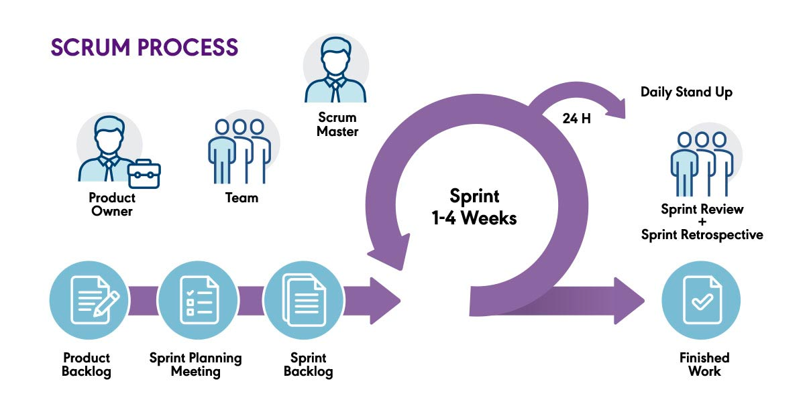
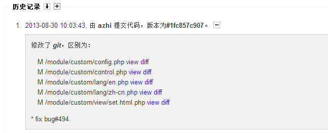

# scrum的基本过程



简单讲解就是

* 所有需求和问题记录为backlog(product backlog)，这是整个产品的待办工作事项
* 在backlog中挑选下一次迭代(版本)的工作事项，确定一次冲刺
* 使用1-4周(其实很难做到1周)完成冲刺后发布上线

核心理念

* 小步快跑而不是指定一个宏大蓝图后长年才能完成
* 积极响应反馈
* 快速调整方向

# 需求的采集与问题的反馈

## 糟糕的案例

需求是来自于四面八方的，来源包括不限于

* 平时的对话沟通
* 聊天软件的沟通
* 往来的邮件

等

### 记录的麻烦

一个糟糕的方法是维护一个在线的excel或更糟糕的是一个离线的excel，这个excel别人编辑不了，查看不了，每个需求和问题没有独立的编号。
产品经理必须自己不断地丰富这个excel，维护它，并保证团队使用的excel是同一个版本。
海量的压力集中在产品经理身上，为了快速记录不得不有时仅仅写一个标题或者非常摘要的信息，等到再需要回忆起这个需求的细节时，相关的上下文信息已经丢失。

### 跟踪的麻烦

每次开发都从excel中取出任务，任务既没有编号，也没有什么在线的系统可以让研发人员、测试人员针对任务进行记录。
大家在会上投屏查看这个excel，然后说明任务的完成情况和问题，这些问题又需要占用会议的时间反哺到这个excel中。

### 所有人的麻烦

逐渐大家都觉得这个离线的excel好麻烦，于是升级为在线版或者本身就是在线版的，研发需要自己填写工作内容，测试需要填写工作内容。
每次昨晚工作还需要记得去一个地方"写日记"

## 较好的案例

### 使用成熟项目管理系统

实际上业界早有成熟的项目管理软件，包括不限于禅道，jira等，产品经理应当首先在这些软件上创建自己的产品。

### 驱动良好user story的编写

需求在scrum中称为用户故事，这个用户故事是所有人贡献的，项目管理系统应当支持和开放权限给所有授权用户提出自己需求的功能。
同时，需求编写不应当是一句话，下面就是一个糟糕的需求

```text
请支持微信扫码登录
```

面对这个需求，团队还需要知道

* 这个功能希望什么时候要？
* 你为啥希望要这个需求？对你产生了什么困难？
* 如果项目团队不做会怎么样？

反之这是一个好的需求

```text
我是一名上班族，我有很多系统的密码要记录，每次登录我们的系统时都会忘记或者记混需要什么密码
我们的系统每次登录失败又会锁定用户5分钟，因此使用起来非常麻烦
我希望在本月内能够添加微信扫码登录
```

同样，下面就是非常糟糕的问题的反馈

```text
昨天系统崩溃了
```

面对这个问题

* 啥时候崩溃的？
* 你干了啥崩溃的？
* 有没有什么错误截图和提示？

相对下面的问题就好很多

```text
昨天下午3点左右系统崩溃了
我访问系统订单页一直弹出网络错误
下面是错误的截图
...
```

## 应记尽记

推动需求和问题的在线化记录其实是一个非常难的工作，因为它给人的印象是我提了就没人理。然而这种观念是错误的。

* 应当养成在线上项目管理软件先记录再提的习惯，先把事情提了并不影响你在微信群中和任何人沟通
* 未被线上化记录的故障和问题反而容易被遗漏，因为团队的例会(日/周)基于项目管理软件执行。
  未在上面记录的事项反而不容易被团队的其它成员以及领导看到，因此反而不会被有效地解决
* 问题反馈容易造成长期无响应，在微信群中的留言等需要人来主动的记录和观测处理时间，程序和定时器等自动化手段无法对问题的除了时长进行判断，
  从而无法有效地进入自动化的事件升级机制(如2小时没有关闭则自动打电话给高级主管等)
* 提出人也很难关注自己提出的问题有没有落地解决

因此，先记录一下问题不影响问题的提出者在微信群中和工程师或二线的研发进行紧急沟通。
京东云、华为云、阿里云等成熟的在线to B服务厂商都有工单系统以及大客户实时在线服务。

## 自动化简化流程

当然，打开一个系统进行登录、查找，问题编写等确实让人觉得麻烦，因此在条件和时间允许下可以编码微信的聊天机器人，通过在微信群中@机器人的做法自动实现故障记录和需求转换等。

# 周度例行需求/故障碰头会

问题和需求都是实时发生的，在发生时也许并不能登录项目管理系统进行详细的记录，或者因为问题过于紧急而忽略了记录，这些都是正常的现象。
因此，在机制上，应当以周为单位组织需求和问题的碰头会，对前端、后端关心的需求满足以及已有问题的处理上进行拉齐。
在统一的项目管理软件中对齐需求和问题的清单以及内容，并查看这些问题现在的处理进度

```plantuml
@startuml
!include  https://plantuml.s3.cn-north-1.jdcloud-oss.com/C4_Container.puml

Person(产品经理, 产品经理)
Person(需求方, 需求方)

Boundary(开发设施, 开发设施) {
    System(项目管理软件, 项目管理软件)
}

产品经理 -d-> 项目管理软件: 自主录入
需求方 -d-> 项目管理软件: 自主录入

产品经理 <-r-> 需求方: 周度拉齐
@enduml
```

# 冲刺目标的确定

冲刺通常也即是发版，是产品向前迭代的行为，它通常以1个月作为周期进行(过短的迭代其实很难保证发布的质量)。
以时间为界限就是在每次迭代中放入当下最紧急的任务，确保每次发布的版本的有效性。

冲刺目标最终是以完成的需求编号以及问题编号作为清单来追踪

# 任务的管理粒度

需求往往代表着一系列开发任务，比如支持扫码登录，意味着需要具备微信开发者账号、需要编写前端代发，需要后台开发等等若干个任务。
对此，本文的态度是不需要将任务拆解的过度细，只需要将任务能够拆解到对应的人即可，以人为目标追踪任务。例如

* user-story-001: 支持微信扫码登录
    * task-001: 申请开发者账号@项目经理(负责人)
    * task-002: 完成原型设计和评审@产品经理(负责人)
    * task-003: 完成前端代码开发@前端工程师(负责人)
    * task-004: 完成后端代码开发@后端工程师(负责人)

注意，任务的管理并不是为了管理而管理，主要是记录每一个需求的核心任务以便在追踪时造成可能延期的阻断项进行记录，过度的任务拆解将造成显著的管理成本上升

# 开始冲刺

## 主要阶段

```plantuml

设计阶段 -> 代码编写阶段
代码编写阶段 -> 调试阶段
调试阶段 -> 投产阶段
```

设计阶段是非常重要的阶段，通常对以下内容进行评审

* 有待改进的产品原型
* 系统底层数据结构和机制的改造
* 技术实现在功能性和非功能性上的设计图和方案
* 技术实现后对运维和测试造成的影响

设计阶段时，产品、测试、技术以及运维的负责人都需要参与和理解未来的产品技术特点，从而设计良好的测试方案和运维方案

## 代码管理工具与项目管理软件的联动

进入代码编写阶段后，日报或者登录100多个系统记录自己的日常工作显然是一种内卷又低效的管理方法。
好的做法是研发写完代码后在提交信息中按照格式要求说明自己完成的工作内容以及相关的任务编号。
项目管理软件通过git的webhook收取到代码的提交信息，随后将代码的提交内容与任务编号进行关联，构成自动化的开发历史

```plantuml
@startuml
!include  https://plantuml.s3.cn-north-1.jdcloud-oss.com/C4_Container.puml

Person(产品经理, 产品经理)
Person(需求方, 需求方)
Person(开发, 开发)

Boundary(开发设施, 开发设施) {
    System(项目管理软件, 项目管理软件)
    System(git, git)
}

产品经理 -d-> 项目管理软件: 自主录入
需求方 -d-> 项目管理软件: 自主录入

产品经理 <-r-> 需求方: 周度拉齐

开发 -d-> git: 提交代码

项目管理软件 <-r-> git: webhook

@enduml
```

下图是以禅道给出的一个例子，假设开发在本次迭代中修复了一个历史问题(编号494)



## 测试

测试是贯穿一次冲刺全周期的内容，具体测试的细节和内容不在本文展开。
测试用例的编写和评审以及后续测试用例的执行以及bug的提出也需要通过项目管理软件维护。
在测试提出bug后，开发修复的bug同样也反馈给项目管理软件进行自动关联。此外，测试主要分为

* 功能性测试: 通过测试用例检查版本计划的功能是否完成完成开发
* 非功能性测试: 包含压力测试(查看系统吞吐能力和性能)、抗脆弱性测试(通过故意制造故障检查系统是否会崩溃、用户数据是否会丢失)

```plantuml
@startuml
!include  https://plantuml.s3.cn-north-1.jdcloud-oss.com/C4_Container.puml

Person(产品经理, 产品经理)
Person(需求方, 需求方)
Person(开发, 开发)
Person(测试, 测试)

Boundary(开发设施, 开发设施) {
    System(项目管理软件, 项目管理软件)
    System(git, git)
    System(流水线, 流水线)
    System(制品库, 制品库)
    
    流水线 <-- 制品库
}

Boundary(测试环境, 集成测试环境) {
    System(测试系统, 测试系统)
}

产品经理 -d-> 项目管理软件: 自主录入
需求方 -d-> 项目管理软件: 自主录入

开发 -d-> 流水线: 发布 

流水线 --> 测试系统: 发布

测试 -d-> 测试系统

产品经理 <-r-> 需求方: 周度拉齐

开发 -d-> git: 提交代码

项目管理软件 <-r-> git: webhook
git -r-> 流水线: 代码编译

@enduml
```

## 投产

投产是冲刺的最后一个阶段，它意味着本次冲刺的结束。

```plantuml
@startuml
!include  https://plantuml.s3.cn-north-1.jdcloud-oss.com/C4_Container.puml

Person(产品经理, 产品经理)
Person(需求方, 需求方)
Person(开发, 开发)
Person(测试, 测试)

Boundary(开发设施, 开发设施) {
    System(项目管理软件, 项目管理软件)
    System(git, git)
    System(流水线, 流水线)
    System(制品库, 制品库)
    
    流水线 <-- 制品库
}

Boundary(测试环境, 集成测试环境) {
    System(测试系统, 测试系统)
}

Boundary(生产环境, 生产环境) {
    System(生产系统, 生产系统)
}

产品经理 -d-> 项目管理软件: 自主录入
需求方 -d-> 项目管理软件: 自主录入

开发 -d-> 流水线: 发布 

流水线 --> 测试系统: 发布

流水线 -u-> 生产系统: 发布

测试 -d-> 测试系统

测试 -u-> 生产系统

产品经理 <-r-> 需求方: 周度拉齐

开发 -d-> git: 提交代码

项目管理软件 <-r-> git: webhook
git -r-> 流水线: 代码编译

@enduml
```

在投产前当然也有一些严格的标准，并且通常还会优先使用预发环境进行验证，这些详细的内容本文不会展开。

# 下一步阅读

[整体环境的概要规划](..%2F%E6%95%B4%E4%BD%93%E7%8E%AF%E5%A2%83%E7%9A%84%E6%A6%82%E8%A6%81%E8%A7%84%E5%88%92)